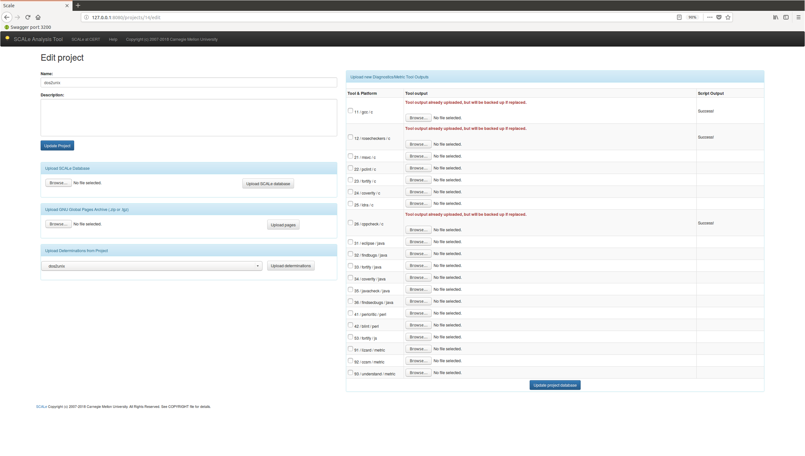

[SCALe](index.md) / [Source Code Analysis Lab (SCALe)](Welcome.md) / [Audit Instructions](Audit-Instructions.md)
<!-- <legal> -->
<!-- SCALe version r.6.5.5.1.A -->
<!--  -->
<!-- Copyright 2021 Carnegie Mellon University. -->
<!--  -->
<!-- NO WARRANTY. THIS CARNEGIE MELLON UNIVERSITY AND SOFTWARE ENGINEERING -->
<!-- INSTITUTE MATERIAL IS FURNISHED ON AN "AS-IS" BASIS. CARNEGIE MELLON -->
<!-- UNIVERSITY MAKES NO WARRANTIES OF ANY KIND, EITHER EXPRESSED OR -->
<!-- IMPLIED, AS TO ANY MATTER INCLUDING, BUT NOT LIMITED TO, WARRANTY OF -->
<!-- FITNESS FOR PURPOSE OR MERCHANTABILITY, EXCLUSIVITY, OR RESULTS -->
<!-- OBTAINED FROM USE OF THE MATERIAL. CARNEGIE MELLON UNIVERSITY DOES NOT -->
<!-- MAKE ANY WARRANTY OF ANY KIND WITH RESPECT TO FREEDOM FROM PATENT, -->
<!-- TRADEMARK, OR COPYRIGHT INFRINGEMENT. -->
<!--  -->
<!-- Released under a MIT (SEI)-style license, please see COPYRIGHT file or -->
<!-- contact permission@sei.cmu.edu for full terms. -->
<!--  -->
<!-- [DISTRIBUTION STATEMENT A] This material has been approved for public -->
<!-- release and unlimited distribution.  Please see Copyright notice for -->
<!-- non-US Government use and distribution. -->
<!--  -->
<!-- DM19-1274 -->
<!-- </legal> -->

SCALe : Cascading Determinations from Old Codebase to New Codebase
===================================================================

This feature allows a user to take determinations made from a previous
SCALe audit and apply them to alerts generated by a new SCALe audit. It
uses `diff` to determine if a code line within a file from a previous
version of a codebase matches a code line within the current version of
the codebase. If the lines are matched and there was a previously-made
determination for the meta-alert, then it infers the same determination
for the current meta-alert.

The instructions on this page apply for re-audits. A typical re-audit
scenario involves performing an initial audit on a codebase and later
re-auditing a new version of the codebase.

The re-audit process leverages the audit work performed on the old
codebase while doing a thorough audit of the new codebase. When
analyzing any alert in the new codebase, you should know if the alert
existed in the old codebase and what determinations were made about that
alert.

This helps to answer critical questions: Were all the previously-cited
problems fixed? Were fixes only done for alerts
marked `True`, and other alerts  were
ignored? Was anything changed in the code? If so, were new problems
introduced into the code?

This scenario assumes you have the following:

-   source for the codebase, old version
-   source for the codebase, new version
-   Both new and old source directories are named the same for correct comparison.
-   The SCALe web app should contain a project for the old source,
    complete with determinations
-   The SCALe web app should contain a project for the new source,
    preferably with no determinations. (This implies that you need to
    have run all analysis tools and built the database, manually or via
    the web app. But you do not have to audit any alerts in the new
    codebase.)

To transfer any determinations from the old codebase to the new
codebase, you should first create a project with an edited version of
the new codebase. Then,

1.  Go to the 'Edit Project' page view (see screenshot below)
2.  Select 'Upload Determinations from Project' in the 'Edit Project'
    page.
3.  Select the project containing the old codebase, and select "Upload
    Determinations".
4.  The new codebase receives determinations from the old codebase.
    1.  Only determinations that apply to unchanged lines are preserved.
    2.  A new Note is added that identifies the verdict as being
        cascaded, with a timestamp (see another screenshot below)

**NOTE OF CAUTION:** Cascaded verdicts are not as trustworthy as direct
verdicts, because data, control, and type flow changes may cause the
previously-correct determination to change. E.g., with different control
flow, a previous True can become a currently-correct False.

"Edit project" view in screenshot below:

After importing cascaded verdicts, auditor view shows Notes entries for
cascaded determinations in the partial screenshot below:

------------------------------------------------------------------------

Attachments:
------------

[editProject.png](attachments/editProject.png) (image/png)

[post-cascade.png](attachments/post-cascade.png) (image/png)
