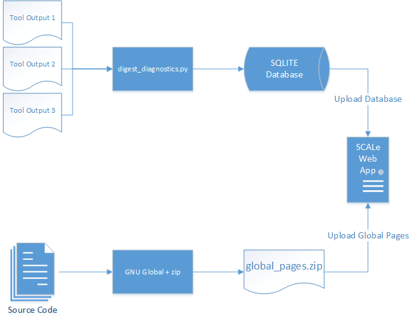
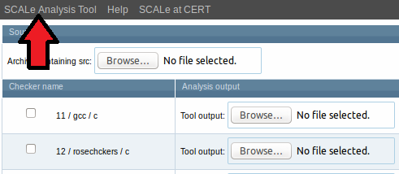
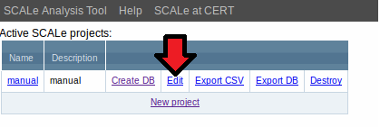
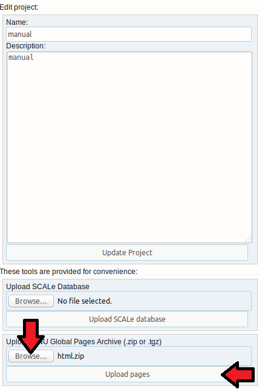
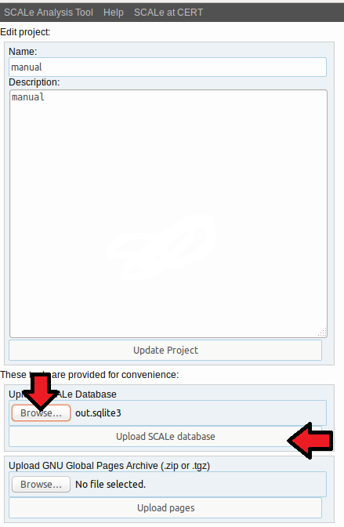
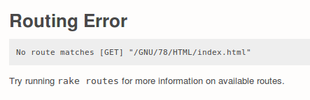
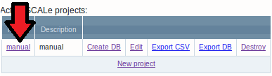

[SCALe](index.md) / [Source Code Analysis Lab (SCALe)](Welcome.md)
<!-- <legal> -->
<!-- SCALe version r.6.7.0.0.A -->
<!--  -->
<!-- Copyright 2021 Carnegie Mellon University. -->
<!--  -->
<!-- NO WARRANTY. THIS CARNEGIE MELLON UNIVERSITY AND SOFTWARE ENGINEERING -->
<!-- INSTITUTE MATERIAL IS FURNISHED ON AN "AS-IS" BASIS. CARNEGIE MELLON -->
<!-- UNIVERSITY MAKES NO WARRANTIES OF ANY KIND, EITHER EXPRESSED OR -->
<!-- IMPLIED, AS TO ANY MATTER INCLUDING, BUT NOT LIMITED TO, WARRANTY OF -->
<!-- FITNESS FOR PURPOSE OR MERCHANTABILITY, EXCLUSIVITY, OR RESULTS -->
<!-- OBTAINED FROM USE OF THE MATERIAL. CARNEGIE MELLON UNIVERSITY DOES NOT -->
<!-- MAKE ANY WARRANTY OF ANY KIND WITH RESPECT TO FREEDOM FROM PATENT, -->
<!-- TRADEMARK, OR COPYRIGHT INFRINGEMENT. -->
<!--  -->
<!-- Released under a MIT (SEI)-style license, please see COPYRIGHT file or -->
<!-- contact permission@sei.cmu.edu for full terms. -->
<!--  -->
<!-- [DISTRIBUTION STATEMENT A] This material has been approved for public -->
<!-- release and unlimited distribution.  Please see Copyright notice for -->
<!-- non-US Government use and distribution. -->
<!--  -->
<!-- DM19-1274 -->
<!-- </legal> -->

SCALe : Manual Project Creation
================================

This page describes how to create a SCALe project via the command-line (also 
called 'manually-created projects' here). These
steps are not strictly necessary, as the web app will create a project
for you given just the source code and tool output. However, manual
creation allows you greater flexibility and power when auditing source
code.

The 'curl/HTTP' method for making manually-created projects makes projects
that are the same as projects created using the SCALe GUI.

CAUTION: However, the 'ruby' method for making manually-created projects makes projects that are
NOT the same as projects created using the SCALe GUI! The 'ruby' method results in projects with these 
issues: (1) database field entries
are missing; (2) some files do not get archived; (3) exported databases are missing fields 
(and database exports haven't been tested with this code plus there are no automated regression tests 
to ensure exports continue to work during development, even if they do now); (4) the missing fields
and files will cause failures interacting with other SCAIFE servers.


There is currently one technique for creating manual projects, which
we call the 'ruby' method. They do not require a SCALe server to be
running. The scripts use the Rails console to run small snippets of
Ruby code that do the actual work of interacting with SCALe. All the
scripts live in scale.app/scripts/cmdline-ruby.

-   [Requirements](#requirements)
-   [Overview](#overview)
-   [Prepare the Source
    Code](#prepare-the-source-code)
    -   [Example dos2unix](#example-dos2unix)
-   [Generate GNU Global
    Pages](#generate-gnu-global-pages)
    -   [Example Generate dos2unix](#example-generate-dos2unix)
-   [Generate a SCALe Database from Your Tool Outputs](#generate-a-scale-database-from-your-tool-outputs)
    -   [Example Generate Database](#example-generate-database)
-   [Create a New Project in the SCALe Web
    App](#create-a-new-project-in-the-scale-web-app)
    -   [Creating a New Project Manually](#creating-a-new-project-manually)
-   [Upload the GNU Global
    Pages](#upload-the-gnu-global-pages)
    -   [Uploading the GNU Global
    Pages Manually](#uploading-gnu-global-pages-manually)
-   [Upload the SCALe
    Database](#upload-the-scale-database)
    -   [Uploading the SCALe
    Database manually](#uploading-the-scale-database-manually)
-   [View Your Project](#view-your-project)

Requirements
------------

1.  A local copy of the source code you are auditing
2.  GNU Global version 6.3.3 or greater
3.  Outputs from static analyzers run against the source code
4.  Access to the `scripts` directory of the SCALe web app, or a local
    copy of this directory

Overview
--------

The following diagram illustrates the process of creating a project
manually.



A SQLite database is generated from the static analyzer outputs.  A
collection of HTML pages representing the source code is generated with
the `htags` utility from GNU Global.  Both of these artifacts are then
uploaded directly to the SCALe web app in a new project.  We now cover
each step of this process in more detail.

Prepare the Source Code
-----------------------

The following steps require access to the source code of the
application being auditing. Your source code should be available as an
archive, in one of these formats: Tarball (tar.gz or tgz), Zip, or
Bzip2 (tar.bz2). This is the same archive that you would upload to the
SCALe web app.

### Example dos2unix

Suppose that, when following the [SCALe Quick Start
Demo](SCALe-Quick-Start-Demo-for-Auditors.md), you opt to create the
database manually, and upload it to the web app, rather than uploading
tool output to the web app directly. You would download the source
code from here:

[dos2unix-7.2.2.tar.gz](http://waterlan.home.xs4all.nl/dos2unix/dos2unix-7.2.2.tar.gz){.extlink}

Generate GNU Global Pages
-------------------------

To generate the GNU Global pages for your source code archive, you can
run the [`create_src_html.py`](Back-End-Script-Design.md) script. This
script takes one argument: the archive of the source you are using. It
then extracts your archive into a temporary directory, runs GNU Global
with the appropriate parameters, and then creates a ZIP archive of the
appropriate HTML files. The resulting archive is named
`html.zip`. Finally, it cleans up the temporary directory.

If any error occurs, this script will leave the temporary directory
available for inspection. As a safety precaution, it will refuse to
operate if the temporary directory has not been deleted.

### Example Generate dos2unix

To generate the GNU Global pages for `dos2unix`, run the following
commands:

```sh
create_src_html.py demo/dos2unix/dos2unix-7.2.2.zip
```

Generate a SCALe Database from Your Tool Outputs
------------------------------------------------

This step requires converting static analyzer outputs into a common
format. The [`digest_alerts.py`](Back-End-Script-Design.md) script is
responsible for this task, however you should actually use the
[`create_database.py`](Back-End-Script-Design.md) directly. It accepts
tool outputs and produces a SQLite database. It is available in the
`scale.app/scripts` directory of your SCALe installation. If you do
not have access to the machine hosting your SCALe installation, you
should request a copy of the scripts directory from your SCALe
administrator.

This script takes the following arguments:

+-----------------------------------+-----------------------------------+
| Database                          | File name of a SQLite database    |
|                                   | (may or may not already exist)    |
+-----------------------------------+-----------------------------------+
| Input                             | File name of output from a        |
|                                   | specific tool                     |
+-----------------------------------+-----------------------------------+
| Source                            | Archive of source code            |
+-----------------------------------+-----------------------------------+
| Tool name                         | Name of tool (e.g. "rosecheckers")|
+-----------------------------------+-----------------------------------+
| Tool platform (language)          | Language the tool analyzes        |
+-----------------------------------+-----------------------------------+
| Tool version (if applicable)      | Version of the tool, if any       |
+-----------------------------------+-----------------------------------+
| Tool ID (alternatively)           | The numeric ID of a tool, version,|
|                                   | and platform/language, instead of |
|                                   | specifying all three
+-----------------------------------+-----------------------------------+

The database can be created using either the labels
(tool_name/tool_platform/tool_version) or the numeric ID for the tool.

Tools and their associated platforms and versions can be examined in
the `scripts/tools.json` file.  Each platform and version combination
for a tool results in a unique tool ID. Tool IDs are assigned in the
same order as the (tool_name, tool_platform, tool_version)
combinations appear in the tools.json file.

If using labels, the tool to use should be specified by name (-t),
platform/language (-p) and possibly version (-V). If using the numeric
tool ID, use the (-i) to specify by number.


If the database does not already exist, the script creates and
initializes it. If the database does exist, the script first removes
any alerts already associated with the specified tool. Therefore, if
you run the script multiple times with the same tool ID, each
invocation erases any data entered by the previous run. However, data
associated with other tools within the database is not overwritten.

Note of caution for uploading code metrics tool output: Before uploading
code metrics tool output, first the output from at least one
flaw-finding static analysis tool must be uploaded. For example, for a
C-language codebase, a GCC output file could be uploaded using the
command above (with the codebase tarball/zipfile and the GCC tool ID),
even if that GCC.txt file is empty (therefore, has no alerts). After
that, code metrics tool output uploads should work.

Additional detail for uploading old versions of Lizard code metrics tool
output: To enable current SCALe to import those old Lizard output files
that have 16 columns, a developer must remove the final NULL from last
line, using a text editor. The old-format Lizard output is parsed by
SCALe when input, with conversion done by the script
scale.app/scripts/convert_lizard_metrics.py

Each alert typically refers to a location in the source code where the
violation occurs. The location typically consists of a file name and a
line number. The script will attempt to normalize these file name
references, for example, by removing machine-specific path prefixes
and converting Windows-style paths to UNIX-style paths.  This
normalization facilitates the display of source code in the web app
when auditing alerts.

The script fills the database with the tool's output, adjusts the
paths, and makes sure that every alert produced by the tool
corresponds with a known CERT Secure Coding rule (or corresponds with
no rule). It will produce errors if

-   it encounters a source file it cannot find.
-   it encounters a alert with a checker it does not recognize.

If it can't find a source file, you can help it by running the
`digest_alerts.py` script with an additional `--source` argument to
direct it to the file.

If it can't find a alert, then edit the tool's `.properties` file
to include the alert, and next re-create the database. (You can
always choose to let these errors remain unfixed.)

### Example Generate Database

Continuing our working example with the dos2unix source code, suppose
that you have cppcheck_oss output (from CPPCheck 1.86) for this code
base. You can produce this output by following instructions for
getting SCALe-acceptable output for various [Static Analysis
Tools](Static-Analysis-Tools.md) that have been integrated with
SCALe. Alternatively, you can use this sample output:
[cppcheck_oss.xml](attachments/cppcheck_oss.xml). You should have a
copy of the dos2unix source as described [above](#example-dos2unix).

First, we process the cppcheck_oss output using one of the following
two example commands.  The command creates a new SQLite database,
called `out.sqlite3`, containing the cppcheck alerts for `dos2unix`.

The database can be created using either the labels
(tool_name/tool_platform/tool_version) or the numeric ID for the tool.
Using labels, for example:

```sh
create_database.py -t "cppcheck_oss" -p "c/cpp" -V "1.86"   out.sqlite3  demo/dos2unix/analysis/cppcheck_oss.xml  demo/dos2unix/package.zip
```

Or, using the unique numeric ID from the database with the `-i` or
`--tool-id` option:

```sh
create_database.py -i 12   out.sqlite3  demo/dos2unix/analysis/cppcheck_oss.xml  demo/dos2unix/package.zip
```

Create a New Project in the SCALe Web App
-----------------------------------------

From the home page of the web app, click **New project**. Give the new
project a name and a description, then click **Create Project**.

Clicking **Create Project** takes you to a page where you can upload
tool outputs and source code, *but you should do nothing on this page
and should instead return to the home page of the SCALe web app.* You
can do so by clicking the **SCALe Analysis Tool** link in the upper left
corner.



### Creating a New Project Manually

You can create a new project without using the SCALe web app. To do
this, you should run the following command in your shell:

```sh
create_project.sh  MyNewProject "Details about my new project"
```

The final argument is optional.

The script will output the new project ID. You will need this ID for later.

### Editing Project Attributes Manually

There are several scripts that let you edit attributes of a SCALe
project.  You will need the project's ID. 
CAUTION: It is possible to edit projects in a way that makes them
NOT the same as projects created using the SCALe GUI, so (1) database field entries
are missing; (2) some files do not get archived; (3) exported databases are missing fields 
(and database exports haven't been tested with this code plus there are no automated regression tests 
to ensure exports continue to work during development, even if they do now); (4) the missing fields
and files will cause failures interacting with other SCAIFE servers.


If the attribute is a string or integer, you can use the
`edit_project.sh` script. For example, the following command changes
the project's description text:

```sh
edit_project.sh $project_id description '"Example test project"'
```

If you want to perform a kludge that sort-of (but not fully) converts a non-testsuite 
project to a testsuite project, you must provide it with a test suite name and version.
CAUTION: This kludge does NOT create a test suite project that is the same as test suite projects 
created using the SCALe GUI, so (1) database field entries
are missing; (2) some files do not get archived; (3) exported databases are missing fields 
(and database exports haven't been tested with this code plus there are no automated regression tests 
to ensure exports continue to work during development, even if they do now); (4) the missing fields
and files will cause failures interacting with other SCAIFE servers.

as shown in
the following commands:

```sh
edit_project.sh $project_id test_suite_name '"test_suite"'
edit_project.sh $project_id test_suite_version '2357'
```

Finally, there are three file attributes, where you can replace the
particular file associated with a project. The following code outfits
a project with the Micro-Juliet supplemental files:

```sh
edit_project_file.sh $project_id function_info_file demo/microjuliet/supplemental/function_info.csv
edit_project_file.sh $project_id file_info_file demo/microjuliet/supplemental/file_info.csv
edit_project_file.sh $project_id manifest_file demo/microjuliet/supplemental/manifest.xml
```


Upload the GNU Global Pages
---------------------------

Return to the home page of the web app, and again click the
**Edit** link for the project you created.



Upload the zip file containing the GNU Global pages, generated above,
by clicking the **Browse...** button underneath the **Upload GNU
Global Pages Archive (.zip or .tgz)** heading and selecting the
archive from your local disk. Then click the **Upload pages** button.



### Uploading GNU Global Pages Manually

To upload pages for a project without using the web app, you need the
project's ID number. If you created the project manually, see the
"Creating a New Project Manually" section.  You can also learn a
project's ID number in the web app, by opening **Edit Project**, and
inspecting the URL. The number is the last element of the URL: For
example, if the URL is:

```
http://localhost:8083/projects/1
```

then the project ID is 1.

To upload an archive of the GNU Global pages, such as produced by
`create_src_html.py`, you can issue the following command:

```sh
upload_src_html.sh   ProjectID   html.zip
```
CAUTION: When uploading source code this way, note that projects created will
NOT necessarily be the same as projects created using the SCALe GUI, so (1) database field entry/ies
may be missing (e.g., filename); (2) exported databases may be missing fields 
(and database exports haven't been tested with this code plus there are no automated regression tests 
to ensure exports continue to work during development, even if they do now); (3) the missing fields
and files may cause failures interacting with other SCAIFE servers.


Upload the SCALe Database
-------------------------

From the home page, click the **Edit** link for the project that you
just created.


The **Edit** option takes you to a page where you can edit various
properties of the existing project. Upload the database you created in
the first step by clicking the **Browse...** button under the **Upload
SCALe Database** heading and selecting your SQLite database. Then
click **Upload SCALe database**.



You are directed to a page where you can view the alertConditions in
the database. If you performed this step before uploading the Gnu
Global pages, you will see an error message. It may be a fullpage
error, so you may need to use your browser's 'Back' button to
escape. Or it may just be an error messge in the lower half of this
page, which looks something like this:



This error is to be expected if you have not yet uploaded the GNU Global
pages.

### Uploading the SCALe Database Manually

To upload a SCALe database for a project without using the web app,
you should enter this command:

```sh
upload_database.py ProjectID ScaleDatabase
```


You will also need the project's ID number. See the "Uploading a GNU
Project Manually" section for details on obtaining this ID.  We will
assume that `$project_id` is set to this number in your shell, and
also in your Rails console.

You will also need the SCALe database. This database could have been
produced by `create_database.py`, or it could have been exported by
SCALe.

Note that this script will print some intermediate errors, but should
indicate at the end of its output whether the database was
successfully uploaded.


View Your Project
-----------------

From the web app home page, click the linked name of the project you
created and view the alertConditions with associated source code.



------------------------------------------------------------------------

[](Adding-a-Tool-to-SCALe.md)
[](Welcome.md)
[](Terms-and-Definitions.md)

Attachments:
------------


[ManualProcess.png](attachments/ManualProcess.png) (image/png)\

[ViewProject.png](attachments/ViewProject.png) (image/png)\

[UploadZipFile.png](attachments/UploadZipFile.png) (image/png)\

[RoutingError.png](attachments/RoutingError.png) (image/png)\

[EditProjectProperties.png](attachments/EditProjectProperties.png) (image/png)\

[EditUploadDatabase.png](attachments/EditUploadDatabase.png) (image/png)\

[ReturnToHome.png](attachments/ReturnToHome.png) (image/png)\

[rosecheckers.txt](attachments/rosecheckers.txt) (text/txt)
