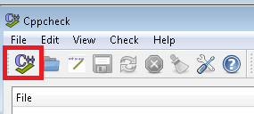
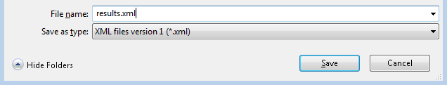

 [SCALe](index.md) / [Source Code Analysis Lab (SCALe)](Welcome.md) / [Audit Instructions](Audit-Instructions.md) / [Static Analysis Tools](Static-Analysis-Tools.md)
<!-- <legal> -->
<!-- SCALe version r.6.5.5.1.A -->
<!--  -->
<!-- Copyright 2021 Carnegie Mellon University. -->
<!--  -->
<!-- NO WARRANTY. THIS CARNEGIE MELLON UNIVERSITY AND SOFTWARE ENGINEERING -->
<!-- INSTITUTE MATERIAL IS FURNISHED ON AN "AS-IS" BASIS. CARNEGIE MELLON -->
<!-- UNIVERSITY MAKES NO WARRANTIES OF ANY KIND, EITHER EXPRESSED OR -->
<!-- IMPLIED, AS TO ANY MATTER INCLUDING, BUT NOT LIMITED TO, WARRANTY OF -->
<!-- FITNESS FOR PURPOSE OR MERCHANTABILITY, EXCLUSIVITY, OR RESULTS -->
<!-- OBTAINED FROM USE OF THE MATERIAL. CARNEGIE MELLON UNIVERSITY DOES NOT -->
<!-- MAKE ANY WARRANTY OF ANY KIND WITH RESPECT TO FREEDOM FROM PATENT, -->
<!-- TRADEMARK, OR COPYRIGHT INFRINGEMENT. -->
<!--  -->
<!-- Released under a MIT (SEI)-style license, please see COPYRIGHT file or -->
<!-- contact permission@sei.cmu.edu for full terms. -->
<!--  -->
<!-- [DISTRIBUTION STATEMENT A] This material has been approved for public -->
<!-- release and unlimited distribution.  Please see Copyright notice for -->
<!-- non-US Government use and distribution. -->
<!--  -->
<!-- DM19-1274 -->
<!-- </legal> -->

SCALe : Cppcheck
=================

Introduction
------------

Cppcheck is a static analysis tool for C and C++. It is free software
available under the GNU GPL. You can read more about Cppcheck at their
Sourceforge page:<http://cppcheck.sourceforge.net/>{.extlink}

Cppcheck scans can be run via a GUI or on the command-line. We'll be
outputting scan results as XML, as this is easy to import into SCALe.

Once you have the XML output, here are instructions for [Converting Text Output to ORG files](Back-End-Script-Design.md#properties).

Running a Scan
--------------

### Command Line

Suppose we want to scan some C sources located under the directory
`/home/user/project` and want to save the results to a file named
`results.xml`.  From the command-line (Ubuntu), we can run the
following:

```sh
cppcheck --enable="all" --language="c" --xml /home/user/project 2> results.xml
```

We enable all checkers (`--enable="all"`), indicate that the target
language is C (`--language="c"`), and output results as XML
(`--xml`). The XML is sent to `stderr`, so we redirect `stderr` to
capture this output.

On Windows, the command is very similar:

```sh
cd "C:\Program Files\Cppcheck" .\cppcheck.exe --enable="all" --language="c" --xml C:\MyProject 2> C:\myfolder\results.xml
```

If you are scanning a C++ project, you can change the `--language`
parameter to `--language="c++"`.  If you want to run checkers for both
languages, you can exclude the language parameter.

### GUI

Cppcheck has a graphical user interface (GUI) for Windows machines.
After installing Cppcheck on your Windows machine, open the Cppcheck
application. Click on the icon in the top left corner, and select the
directory you want to scan. The scan will start immediately.



When the scan is finished, export the results to XML by navigating to
the menu "File-&gt;Save Results to File".  Decide where to save your
results and ensure "Save as type" is set to "XML files version 1
(\*.xml)".  Click Save to generate the XML file:



------------------------------------------------------------------------

Attachments:
------------

 [SaveAs.png](attachments/SaveAs.png) (image/png)
 [cppcheck.png](attachments/cppcheck.png) (image/png)

------------------------------------------------------------------------

[](Fortify-SCA.md)
[](Static-Analysis-Tools.md)
[](Cppcheck.md)

