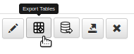

 [SCALe](index.md) / [Source Code Analysis Lab (SCALe)](Welcome.md) / [SCALe Quick Start Demo for Auditors](SCALe-Quick-Start-Demo-for-Auditors.md)
<!-- <legal> -->
<!-- SCALe version r.6.5.5.1.A -->
<!--  -->
<!-- Copyright 2021 Carnegie Mellon University. -->
<!--  -->
<!-- NO WARRANTY. THIS CARNEGIE MELLON UNIVERSITY AND SOFTWARE ENGINEERING -->
<!-- INSTITUTE MATERIAL IS FURNISHED ON AN "AS-IS" BASIS. CARNEGIE MELLON -->
<!-- UNIVERSITY MAKES NO WARRANTIES OF ANY KIND, EITHER EXPRESSED OR -->
<!-- IMPLIED, AS TO ANY MATTER INCLUDING, BUT NOT LIMITED TO, WARRANTY OF -->
<!-- FITNESS FOR PURPOSE OR MERCHANTABILITY, EXCLUSIVITY, OR RESULTS -->
<!-- OBTAINED FROM USE OF THE MATERIAL. CARNEGIE MELLON UNIVERSITY DOES NOT -->
<!-- MAKE ANY WARRANTY OF ANY KIND WITH RESPECT TO FREEDOM FROM PATENT, -->
<!-- TRADEMARK, OR COPYRIGHT INFRINGEMENT. -->
<!--  -->
<!-- Released under a MIT (SEI)-style license, please see COPYRIGHT file or -->
<!-- contact permission@sei.cmu.edu for full terms. -->
<!--  -->
<!-- [DISTRIBUTION STATEMENT A] This material has been approved for public -->
<!-- release and unlimited distribution.  Please see Copyright notice for -->
<!-- non-US Government use and distribution. -->
<!--  -->
<!-- DM19-1274 -->
<!-- </legal> -->

SCALe : Export Analysis Results from the Web Application
=========================================================

### Please note: This section has not been fully updated. Screenshots and usage information may be deprecated, and new features not introduced.

### See section [The SCALe Web App](The-SCALe-Web-App.md) for updated feature and use information

Prerequisites for This Step
---------------------------

1.  Access to a SCALe web app (you need the URL of the application plus
    a username and password, obtainable from your SCALe administrator)
2.  A supported web browser (currently Chrome, Firefox, or Internet
    Explorer)
3.  The dos2unix alerts from CERT Rosecheckers uploaded to the web
    application (as done in [Step 3](Upload-Source-Code-and-Analysis-Outputs.md))

After auditing alertConditions in the SCALe web app, you can export the
results of your audit to a SQLite or a CSV file. 
Note that **a SQLite export contains all the data from the project, but a 
CSV export does not** (e.g., a CSV export does not contain secondary alert
messages, may not contain all (or any) of the primary alert
messages, and may not include alert IDs). An exported CSV file is
often further analyzed to produce statistics for a report. To obtain a
CSV file, first go to the SCALe web app homepage. This can be reached
from any page by clicking the "Scale Analysis Tool" link at the top left
of the page.

Back on the homepage, click the **Export Tables** link for the desired
project. Below, we download a CSV file for the dos2unix audit.

Save the file to your local system, and unzip it, to produce a folder
of CSV files.  You can now open these files in a spreadsheet tool such
as Excel. The `display.csv` file contains information about every
alert in the project: the tool that produced the alert, the file and
line number where the alert occurs, the message from the alert, and so
on. (However, as mentioned above, a SQLite export contains all the
data from a project ***but a CSV export does not***.) See [this
table](The-SCALe-Web-App.md#alertcondition-viewer-fields) for a detailed
explanation of all the alertCondition fields.

This completes our demo of the SCALe process.

------------------------------------------------------------------------

Attachments:
------------

 [ScaleLink.png](attachments/ScaleLink.png) (image/png)\
 [ExportTables.png](attachments/ExportTables.png) (image/png)
