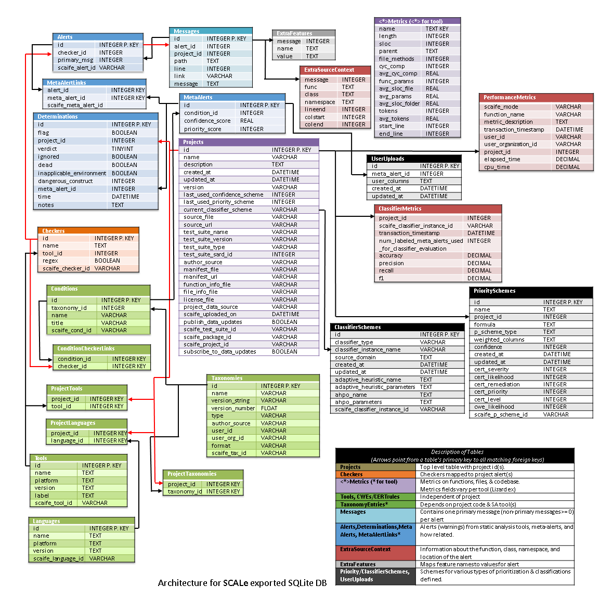

 [SCALe](index.md) / [Source Code Analysis Lab (SCALe)](Welcome.md)
<!-- <legal> -->
<!-- SCALe version r.6.2.2.2.A -->
<!--  -->
<!-- Copyright 2020 Carnegie Mellon University. -->
<!--  -->
<!-- NO WARRANTY. THIS CARNEGIE MELLON UNIVERSITY AND SOFTWARE ENGINEERING -->
<!-- INSTITUTE MATERIAL IS FURNISHED ON AN "AS-IS" BASIS. CARNEGIE MELLON -->
<!-- UNIVERSITY MAKES NO WARRANTIES OF ANY KIND, EITHER EXPRESSED OR -->
<!-- IMPLIED, AS TO ANY MATTER INCLUDING, BUT NOT LIMITED TO, WARRANTY OF -->
<!-- FITNESS FOR PURPOSE OR MERCHANTABILITY, EXCLUSIVITY, OR RESULTS -->
<!-- OBTAINED FROM USE OF THE MATERIAL. CARNEGIE MELLON UNIVERSITY DOES NOT -->
<!-- MAKE ANY WARRANTY OF ANY KIND WITH RESPECT TO FREEDOM FROM PATENT, -->
<!-- TRADEMARK, OR COPYRIGHT INFRINGEMENT. -->
<!--  -->
<!-- Released under a MIT (SEI)-style license, please see COPYRIGHT file or -->
<!-- contact permission@sei.cmu.edu for full terms. -->
<!--  -->
<!-- [DISTRIBUTION STATEMENT A] This material has been approved for public -->
<!-- release and unlimited distribution.  Please see Copyright notice for -->
<!-- non-US Government use and distribution. -->
<!--  -->
<!-- DM19-1274 -->
<!-- </legal> -->

SCALe : Exported Database Design
=================================

-   [Introduction and Processes](#introduction-and-processes)
-   [Database Format Diagram](#database-format-diagram)
-   [Tables:](#tables)
-   [Fusion](#fusion)
-   [Database Tables](#database-tables)
    -   [Projects](#projects)
    -   [Messages](#messages)
    -   [Alerts](#alerts)
    -   [Checkers](#checkers)
    -   [Taxonomies](#taxonomies)
    -   [Conditions](#conditions)
    -   [ConditionCheckerLinks](#conditioncheckerlinks)
    -   [MetaAlerts](#metaalerts)
    -   [Determinations](#determinations)
    -   [MetaAlertLinks](#metaalertlinks)
    -   [Tools](#tools)
    -   [ExtraSourceContext](#extrasourcecontext)
    -   [ExtraFeatures](#extrafeatures)
    -   [PrioritySchemes](#priorityschemes)
    -   [ClassifierSchemes](#classifierschemes)
    -   [UserUploads](#useruploads)
    -   [VERDICT](#verdict)
    -   [LEVEL](#level)

### Introduction and Processes

This page describes the format of an SQLite database for an exported
project. These databases are exported by the 'Export Database' button in
the SCALe web app.

For the following discussion, all paths refer to paths in
the `$SCALE_HOME/scale.app` folder.

This same format is used in several other places as well.
The `scripts/digest_alerts.py` script (see [SCALe back-end Scripts](Back-End-Script-Design.md) for more information)
produces this format of database. This format is also used to store
backup copies of the project data in the `backup` folder. Finally, this
format is also used for the `db/external.sqlite3` database when it is
used. This file is part of the import and export process for SCALe
projects.

When a database is created, the web app delegates database creation to
the `digest_alerts.py` script. The database it creates is stored in
`db/external.sqlite3. If it is not already present, the script will
also initialize db/persistent.sqlite3 with language/tool details that
are shared across all projects.`The data is also copied to the
`backup` folder. Then it is assimilated into the
`db/development.sqlite3` database.

Similarly, when the user selects the `Export Database` button, the web
app copies the appropriate database from the `backup` folder and stores
it in `db/external.sqlite3` folder. It updates this database with any
changes the auditors may have made (adding determinations, notes, or
editing the project name or description). Finally, it makes
the `external.sqlite3` file available for download.

NOTE: **Whenever the exported database design is modified, developers
should consider if the sanitizer** (see [Sanitizer](Sanitizer.md))
**needs to also be updated**. For example, new fields may possibly be
sensitive (and should be sanitized).

### Database Format Diagram

The PowerPoint slide used to make the figure above is
[attached](attachments/DataBaseFormat.pptx) to this page.

This is a diagram of database tables. Each table has a key which is a
set of one or more fields that are unique for each record in the table.
When there is only one such field, it is marked PRIMARY KEY (or P. KEY).
When there are two or more fields, they are marked KEY.

Some fields serve as foreign keys, they link to a primary key in another
table. In these cases, an arrow runs between tables from the primary key
to the foreign key.

The following tables for the new architecture are only partially
implemented in the current SCALe release: ConfidenceScores and
ClassificationSchemes.

The &lt;\*&gt; Metrics table schema varies for each metrics tool. Each
metrics tool outputs values for a different set of fields, which vary
greatly in number. The schema shown in the table in the figure is for
the Lizard tool, and thus the table is named LizardMetrics. SCALe
versions 2.0 and newer will create metrics tables for output from 3
tools: Lizard, CCSM, and Understand (tables named LizardMetrics,
CCSMMetrics, and UnderstandMetrics respectively).

Some of the tables have an `id` field as the first field. This is an
integer that uniquely identifies each record in the table. The tables
can refer to each others' records using the `id` field or, for the
`Rules` and `Checkers` tables, using their first field, which is a text
field named `'name'`. For example, each alert (e,g., each record in
the `Alerts` table) has a `primary_msg` field. This indicates which
message (eg `record` in the `Messages` table) is the primary message
associated with the alert. In the tables below, the `Key` column
indicates the table name (if any) whose `id` or `name` field corresponds
with the entry for the field in the same row (in the first column). In
the `Alerts` table below, the `primary_msg` corresponds with the
`id` field of the `Messages` table. Likewise, the `alert` field in
the `Messages` table associates each message with a single
alert. Both of these fields exist because there may be more than
one message per alert. However, one message always serves as the
'primary' message, which distinguishes it from other messages associated
with the alert.

### Tables:

* **Projects**: Holds information about a SCALe project. Contains only one record per database.
* **MetaAlerts**: Links to a condition (CERT rule or CWE), path,line. Also stores latest-calculated value (if any has been calculated) for meta-alert priority and/or confidence that the meta-alert is true (confidence as calculated by a classifier).
* **Determinations**: Holds history of determinations per meta-alert,
including primary and supplemental verdicts, notes, flag, and timestamp
(latter includes date). This data will be useful for developing
classifiers using features including determination changes.
Determination and notes fields are in accordance with our paper [Static Analysis Alert Audits: Lexicon & Rules](https://resources.sei.cmu.edu/library/asset-view.cfm?assetID=484185){.extlink}
* **ConditionsCheckerLinks**: Links checker ids with condition ids
(which previously only supported CERT rule IDs). This manages the
many-to-many relationship between checkers and conditions.
* **MetaAlertLinks**: Links alert ids with meta-alert
ids. This manages the many-to-many relationship between alerts
and meta-alerts.
* **Alerts**: Alerts map to a single primary
message (and zero or more secondary messages), and each has a MetaAlert
entry for each condition it maps to, regardless of whether it is a fused
alert.
* **Taxonomies**: Contains the name, version, and meta-information
about the taxonomies, which contain conditions in the Conditions table.
Additionally there is the "format" field which is a JSON-encoded
string of a list of additional field names in the formatted_data column
of Conditions. These varying fields are from differing sources (e.g.  CERT, CWE).
* **Conditions**: Contains 2 fields common to CWE and CERT rules.
"name" contains the short name (e.g., INT31-C) and title contains the
title (everything after the short name and colon on the title of the
webpage for a CWE, and everything after the short name and period for
a CERT guideline). E.g.,
    + For INT31-C, the title is "Ensure that integer conversions do not result in lost or misinterpreted data"
    + For CWE-190, the title is "Integer Overflow or Wraparound"
* **PrioritySchemes**: Records schemes for various types of
    prioritization per classification scheme, with different weights for
    commonly considered factors, field for weighting a user-added
    factor, and field for formula for prioritization. To support
    taxonomy extensibility, at project creation, we will automatically
    add an entry in this table for the weight of each taxonomy-specific
    table’s fields (e.g., CERTrules.severity,
    CERTrules.likelihood,CWEs.likelihood). We will enable user uploads
    of user-specific metrics to be associated with a weight in the
    prioritization scheme.
*   **ClassifierSchemes**: Records classification schemes, including
    type (if any) of automated hyper-parameter generation used prior to
    classifier development.
*   **UserUploads**: Enables the user to upload custom field names to be
    used in the prioritization of alerts.
*   **Tools**: All available tools (with versions) known to the SCALe application
*   **ProjectTools**: Analysis tools used in the project.
*   **Languages**: All code languages (with versions) known to the application.
*   **ProjectLanguages**: Code languages specifically relevant to the project.

Note: Secondary Messages are not shown, but they exist in the new
architecture as in the previous architecture. Secondary Messages entries
use the primary Message index to map to secondary messages.
Specifically: Secondary Messages go into the same Messages table, but
their `Messages.id` value (integer
primary key) is not the value in any Alerts.primary_msg field.
Secondary messages have the same value (integer) in Messages.alert
as the primary messages.

**Example of multiple conditions**: Static analysis (anonymized) Tool
A's checker I_Overflow maps to CERT rules INT30-C and INT32-C

Example of fusion: If Tool A and Tool B each identify an integer
overflow on line 5 of a file, those two alertConditions get fused
automatically.

The GUI shows meta-alerts, which saves the auditor time (over auditing
only un-fused alertConditions). A 'meta-alert' refers to a fused alertCondition for
alerts that have been fused, and is a placeholder for possible future
fusion for single alertConditions that currently have no other alertConditions to fuse
with. Fused alertConditions can also be measured more accurately because they
account for redundant alertConditions issued by the same tool or distinct
tools. Our verdicts apply to fused alertConditions, and can apply to all the
alerts in a fused alertCondition. Therefore, we now associate verdicts with
fused alertConditions, rather than alerts.

### Fusion

The architecture enables associating a single checker with multiple
conditions (meaning to multiple `Conditions.id` (s).
(Previously, SCALe limited mappings to only one rule per checker.) If
two alerts match in path and line number, a meta-alert should be
created for each checker's matched taxonomy items (e.g., each CERT rule,
each CWE weakness, etc.) and if they share one of these taxonomy items
they will share a meta-alert.

There is a possibility that for some tools, alertConditions that differ in
line number should still be fused. This might occur, for instance, if
one tool offsets their line numbers from 0 while the other offsets from
1.

Detail:

- For a given `MetaAlerts.id`, there can be multiple
`MetaAlertLinks` entries (all with same
`MetaAlertLinks.meta_alert_id`, but different
`MetaAlertLinks.alert`      ).

    +  For every `MetaAlerts.id`,  there is at least one (different
    integer)  `Alerts.id`.
    +   For a  given `MetaAlerts.id`, there *may* be multiple
    `Alerts.id `(s)

-   For a given `Alerts.id`, there *may* be multiple
    `MetaAlerts.id `(s).
-   A `Alerts.id` is unique to a given alert from a tool (uniquely
    an alert for a specific      line, file, taxonomyID (e.g., rule or
    CWE), **AND** message text).
-   Sometimes multiple tools warn about the same flaw (e.g., CWE-190) on
    the same line of the same file: they have the      same
    `MetaAlerts.id`, but different `Alert.id.`
-   Sometimes, one tool's alert maps to multiple
    `Conditions.id `(s).      (E.g., one alert from one tool could
    map to both INT31-C and CWE-190.) In that case, one `Alerts.id`
    is associated with multiple
    `MetaAlerts.id` (s) (they are
    different integers, but they are associated in the
    `MetaAlertLinks` table)

If a second tool provides an alert about the same flaw (both alerts are for the same `Conditions.id` on the
same line of the same file, then a new entry must be made in the `MetaAlertLinks` table, with the existing `MetaAlerts.id`, and the particular tool's alert` Alerts.id `entered for
`MetaAlertLinks.alert` (for different tools, the `Alerts.id` is different).

So, for 2 alerts from different tools, there will be 2 entries in
the `MetaAlertLinks` table:

-   `MetaAlertLinks.alert`      =
    `Alerts.id      `for tool \#1, and
    `MetaAlertLinks.meta_alert_id`      =
    `MetaAlerts.id      `(for the shared metaalert)
-   `MetaAlertLinks.alert`      =
    `Alerts.id      `for tool \#2, and
    `MetaAlertLinks.meta_alert_id`   = `MetaAlerts.id      `(for the shared metaalert)

NOTE: Some tools will produce alerts that differ only in their
"secondary messages" (which can be viewed by selecting the hyperlinked
"More" text). Those alertConditions will be fused, but separate rows will display
under the fused alertConditions for the unique alertConditions (that differ only in
secondary messages).

### Database Tables

The database tables are designed as follows. (Definitions of possible
values in green font, in tables that exist only in the wiki, NOT in the
database. VERDICT and LEVEL are not SQLite types; instead they are
labels used only here to help developers understand what values are
acceptable.):

### **Projects**

| column_name | type | notes |
|---|:---:|---------------------------|
| id | INTEGER | Will always be 0 for exported databases |
| name | VARCHAR | |
| description | TEXT | |
| created_at | DATETIME | |
| update_at | DATETIME | |
| version | VARCHAR | Currently `SCALe_research_db_6` |
| last\_used\_confidence\_scheme | INTEGER | The id of the last ClassifierScheme the stored a confidence_score |
| last\_used\_priority\_scheme | INTEGER | The id of the last PriorityScheme that stored a priority_score |
| current\_classifier\_scheme | VARCHAR | The name of the current ClassifierScheme |
| source_file | VARCHAR | filename containing source code archive |
| source_url | VARCHAR | URL from where source code archive was possibly downloaded |
| test_suite_name | VARCHAR | Name if this is a test suite |
| test_suite_version | VARCHAR | Version if this is a test suite |
| test_suite_sard_id | INTEGER | NIST SARD id of the test suite |
| author_source | VARCHAR | Organization of test suite creator |
| manifest_file | VARCHAR | Manifest file (test suite) |
| manifest_url | VARCHAR | Manifest download URL (test suite) |
| function_info_file | VARCHAR | Function information file (test suite) |
| file_info_file | VARCHAR | File information file (test suite) |
| license_file | VARCHAR | Name of license file (test suite) |
| project_data_source | VARCHAR | Specifies whether the project was originally created locally, downloaded as a SCAIFE Project, or downloaded as a SCAIFE Package |
| scaife_uploaded_on | DATETIME | If/When the project was uploaded to SCAIFE |
| publish_data_updates | BOOLEAN | Specifies whether all local changes should be automatically uploaded to SCAIFE |
| subscribe_to_data_updates | BOOLEAN | Specifies whether to automatically receive data updates from SCAIFE  |
| scaife_test_suite_id | VARCHAR | |
| scaife_package_id | VARCHAR | |
| scaife_project_id | VARCHAR | |

### **Messages**

| column_name | type | notes |
|---|:---:|---------------------------|
| id | INTEGER | See scale.app/scripts/**saorg2sql.py**: `Messages.id` = Z * 100 + TOOL\_ID + PREVIOUS\_DIAGNOSTICS|
| project_id | INTEGER ||
| alert | INTEGER ||
| path | TEXT ||
| line | INTEGER ||
| link | VARCHAR | Not used in exported database |
| message | TEXT ||

### **Alerts**

| column_name | type | notes |
|---|:---:|---------------------------|
| id | INTEGER | See scale.app/scripts/**saorg2sql.py**: `Messages.id` = Z * 100 + TOOL\_ID+ PREVIOUS\_DIAGNOSTICS |
| checker_id | INTEGER | |
| primary_msg | INTEGER | |
| scaife_alert_id | VARCHAR| alert id from SCAIFE |

### **Checkers**

| column_name | type |
|---|:---:|
| id | INTEGER |
| name | TEXT |
| tool | INTEGER |
| regex | BOOLEAN |
| scaife_checker_id | VARCHAR |

### **Taxonomies**
| column_name | type |
|---|:---:|
| id | INTEGER |
| name | VARCHAR |
| version_string | VARCHAR |
| version_number | FLOAT |
| type | VARCHAR |
| author_source | VARCHAR |
| user_id | VARCHAR |
| user_org_id | VARCHAR |
| format | VARCHAR |
| scaife_tax_id | VARCHAR |

### **Conditions**

| column_name | type |
|---|:---:|
| id | INTEGER |
| taxonomy_id | INTEGER |
| name | VARCHAR |
| title | VARCHAR |
| formatted_data | VARCHAR |
| scaife_cond_id | VARCHAR |

### **ConditionCheckerLinks**

| column_name | type | notes |
|---|:---:|---------------------------|
| condition_id | INTEGER | Per digest_alerts.py, this id starts at a taxonomy number times 1000
| checker_id | INTEGER |

### **MetaAlerts**

| column_name | type | notes |
|---|:---:|---|
| id | INTEGER | Starts at 0, increments by 1. |
| condition_id | INTEGER | |
| confidence_score | REAL | Latest-calculated classifier confidence score |
| priority_score | INTEGER | Latest-calculated alert priority score |
| scaife_meta_alert_id | VARCHAR | meta alert id from SCAIFE |
| code_language | VARCHAR | |

### **Determinations**

| column_name | type | notes |
|---|:---:|---|
| id | INTEGER | Starts at 0, increments by 1. |
| project_id | INTEGER | |
| meta_alert | INTEGER | |
| time | DATETIME | |
| verdict | TINYINT | |
| flag | BOOLEAN | |
| notes | TEXT | |
| ignored | BOOLEAN | |
| dead | BOOLEAN | |
| inapplicable_environment | BOOLEAN | |
| dangerous_construct | INTEGER | |

Every MetaAlert will have at least one Determination, which will be created at database creation time, and will have default values.

### **MetaAlertLinks**

| column_name | type |
|---|:---:|
| alert | INTEGER |
| meta_alert_id   | INTEGER |

### **Tools**

| column_name | type |
|---|:---:|
| id | INTEGER |
| name | VARCHAR |
| platform | VARCHAR |
| version | VARCHAR |
| label | VARCHAR |
| scaife_tool_id | VARCHAR | |

### **Languages**

| column_name | type |
|---|:---:|
| id | INTEGER |
| name | VARCHAR |
| platform | VARCHAR |
| version | VARCHAR |
| scaife_language_id | VARCHAR | |

### **ProjectLanguages**

| column_name | type |
|---|:---:|
| project_id | INTEGER |
| language_id | INTEGER | |

### **ProjectTools**

| column_name | type |
|---|:---:|
| project_id | INTEGER |
| tool_id | INTEGER | |

### **ProjectTaxonomies**

| column_name | type |
|---|:---:|
| project_id | INTEGER |
| taxonomy_id | INTEGER | |

### **ExtraSourceContext**

| column_name | type |
|---|:---:|
| message | INTEGER |
| func | TEXT |
| class | TEXT |
| namespace | TEXT |
| lineend | INTEGER |
| colstart | INTEGER |
| colend | INTEGER |

### **ExtraFeatures**

| column_name | type |
|---|:---:|
| message | INTEGER |
| name | TEXT |
| value | TEXT |

### **PrioritySchemes**

| column_name | type | notes |
|---|:---:|---|
| id | INTEGER | |
| name | VARCHAR | |
| project_id | INTEGER  | |
| formula | TEXT | |
| weighted_columns** | TEXT | |
| confidence | INTEGER | |
| created_at | DATETIME | |
| updated_at | DATETIME | |
| cert_severity | INTEGER | |
| cert_likelihood | INTEGER | |
| cert_remediation | INTEGER  | |
| cert_priority | INTEGER  | |
| cert_level | INTEGER  | |
| cwe_likelihood | INTEGER  | |
| scaife_p_scheme_id | VARCHAR | priority scheme id from SCAIFE |
| p_scheme_type | VARCHAR | priority scheme save type for SCAIFE |

### **ClassifierSchemes**

| column_name | type | notes |
|---|:---:|---|
| id | INTEGER | |
| classifier_instance_name | VARCHAR | |
| classifier_type | VARCHAR | |
| source_domain | TEXT | |
| created_at | DATETIME | |
| updated_at | DATETIME | |
| adaptive_heuristic_name | TEXT | |
| adaptive_heuristic_parameters** | TEXT | |
| ahpo_name | TEXT  | |
| ahpo_parameters** | TEXT | |
| scaife_classifier_instance_id | VARCHAR | classifier scheme instance id from SCAIFE |

**field names vary and are dynamically updated based on user input.

### **UserUploads**

| column_name | type | notes |
|---|:---:|---|
| id | INTEGER | |
| meta\_alert\_id | INTEGER | |
| user_columns | TEXT | JSON formatted |
| created_at | DATETIME | |
| updated_at | DATETIME | |

NOTE: data only populated if user uploads CSV with appropriate data

### PerformanceMetrics

| column_name | type | notes |
|---|:---:|---------------------------|
| id | INTEGER | |
| scaife_mode | VARCHAR(255) | The mode SCALe is being used in when the metric was collected (i.e., "Demo", "Scale-only", or "SCAIFE-connected")|
| function_name | VARCHAR(255) | The function whose performance is being measured |
| metric_description | TEXT | Contains more information about an individual performance metric |
| transaction_timestamp | DATETIME | When the metric was collected |
| user_id | VARCHAR(255) | |
| user_organization_id | VARCHAR(255) | |
| project_id | INTEGER | |
| elapsed_time | DECIMAL | The actual time taken for the transaction to complete (i.e., the wall-clock time) |
| cpu_time | DECIMAL  | The exact amount of time that the CPU spent processing data for the transaction |

### ClassifierMetrics

| column_name | type | notes |
|---|:---:|---------------------------|
| id | INTEGER | |
| project_id | INTEGER | |
| scaife_classifier_instance_id | VARCHAR(255) | classifier scheme instance id from SCAIFE |
| transaction_timestamp | DATETIME | When the metric was collected |
| num_labeled_meta_alerts_used_for_classifier_evaluation | INTEGER  | For example, with a total labeled dataset of 100 meta-alerts, if 70 of them were used to train the classifier, then there would be 30 labeled meta-alerts used for classifier evaluation. These labeled meta-alerts come from the dataset the classifier is run on, which may or may not be the dataset used to create the classifier.  This dataset typically does not include any labeled data received since classifier creation. |
| accuracy | DECIMAL | The fraction of correct predictions made by the classifier |
| precision | DECIMAL | The proportion of positive identifications that were actually correct |
| recall | DECIMAL | The proportion of true positives that were correctly identified  |
| f1 | DECIMAL | An overall measure of a classifier’s accuracy that combines precision and recall |

### VERDICT

  Value   Meaning
  ------- ------------
  0       Unknown
  1       Ignored
  2       False
  3       Suspicious
  4       True

### LEVEL

  Value   Meaning
  ------- ---------
  1       Low
  2       Medium
  3       High

------------------------------------------------------------------------

Attachments:
------------

[DataBaseFormat.png)](attachments/DataBaseFormat.png)
(image/png)

[EnhancedScaleDiagram\_20180920v2.pptx](attachments/DataBaseFormatDiagram.pptx)
(application/vnd.openxmlformats-officedocument.presentationml.presentation)\
