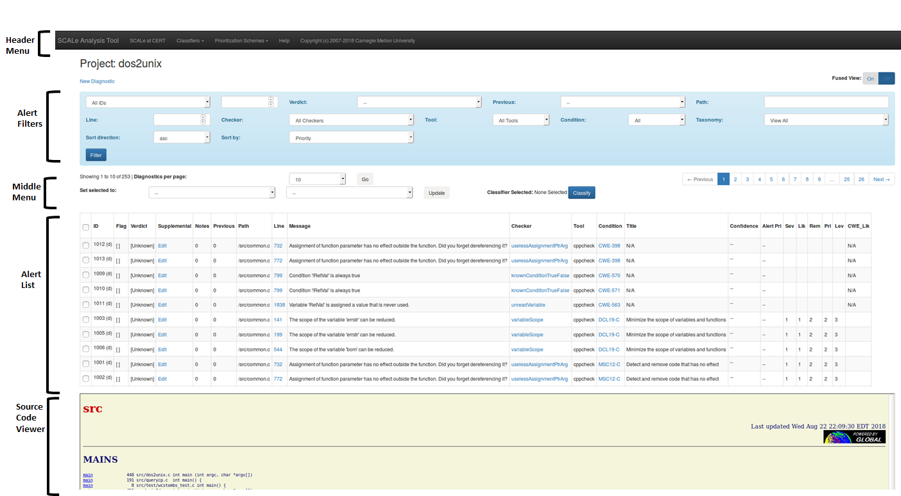

 [SCALe](index.md) / [Source Code Analysis Lab (SCALe)](Welcome.md) / [SCALe Quick Start Demo for
    Auditors](SCALe-Quick-Start-Demo-for-Auditors.md)
<!-- <legal> -->
<!-- SCALe version r.6.7.0.0.A -->
<!--  -->
<!-- Copyright 2021 Carnegie Mellon University. -->
<!--  -->
<!-- NO WARRANTY. THIS CARNEGIE MELLON UNIVERSITY AND SOFTWARE ENGINEERING -->
<!-- INSTITUTE MATERIAL IS FURNISHED ON AN "AS-IS" BASIS. CARNEGIE MELLON -->
<!-- UNIVERSITY MAKES NO WARRANTIES OF ANY KIND, EITHER EXPRESSED OR -->
<!-- IMPLIED, AS TO ANY MATTER INCLUDING, BUT NOT LIMITED TO, WARRANTY OF -->
<!-- FITNESS FOR PURPOSE OR MERCHANTABILITY, EXCLUSIVITY, OR RESULTS -->
<!-- OBTAINED FROM USE OF THE MATERIAL. CARNEGIE MELLON UNIVERSITY DOES NOT -->
<!-- MAKE ANY WARRANTY OF ANY KIND WITH RESPECT TO FREEDOM FROM PATENT, -->
<!-- TRADEMARK, OR COPYRIGHT INFRINGEMENT. -->
<!--  -->
<!-- Released under a MIT (SEI)-style license, please see COPYRIGHT file or -->
<!-- contact permission@sei.cmu.edu for full terms. -->
<!--  -->
<!-- [DISTRIBUTION STATEMENT A] This material has been approved for public -->
<!-- release and unlimited distribution.  Please see Copyright notice for -->
<!-- non-US Government use and distribution. -->
<!--  -->
<!-- DM19-1274 -->
<!-- </legal> -->

SCALe : Inspect AlertConditions to Adjudicate for Conditions
=======================================================================

This step involves inspecting alertConditions to make adjudications about the specified conditions. A condition is a type of code flaw listed in a taxonomy of code flaws, such as CWE-190 or INT31-C, as defined on our [Terms and Definitions](Terms-and-Definitions.md) page.

### Please note: This section has not been fully updated. Screenshots and usage information may be deprecated, and new features not introduced.

### See section [The SCALe Web App](The-SCALe-Web-App.md) for updated feature and use information.

Prerequisites for This Step
---------------------------

1.  access to a SCALe web app (you need the URL of the application plus
    a username and password, obtainable from your SCALe administrator)
2.  a supported web browser (currently Chrome, Firefox, or Internet
    Explorer)
3.  the dos2unix alerts from CERT Rosecheckers uploaded to the web app (as
    done in the [previous step](Upload-Source-Code-and-Analysis-Outputs.md))

AlertCondition Viewer
------------

After creating the dos2unix project, you are redirected to the alertCondition
viewer page. This page allows you to view all of the alertConditions produced by
the static analysis tools. In fused view (fused or unfused selected by top-right toggle), 
you will see alertConditions that map to the same meta-alert as a yellow-background meta-alert row, 
which you can select and expand to see the information for each of
the alertConditions that map to it. (Definitions of alertCondition and meta-alert 
are on [Terms and Definitions](Terms-and-Definitions) page.)
You can filter the alertConditions and meta-alerts using various
criteria. 

Information pertinent to auditing is provided for each
alertCondition/meta-alert. For example, the location of the alertCondition in the source code is
provided. The source code associated with each alertCondition can also be viewed
in the browser. A link is provided to the condition (CWE or CERT Secure Coding rule)
associated with the alertCondition. The task of the auditor is to determine if
the alertCondition is indeed a violation of the specified condition.

Here is a graphical overview of the alertCondition viewer page. (NOTE: The labels on the left are outdated and need 
to be updated. Currently they say 'Alert List' and 'Alert Filters', those should be 'AlertCondition / Meta-alert list' 
and 'AlertCondition/Meta-Alert Filters'.)

The **AlertConditions Filters** toolbar allows you to filter the displayed alerts
by various criteria. In the AlertCondition Filters section, **select the Fused View "On"**, for efficient meta-alert auditing.

The **alertCondition List** section displays the diagnostics. The meta-alert row
for a fused alertCondition is shown with a yellow-colored background, and in the
ID column the meta-alert ID is displayed. When editable fields (or the
hyperlinked line number) are selected, the fused alertCondition expands so the
separate alerts show (with aqua-colored background) in rows below the
meta-alert row and those rows show the alert (or alertCondition) ID in the ID column.
Separate rows of fused alertConditions may be otherwise identical but contain
different secondary message sets (visible in popup windows if the user
selects the hyperlinked "More" or "Secondary Message Set" text).
Meta-alerts that contain only a single unfused alertCondition have a
white-colored background, do not expand, and show the alert (or alertCondition) ID in
the ID column.

The **Source Code Viewer** section displays the code associated with a
given meta-alert (a single alertCondition or fused alertConditions). [This table](The-SCALe-Web-App.md#alert-viewer-fields)
describes the fields displayed in the alertCondition List section (not all of
these are visible in the screenshot above).

Example Auditing of AlertConditions / Meta-alerts
--------------------------

Audit determinations encompass primary verdicts and supplemental
verdicts, and it is often useful to enter comments in a notes field. The
auditing lexicon and auditing rules that should be used are described in
our IEEE Secure Development paper,
[Static Analysis Alert Audits: Lexicon & Rules](http://resources.sei.cmu.edu/library/asset-view.cfm?assetid=484185){.extlink}.
That paper is attached to this manual:
[audit-rules-lex-secdev-final-ieee.pdf](attachments/audit-rules-lex-secdev-final-ieee.pdf).

Let's look at some alertConditions from dos2unix results, and decide whether there is a violation of 
the specified CERT Coding rule in each. If the answer is yes, we've found a **true
positive**. If the answer is no, we've found a **false positive**.

### Audit Example 1

In the filters section, set the "Rule" field to STR31-C, then click the
**Filter** button.

This filter should produce 10 alertConditions, shown below. We will focus on the
alertCondition that occurs on line 460. (**NOTE: the screenshots below are slightly outdated and do not show all the current fields like Notes or Supplemental, which are shown in the large graphical overview figure above.**)

STR31-C is a CERT Secure Coding rule that states: "Guarantee that
storage for strings has sufficient space for character data and the null
terminator." If a buffer is used to store a string that exceeds its
bounds, the program may be susceptible to a buffer overflow attack.
Let's inspect the source code to determine if this alertCondition is a true
positive. Click the hyperlinked line number (460) from the alert. The
source code viewer will show the suspect source code line, highlighted
in yellow.

A call to the function `strcpy` occurs on line 460, storing the string
constant `"dos2unix"` into the buffer named `progname`. Is the buffer
large enough to hold this string and the accompanying null terminator?
We can see from its declaration on line 451 that the `progname` buffer
can store up to 9 elements. The string `"dos2unix"` has only 8
characters, therefore this string plus the null terminator perfectly fit
into the buffer. Therefore, this alertCondition is a false positive. You should
set the **Verdict** of the alertCondition to **False**, in the alertCondition List, by
clicking the Verdict field and selecting **False**. The first click
converts the raw verdict text into a drop-down selector.

The next click activates the drop-down selector. You then select the
appropriate verdict from the drop-down. (**NOTE: screenshot below is out of date. Options are actually: Unknown, Complex, Dependent, False,True**)

The alertCondition now has the desired verdict. Verdicts apply at the meta-alert level. So, whether the adjudicator made the verdict with fused-view or unfused-view, all alertConditions that map to this same meta-alert now have that same verdict.

### Audit Example 2

Let's look at another alertCondition. In the filter section, set the
"Condition" field to EXP34-C. Then click the **Filter** button. **NOTE: screenshot below is out of date. Field is 'condition' not 'Rule'**

You should see the following three alertConditions. We will focus on the
alertCondition specifying line 489. (**NOTE: screenshot below does not show all the current fields like Notes or Supplemental, which are shown in the large graphical overview figure above.**)

CERT Secure Coding rule EXP34-C states: "Do not dereference null
pointers." Dereferencing a null pointer is undefined behavior, and may
result in abnormal program termination. In rare cases, more serious
exploits are possible.

Let's look at the source code for this alertCondition by clicking the
hyperlinked line number, 489.

The function `malloc` is used to dynamically allocate a chunk of memory
for a struct. A pointer to this memory is stored in a local variable,
`pFlag`. This pointer is then dereferenced to initialize the fields of
the struct. However, a call to `malloc` may return a null pointer, in
the case when memory allocation fails. The code does not check for this
possibility and may result in a null pointer dereference. Therefore,
this alertCondition is a true positive. You should set the **Verdict** of
the alertCondition to **True** in the alertCondition viewer. (NOTE: screenshot
below does not show all the current fields like Notes or
Supplemental, which are shown in the large graphical overview figure
above.)

------------------------------------------------------------------------

Attachments:
------------

 [VerdictSelected.png](attachments/VerdictSelected.png) (image/png)\
 [VerdictOptions.png](attachments/VerdictOptions.png) (image/png)\
 [VerdictSelector.png](attachments/VerdictSelector.png) (image/png)\
 [SourceCodeLine460.png](attachments/SourceCodeLine460.png) (image/png)\
 [Line460Display.png](attachments/Line460Display.png) (image/png)\
 [RuleFilter.png](attachments/RuleFilter.png) (image/png)\
 [VerdictLine.png](attachments/VerdictLine.png) (image/png)\
 [AlertSourceCode.png](attachments/AlertSourceCode.png) (image/png)\
 [AlertConditions.png](attachments/AlertConditions.png) (image/png)\
 [RuleField.png](attachments/RuleField.png) (image/png)\

[AlertConditionsViewer.png](attachments/AlertConditionsViewer.png) (image/png)\

[audit-rules-lex-secdev-final-ieee.pdf](attachments/audit-rules-lex-secdev-final-ieee.pdf)
(application/pdf)\
