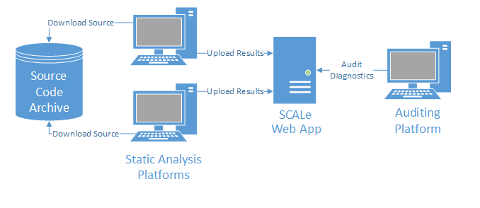

 [SCALe](index.md) / [Source Code Analysis Lab (SCALe)](Welcome.md)
<!-- <legal> -->
<!-- SCALe version r.6.7.0.0.A -->
<!--  -->
<!-- Copyright 2021 Carnegie Mellon University. -->
<!--  -->
<!-- NO WARRANTY. THIS CARNEGIE MELLON UNIVERSITY AND SOFTWARE ENGINEERING -->
<!-- INSTITUTE MATERIAL IS FURNISHED ON AN "AS-IS" BASIS. CARNEGIE MELLON -->
<!-- UNIVERSITY MAKES NO WARRANTIES OF ANY KIND, EITHER EXPRESSED OR -->
<!-- IMPLIED, AS TO ANY MATTER INCLUDING, BUT NOT LIMITED TO, WARRANTY OF -->
<!-- FITNESS FOR PURPOSE OR MERCHANTABILITY, EXCLUSIVITY, OR RESULTS -->
<!-- OBTAINED FROM USE OF THE MATERIAL. CARNEGIE MELLON UNIVERSITY DOES NOT -->
<!-- MAKE ANY WARRANTY OF ANY KIND WITH RESPECT TO FREEDOM FROM PATENT, -->
<!-- TRADEMARK, OR COPYRIGHT INFRINGEMENT. -->
<!--  -->
<!-- Released under a MIT (SEI)-style license, please see COPYRIGHT file or -->
<!-- contact permission@sei.cmu.edu for full terms. -->
<!--  -->
<!-- [DISTRIBUTION STATEMENT A] This material has been approved for public -->
<!-- release and unlimited distribution.  Please see Copyright notice for -->
<!-- non-US Government use and distribution. -->
<!--  -->
<!-- DM19-1274 -->
<!-- </legal> -->

SCALe : Installing SCALe
=========================

This page serves as a guide for users installing SCALe in their
organization.

-   [Installation Overview](#installation-overview)
-   [Source Code Archive](#source-code-archive)
-   [Static Analysis Platform](#static-analysis-platform)
-   [Auditing Platform](#auditing-platform)
-   [SCALe Web App Server](#scale-web-app-server)
    -   [Note on Web Servers](#note-on-web-servers)
    -   [Notes on Installing/Configuring VMs on Ubuntu based Linux Distributions](#notes-on-installingconfiguring-vms-on-ubuntu-based-linux-distributions)
    -   [Notes on expanding disk size of the VM on a machine without a non-USB DVD drive](#notes-on-expanding-disk-size-of-the-vm-on-a-machine-without-a-non-usb-dvd-drive)

Installation Overview
---------------------

The following diagram illustrates the components of a simple SCALe
installation.



The following table provides a brief description of the components in
this diagram. In the subsequent sections, we describe each component in
more detail:

  Component                  Description
  -------------------------- -------------------------------------------------------------
  Source code archive        Stores a read-only copy of the source code
  Static analysis platform   Builds the source code and runs static analyzers against it
  Auditing platform          Connects to the web app to audit alerts
  SCALe web server           Hosts the SCALe web app

Source Code Archive
-------------------

The **source code archive** stores the source code to be analyzed and
audited. The source code must be accessible to the **static analysis
platform**. Otherwise, there are no constraints on the implementation of
this archive. For example, the archive could be physically maintained as
a catalog of DVDs containing the source code, which are delivered to the
[static analysis](Terms-and-Definitions.md#static-analys)
platform. Alternatively, the archive could be implemented as a directory
on a network file system to which the static analysis platform has
access.

**Security Note:** If this component is networked, we recommend that it
be accessible strictly by intranet because of the possibly sensitive
nature of the data maintained.

Static Analysis Platform
------------------------

A **static analysis platform** obtains the source code from the source
code archive. It is then used to build the source and run static
analyzers against it. The requirements for this machine are therefore
determined by the build requirements and by the specific static
analyzers chosen. For example, in the [quick start
demo](SCALe-Quick-Start-Demo-for-Auditors.md), we analyze C
code for a UNIX platform using Coverity and Fortify. Therefore, our
static analysis platform is a Linux machine with GCC and make, as well
as Coverity and Fortify, installed. An installation can contain multiple
static analysis platforms, for example, if different operating systems
are required for different audits.

The outputs from the static analysis, along with the source code, are
uploaded to the SCALe web app. This upload requires a supported web
browser and the ability to connect to the web app over a network. If
either of these constraints pose difficulties for your static analysis
platform, you can first transfer the source and results to another
machine that meets these requirements and then perform the upload.

**Security Note:** If this component is networked, we recommend that it
be accessible strictly by intranet because of the possibly sensitive
nature of the data maintained. Internet access may be required to
configure the software necessary to build the source and run the
analyzers, but after this initial configuration, Internet access should
be disabled.

Auditing Platform
-----------------

The **auditing platform **connects to the SCALe web app, which runs on
the SCALe web server. This application is used by auditors to view all
of the alerts produced by the various static analyzers and
determine if they are true violations of CERT Secure Coding rules. The
auditing platform must be able to access the web app over a network
using a [supported browser](The-SCALe-Web-App.md#supported-browsers).


**Security Note:** This machine can access the SCALe web app, which
hosts potentially sensitive information. Therefore, we recommend that
this machine not be accessible from the Internet. Internet access may be
required to configure this machine, but after the initial configuration,
Internet access should be disabled.

SCALe Web App Server
--------------------

The **SCALe web app server** hosts the SCALe web app. Static analysis
outputs and source code are uploaded to this application. The outputs
are consolidated into a standard format and presented to auditors for
evaluation. The source code is uploaded so that auditors can view the
code associated with a particular alertCondition in the browser.

[Tips for SCALe performance improvement](Tips-for-SCALe-performance-improvement.md)

Installations may be marked as **Online** or **Offline**.
An online installation requires that the host machine have access to the
internet.  An offline installation does not require internet access.

The SCALe web app is distributed by CERT in various ways, including:

1. as a separate code distribution snapshot (not a git clone);
2. clone-able (and updatable) from an SEI-internal git repository; and
3. pre-installed on a virtual machine (VM).

## SCALe installation as a Docker container

We currently recommend installing SCALe as a Docker container.
Code obtained via distribution methods 1 and 2 can be used to start SCALe as 
a Docker container. SCALe VMs (distribution method 3) 
are currently distributed with SCALe installed as a Docker container on the VM.

### Using the `docker-compose` method

Our [GitHub SCALe public release scaife-scale branch](https://github.com/cmu-sei/SCALe/tree/scaife-scale) has been recently tested and works with the `scaife/docker-compose.yml` file being used successfully to start a standalone SCALe Docker container, using the following command in the `scaife` directory:
```
docker-compose -f docker-compose.yml init --build scale
```

### Using the separate `Dockerfile` method

There is a `Dockerfile` for automated container deployment (The `$SCALE_HOME/scale.app/Dockerfile` file has not been tested recently, as of January 2021, so it's not certain it works.) It can run SCALe as a standalone container. Alternatively, it can run SCALe as a dependent container, sharing the `scale.app` directory tree with the container's host.

* `$SCALE_HOME/scale.app/Dockerfile`


## Update patches

For distribution methods #1
and #3, update patches may be provided with bugfixes and feature
enhancements, while those with access to the git repository can simply
do a git pull or checkout the git branch with the feature/fix of
interest.

Additional information about our automated deployment process and the explicitly-added third-party code
is available in these code locations that are part of the released code:

* `$SCALE_HOME/scale.app/cookbooks`
* `$SCALE_HOME/scale.app/Vagrantfile`
* `$SCALE_HOME/scale.app/Gemfile`
* For creating a VirtualBox base box that is used with the auto-deployment process with the `Vagrantfile`, we install `VirtualBox Guest Additions` [per these instructions](https://www.engineyard.com/blog/building-a-vagrant-box-from-start-to-finish){.extlink}
* The file `$SCALE_HOME/scale.app/package.py` is used in the automated VM creation process

## Note on Web Servers

The web app runs within a web server. Of the various options for this
web server, we recommend using the `Thin` web server, which comes packaged
with Ruby. You may also use other web server platforms, such as
`Apache`. However, this documentation does not cover the installation and
configuration of other platforms. After running the preceding commands,
refer to [The SCALe Web App](The-SCALe-Web-App.md) page for
information on how to configure and launch the application.

## VM Releases

### Notes on Installing/Configuring VMs on Ubuntu based Linux Distributions

On Ubuntu based distributions (including Mint) that use the Gnome
desktop, the VMware Workstation  will not display VM instances that have
been newly created or imported. (The VMs can still be launched directly
by clicking on the `.vmx` file). Without them being listed in the vmplayer
launcher, however, they cannot be configured and customized. The
following steps will fix the problem:

1.   Go to `Preferences/Privacy` and enable `"Never forget old files"`
2.   Launch the VMWare Workstation
3.   Go to `File/Open a Virtual Machine`; browse  to the machine in
    question (in `\~/.vmware`) and open the machine.

After opening the machine (or importing a new one) they will now be
listed in the launcher.

### Notes on expanding disk size of the VM on a machine without a non-USB DVD drive

vmplayer does not have the ability to boot from USB devices, so booting
the VM from an installation DVD in order to expand the disk size doesn't
work. However, this isn't actually necessary in order to expand the disk
size. Instead:

1.  Boot the VM normally
2.  `sudo wget install gparted`
3.  launch `gparted`
4.  CAUTION: Before doing the next step, separately record the swap partition's size
5.  delete the swap partition
6.  expand the root partition to the desired size (minus the size of the swap partition)
7.  recreate the swap partition


## Likely-outdated methods for installation that do not use containers

We retain the following list of specific-OS-installs on our installation page, because some people not want to use containers and may find these instructions helpful to perform a non-container installation. We expect that updates would be needed to the existing instructions.
You can **try** following the links below to find installation instructions (primarily
written for distribution methods #1 and #2) for your specific
platform. They worked at one time.

**However, we have not maintained the following OS-specific install information
for quite some time, and the instructions may no longer work.**

#### Ubuntu 14.04, Trusty Tahr, x86-64

  * [Installing the SCALe Web App on 64-bit Ubuntu 14.04 - Online](Installing-the-SCALe-Web-App-on-64-bit-Ubuntu-14.04---Online.md)

#### XUbuntu 16.04, Xenial Xerus, x86-64

  *  [Installing the SCALe Web App on 64-bit XUbuntu 16.04 - Online](Installing-the-SCALe-Web-App-on-64-bit-XUbuntu-16.04---Online.md)

#### Red Hat Enterprise Linux (RHEL), Server Edition, release 7.1, x86-64

  * [Installing the SCALe Web App on 64-bit Red Hat Enterprise Linux 7.1 Server - Online](Installing-the-SCALe-Web-App-on-64-bit-Red-Hat-Enterprise-Linux-7.1-Server---Online.md)
  * [Installing the SCALe Web App on 64-bit Red Hat Enterprise Linux 7.1 Server - Offline](Installing-the-SCALe-Web-App-on-64-bit-Red-Hat-Enterprise-Linux-7.1-Server---Offline.md)

#### Red Hat Enterprise Linux (RHEL), Server Edition, release 6.4, x86-64 (works on workstation, too!)

  * [Installing the SCALe Web App on 64-bit Red Hat Enterprise Linux 6.4 Server - Offline](Installing-the-SCALe-Web-App-on-64-bit-Red-Hat-Enterprise-Linux-6.4-Server---Offline.md)

#### CentOS 6.6, x86-64 ([minimal version](http://vault.centos.org/6.6/isos/x86_64/CentOS-6.6-x86_64-minimal.iso){.extlink},with gnome user interface and a browser added)

  * [Installing the SCALe Web App on 64-bit CentOS Linux 6.6  (minimal version, with gnome and browser added) -  Offline](Installing-on-64-bit-CentOS-Offline.md)


------------------------------------------------------------------------

[](User-Roles.md)
[](Welcome.md)
[](The-SCALe-Web-App.md)

Attachments:
------------


[app.png](attachments/app.png) (image/png)
