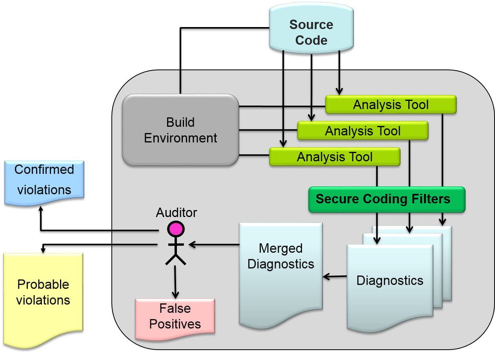
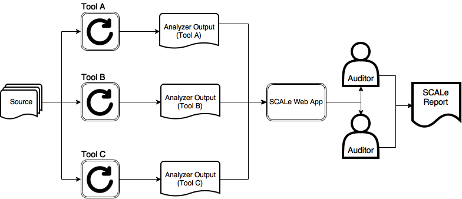

[SCALe](index.md) / [Source Code Analysis Lab (SCALe)](Welcome.md)
<!-- <legal> -->
<!-- SCALe version r.6.5.5.1.A -->
<!--  -->
<!-- Copyright 2021 Carnegie Mellon University. -->
<!--  -->
<!-- NO WARRANTY. THIS CARNEGIE MELLON UNIVERSITY AND SOFTWARE ENGINEERING -->
<!-- INSTITUTE MATERIAL IS FURNISHED ON AN "AS-IS" BASIS. CARNEGIE MELLON -->
<!-- UNIVERSITY MAKES NO WARRANTIES OF ANY KIND, EITHER EXPRESSED OR -->
<!-- IMPLIED, AS TO ANY MATTER INCLUDING, BUT NOT LIMITED TO, WARRANTY OF -->
<!-- FITNESS FOR PURPOSE OR MERCHANTABILITY, EXCLUSIVITY, OR RESULTS -->
<!-- OBTAINED FROM USE OF THE MATERIAL. CARNEGIE MELLON UNIVERSITY DOES NOT -->
<!-- MAKE ANY WARRANTY OF ANY KIND WITH RESPECT TO FREEDOM FROM PATENT, -->
<!-- TRADEMARK, OR COPYRIGHT INFRINGEMENT. -->
<!--  -->
<!-- Released under a MIT (SEI)-style license, please see COPYRIGHT file or -->
<!-- contact permission@sei.cmu.edu for full terms. -->
<!--  -->
<!-- [DISTRIBUTION STATEMENT A] This material has been approved for public -->
<!-- release and unlimited distribution.  Please see Copyright notice for -->
<!-- non-US Government use and distribution. -->
<!--  -->
<!-- DM19-1274 -->
<!-- </legal> -->

SCALe : Introduction
=====================
[Copyright](SCALe-copyright.md)

-   [Purpose](#purpose)
-   [SCALe Overview](#scale-overview)
-   [Documentation Conventions](#documentation-conventions)
-   [Contributors](#contributors)
-   [Support](#support)

Purpose
-------

The purpose of this document is to provide installation and usage
information for new SCALe users, whether individuals or organizations.
This document is meant to be read electronically (although no Internet
connectivity is required), so we use hyperlinks to direct readers to
other parts of the document.

SCALe Overview
--------------

[SCALe](Terms-and-Definitions.md#scale)
(Source Code Analysis Lab) was created in 2010 as a project in the SEI's
[Secure Coding
Initiative](http://www.cert.org/secure-coding/) (SCI).
It has been used to provide high-quality security audits to codebases in
C/C++, Java, and Perl.

SCALe includes an application and processes for detecting
[vulnerabilities](Terms-and-Definitions.md#vulnerability)
in source code. It was developed by the CERT Division at Carnegie Mellon
University's Software Engineering Institute. By using output from
multiple flaw-finding [static code
analysis](Terms-and-Definitions.md#static-analysis)
tools, SCALe finds more code defects than any single flaw-finding static
code analysis tool would find. However, using multiple tools increases
the human work required to handle the large volume of alert output.
[Alerts](Terms-and-Definitions.md#alert)
produced by the flaw-finding static code analysis tools must be examined
by a human expert who determines whether each meta-alert (or the tuple of (filepath, line number,
code flaw) that each such alert maps to, which we call a meta-alert)
represents an actual code defect (true positive) or not (false positive). The SCALe system is
designed to make this process easier and to automate much of
it. SCALe can also be useful as part of a code development system or
simply for code auditing.

SCALe uses filters to screen for alerts that can be mapped to CWEs or
CERT Coding rules (targeting alerts that indicate software security
issues), thereby reducing the number of alerts that might be examined by
a human. An alert mapped to a (code flaw) condition is an alertCondition. 
SCALe also facilitates the auditor's process of examining
alertConditions by providing an easy-to-use GUI for examining meta-alerts and alertConditions, identifying
true positives, and saving that information to a database. SCALe
provides many scripts and other software to help run static analysis
tools, to create a code audit report, and to manage information about
the analysis (and also about the source code being analyzed).

The following image outlines the flow of data in the SCALe process:

In the SCALe process, a source codebase is analyzed using multiple
static analysis tools. Static analysis tools analyze the code without
executing it, and SCALe uses output from two kinds of static analysis
tools: flaw-finding tools and code metrics tools. These tools can be
open source or proprietary. Each flaw-finding tool produces output
(often copious) containing alerts—that is, problems in the source code
identified by the tool. Some, but not all, of these alerts indicate
[vulnerabilities](Terms-and-Definitions.md#vulnerability)
(such as buffer overflows).

Flaw-finding analysis tools may report problems related to style (such
as insufficient comments) or performance (such as call of a slow
function when a faster one would suffice) but not related to security.
Only alerts related to security are mapped to CERT coding rules. Any
alert that doesn't have at least one mapping to either a CWE or CERT
coding rule is filtered from the results. Alerts are mapped to one or more type
of code flaw type, a.k.a. "condition", and each such mapping creates an
"alertCondition" that maps to a meta-alert that needs to be adjudicated (e.g., True or False).

Those meta-alerts and the code metrics are then placed into a database where
the meta-alerts are examined by one or more auditors. Each auditor, when
examining a meta-alert, must decide if it is correct (a true violation of a
secure coding rule), incorrect (a false positive), or if a different
verdict applies. Typically, the meta-alerts are too numerous for the auditors
to examine all of them. In SCALe, this issue is addressed in multiple
ways, described in detail
[here](Validating-SCALe-AlertConditions.md)
and summarized as follows:
The first method prioritizes meta-alerts for
manual examination, and auditor effort/time is used auditing the
prioritized list in order. A second method partitions meta-alerts into
*buckets*; each bucket contains all the meta-alerts associated with a single
code flaw (e.g., a particular CWE or particular CERT coding rule).
For each bucket, the auditor analyzes the alertConditions
until a true positive is found or until the bucket is exhausted.
If the auditor finds a true positive, all remaining unconfirmed
alertConditions are marked as suspicious (probable violations), and the auditor
moves on to the next bucket. The result of the second method is a
classification of the security meta-alerts into true violations, probable
violations, and false positives. A third method involves using an
automated classifier to partition meta-alerts into expected-true (e-TP),
expected-false (e-FP), and indeterminate (I). The automated classifier
can be used in conjunction with prioritization of manual examination of
indeterminate meta-alerts. This version of SCALe includes many features for
integrating use of classification, and when used as a module within an SEI
SCAIFE System in SCAIFE-Connected mode, automated classification can be done on the meta-alerts.

The SCALe [application](Web-App-Design.md) simplifies the
process of auditing meta-alerts. It takes as input the source code and the
feedback from the various tools that can be run on the code. With this
information, it provides a web-based interface to the alertConditions and meta-alerts, allowing
auditors to quickly view all information associated with the meta-alert
and all associated alertConditions,
including the source code it applies to. It makes auditor work more
efficient by fusing alertConditions into a single meta-alert view, where alerts
for the same filepath, line, and condition are shown together. It also
enables auditors to check if previous audit determinations or notes have
been provided for the same checker, filepath, and line but different
condition(s). SCALe allows auditors to mark a meta-alert's (single)
verdict, any combination of supplemental verdict(s), add notes, and add
a flag. SCALe enables auditors to export the alertConditions (and meta-alerts,
code metrics, and all other SCALe database data) for outside work, such
as for classifier development or for building a spreadsheet of the
alertConditions marked as true positives.

SCALe enables users to to create meta-alert prioritization schemes to order
alertConditions or meta-alerts in the GUI according to user-editable mathematical formulas,
using meta-alert-related fields such as classifier-derived confidence,
risk, and cost. (Confidence that a meta-alert is true is not the only
important factor. Other important factors include how severe of a
security risk a code flaw condition poses, and also an estimate how much
it costs to fix the flaw. A prioritization scheme formula might use each of
these and additional metrics.)

Advanced users can upload files to provide new data that can be used in
these prioritization formulas. SCALe filters can be used to limit the
view to alertConditions or meta-alerts of interest (e.g., a particular taxonomy, condition, or
filepath). SCALe maintains a history of audit determinations.

Finally, SCALe code includes a script that creates a "sanitized" version
of an exported SCALe database, anonymizing fields (and deleting some
fields) that may possibly contain sensitive data, while retaining
sufficient data for machine learning classification features. (However,
the sanitization functionality is not completely updated for the latest
version of the exported .csv file exports, so for
now, users should not depend on the sanitizer to secure their sensitive
data when exported in that format. Also, users should inspect the sanitized database
to verify that their sensitive data has been sanitized.)

The diagram above gives a high-level overview of the SCALe audit
process. A source codebase is analyzed with various static analysis
tools. Output from the tools are uploaded to the SCALe web app. Auditors
use the web app to evaluate the alertConditions, determining if alertConditions or meta-alerts are true
violations of conditions (conditions such as CERT Secure Coding rules or
CWEs). Auditors can make other determinations than simply true or false,
as SCALe now provides auditors all the options for labeling primary and
supplemental determinations (and notes) as described in our paper
[Static Analysis Alert Audits: Lexicon & Rules](https://resources.sei.cmu.edu/library/asset-view.cfm?assetid=484185).
The results of auditor evaluations can be exported into a database or
other file, and that can be compiled into a report. The SCALe web app
recognizes outputs from many popular static analyzers.

The SEI
has [more
information](http://www.cert.org/secure-coding/products-services/scale.cfm)
 about SCALe, including links to online instructional SCALe videos
(outdated for the current version), details about auditing (mostly
outdated), and information about SCALe services, the SCALe seal, and
the SCALe certificate.

Documentation Conventions
-------------------------

This documentation is intended to be legible offline; that is when
viewed on a machine without access to the Internet. As such we have
distinguished internal links (that point within the SCALe documentation)
from external links. External links are shown with this
icon:  and are green.

This documentation contains many code blocks that explain how to perform
some action. These blocks are written using the Bash shell language.
Because the syntax of different shells can vary, you may need to tweak
the syntax if you use a different shell, such as csh.

Some commands must be run with root privileges. In code blocks, these
commands are prepended with the  `sudo` command. If you get an error
when running `sudo`, then you will need to execute these commands in an
account that has administrator access. Alternatively, you can run these
commands using a root account, in which case you do not need to
prepend `sudo` to the command.

Contributors
------------

Contributors within SEI / CERT:

Thanks go to Eric Azebu, Lucas Bengtson, Lori Flynn, Charisse Haruta,
Sujay Jain, Pranjal Jumde, Derrick H. Karimi, David Keaton, William
Klieber, Aman Kumar, Carol Lallier, Jiyeon Lee, Reed Little, Justin Loo,
Derek Leung, Yitzhak Mandelbaum, Ebonie McNeil, Dhruv Mohindra, Aniket
Mokashi, Vishal Patel, Dan Plakosh, Abhishek Ramani, Maria A Rodriguez
De La Cruz, Raunak Rungta, Brendan Saulsbury, Robert C. Seacord, David
J. Shepard, Matt Sisk, William Snavely, Dean F. Sutherland, David Svoboda, Baptiste
Vauthey, Michael Shaye-Wen Wang, Eric Wong, and Shirley
Zhou for helping with the development and testing of SCALe and the
documentation.

Thanks to Archie Andrews, Robert Schiela, and Mark Sherman for support
and guidance.

Contributors external to SEI / CERT:

Thank you to all collaborators who contribute code intended to help us improve SCALe and/or SCAIFE, with new features, bugfixes, and enhancements for DevOps. We hope this section of the README will grow, and invite you to contribute to SCALe/SCAIFE development!

Thank you to:
* Dr. Wei Le and her team at Iowa State University (Benjamin Steenhoek,  Ashwin Kallingal Joshy, Jason McInerney, and Xiuyuan Guo), who contributed SARIF tool output for use in our automated testing infrastructure.

Some code and data used for testing purposes (or as input data) comes from open-source codebases with licenses that allow that, such as the Juliet Test Suite, dos2unix, and JasPer. This system uses open-source code and packages with licenses that permit that, and we thank all those many developers who contributed to the software tools we use to build our own systems.

Support
-------

Questions and comments can be sent to
[scale-support@cert.org](mailto:scale-support@cert.org) [.](https://cert.org)

------------------------------------------------------------------------

  

Attachments:
------------

[SCALeProcess.png](attachments/SCALeProcess.png) (image/png)\

[AuditProcess.png](attachments/AuditProcess.png) (image/png)
