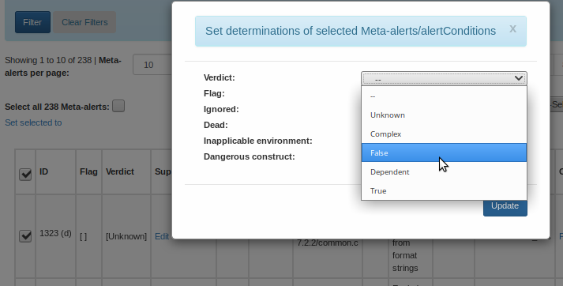
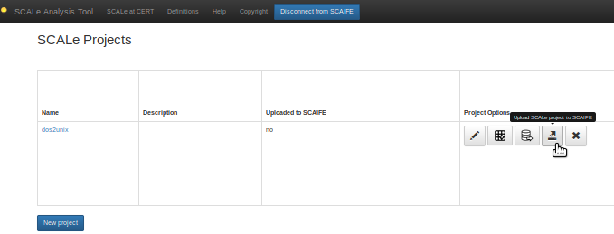
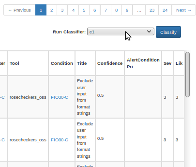

[SCALe](index.md) / [Source Code Analysis Lab (SCALe)](Welcome.md) / [Source Code Analysis Integrated Framework Environment (SCAIFE)](SCAIFE-Welcome.md)
<!-- <legal> -->
<!-- Copyright 2021 Carnegie Mellon University. -->
<!--  -->
<!-- This material is based upon work funded and supported by the -->
<!-- Department of Defense under Contract No. FA8702-15-D-0002 with -->
<!-- Carnegie Mellon University for the operation of the Software -->
<!-- Engineering Institute, a federally funded research and development -->
<!-- center. -->
<!--  -->
<!-- The view, opinions, and/or findings contained in this material are -->
<!-- those of the author(s) and should not be construed as an official -->
<!-- Government position, policy, or decision, unless designated by other -->
<!-- documentation. -->
<!--  -->
<!-- References herein to any specific commercial product, process, or -->
<!-- service by trade name, trade mark, manufacturer, or otherwise, does -->
<!-- not necessarily constitute or imply its endorsement, recommendation, -->
<!-- or favoring by Carnegie Mellon University or its Software Engineering -->
<!-- Institute. -->
<!--  -->
<!-- NO WARRANTY. THIS CARNEGIE MELLON UNIVERSITY AND SOFTWARE ENGINEERING -->
<!-- INSTITUTE MATERIAL IS FURNISHED ON AN 'AS-IS' BASIS. CARNEGIE MELLON -->
<!-- UNIVERSITY MAKES NO WARRANTIES OF ANY KIND, EITHER EXPRESSED OR -->
<!-- IMPLIED, AS TO ANY MATTER INCLUDING, BUT NOT LIMITED TO, WARRANTY OF -->
<!-- FITNESS FOR PURPOSE OR MERCHANTABILITY, EXCLUSIVITY, OR RESULTS -->
<!-- OBTAINED FROM USE OF THE MATERIAL. CARNEGIE MELLON UNIVERSITY DOES NOT -->
<!-- MAKE ANY WARRANTY OF ANY KIND WITH RESPECT TO FREEDOM FROM PATENT, -->
<!-- TRADEMARK, OR COPYRIGHT INFRINGEMENT. -->
<!--  -->
<!-- [DISTRIBUTION STATEMENT A] This material has been approved for public -->
<!-- release and unlimited distribution.  Please see Copyright notice for -->
<!-- non-US Government use and distribution. -->
<!--  -->
<!-- This work is licensed under a Creative Commons Attribution-ShareAlike -->
<!-- 4.0 International License. -->
<!--  -->
<!-- Carnegie Mellon® and CERT® are registered in the U.S. Patent and -->
<!-- Trademark Office by Carnegie Mellon University. -->
<!--   -->
<!-- DM20-0043 -->
<!-- </legal> -->

The SCAIFE manual (documentation) copyright covers all pages of the SCAIFE/SCALe manual with filenames that start with text 'SCAIFE' and that copyright is [here](SCAIFE-MANUAL-copyright.md).

The non-SCALe part of the SCAIFE _system_ has limited distribution that is different than the SCALe distribution. [Click here to see the SCAIFE system copyright.](SCAIFE-SYSTEM-copyright.md)

The SCAIFE API definition has its own distribution that is different than the SCAIFE system, SCAIFE manual, and SCALe distribution. The SCAIFE _API_ definition copyright is [here](SCAIFE-API-copyright.md)

SCAIFE : DataHub Module
=======================

-   [Overview](#overview)
-   [Using SCALe to Upload to the DataHub](#using-scale-to-upload-to-the-datahub)
-   [Creating a Test Project](#creating-a-test-project)
-   [Adding Audit Data (Adjudications True and False)](#adding-audit-data-adjudications-true-and-false)
-   [CI Integration](#integration-with-ci)

## Overview

The DataHub Module is the main entity server that stores data such as projects, test suites and tool/checker
information to be used in the classification and alert prioritization.The DataHub also performs
automatic alert forwarding for projects that use Adaptive Heuristics. It makes automated
adjudications for test suite projects, which must be uploaded to the DataHub with a manifest
file that provides meta-data about code flaws. The DataHub is often referred to as the Remote Database.

## Using SCALe to Upload to the DataHub

[SCALe](Welcome.md) is one instantiation of a SCAIFE UI module. We've
modified the previous version of SCALe for (optional) SCAIFE
integration. To upload SCALe projects to the DataHub, find the 'Help' option in the top menu-bar of the
SCALe application which you should open in a new tab in Firefox (so you have SCALe application open in one tab,
the SCALe/SCAIFE HTML manual in the other). The SCALe/SCAIFE HTML manual has a lot of detail about how to
use SCAIFE and SCALe, although some of the SCALe pages are a bit outdated.

In the SCAIFE/SCALe HTML manual tab, select "Source Code Analysis Lab (SCALe)" hyperlinked text that is at
the top of the available pages. That limits your index view to most of the important content.
Also right-click "Using SCAIFE" to open that in a new tab, which opens the SCAIFE-focused index part of the HTML manual.

In your second tab, the ["SCALe Quick Start Demo for Auditors"](SCALe-Quick-Start-Demo-for-Auditors.md) is helpful at learning the basics of SCALe.

## Creating a Test Project

To create a test project in the DataHub from SCALe, follow the instructions below. Following these instructions will
result in creating a SCAIFE DataHub project that can be used for testing classifiers in the [Statistics Module]
(SCAIFE-Statistics.md).

1. Select "New Project". You should create either a dos2unix or micro-juliet project.

2. Project Name: dos2unix OR microjuliet. (The actual project name doesn't matter). Then select "Create Project".

3. For microjuliet, select "Yes" on "Is src a test suite?". For dos2unix, leave the selection at "No".

4. For "Archive containing src", select "Choose file".

5. In the file upload window:

   * Select dos2unix (on left sidebar of the file explorer) and then dos2unix-7.2.2.zip

     * -OR-

   * Select test_input (on left sidebar of the file explorer) and then micro_juliet_v1.2_for_C_CPPcheck_cppcheck.zip

NOTE: Please do not use your host machine's web browser, rather than the Vagrant-created VM, to access SCALe or do anything else for these tests.
This testing is designed only to be done on the SCAIFE VM.
One of the many ways you will have problems with these tests if you don't use the Vagrant-created VM that you should,
is that you won't see dos2unix  or test_input  in the file upload window.
In those cases, you will have to select the proper path for these files.
The paths are scaife/ui_server_stub/scale.app/demo/dos2unix and scaife/datahub_server_stub/swagger_server/test/test_input for MicroJuliet.
However, you will probably have a lot of other problems if you do that, because our VM has particular things added in particular places that work with the test.
So you should only use the Vagrant-created SCAIFE VM for these tests.

6. For "Code Languages", select C, then 99, then the "Add" button to add it to "Project Languages Selected:". Next select C++, then 14 and then the "Add" button to also include it.

7. You'll next fill in "Static Analysis Tool Output":

   * For dos2unix, hit the "Choose File" for Rosecheckers. In the file upload window, select "dos2unix" on the left sidebar, and then "analysis", and then "rosecheckers_oss.txt".

   * For microjuliet, hit the "Choose File" for cppcheck. In the file upload window, select "test_input" on the left sidebar, and then the micro_juliet_v1-2_cppcheck_tool_output.xml file.

   * For microjuliet, specify these additional files and string fields:
     * Test suite name: microjuliet
     * Test suite version: 1.2
     * Test suite type: Juliet
     * est suite SARD ID: 86
     * Author source: someAuthor
     * License string: someLicense
     * Manifest File: scaife/datahub_server_stub/swagger_server/test/test_input/micro_juliet_v1-2_for_C_Cpp_cppcheck_manifest.xml
     * Source File CSV: scaife/datahub_server_stub/swagger_server/test/test_input/juliet_v1-2_files_cppcheck.csv
     * Source Function CSV: scaife/datahub_server_stub/swagger_server/test/test_input/juliet_v1-2_functions_cppcheck.csv

8. Select the "Create Database" button. It has a database icon on it, and is located above the "Script Output" in the webpage.
9. Then select the "Create Project from Database" button, which is the middle one of three buttons.

This brings you to the project auditing page.

## Adding Audit Data AKA Adjudications True and False

You must next set at least 10 meta-alert verdicts to "True", and at least 10 to "False". The easiest way to do this is to:

1. Click the checkbox to the left of the "ID", below the "Set Selected To" text. This selects all visible audits (which is 10, by default).
2. Click the "Set Selected To", and then set "Verdict" to "True", and click the "Update" button.
3. After, click the "Next" button to the right of the page, just above the 'Run Classifier' section. This should bring up alerts 11 to 20.
4. Select all visible verdicts again
5. Click "Set Selected To", and
6. Then set "Verdict" to "False", and click the "Update" button.

7. Go to the home page by hitting "SCALe Analysis Tool" on the upper left of the page. You should now have a single project named dos2unix or microjuliet
in the project landing page.

**Important**: To access SCAIFE functionality in SCALe, the user must be connected to SCAIFE. See [SCAIFE Registration](SCAIFE-Registration.md) for more information.

8. Once connected to SCAIFE, click the "Upload SCALe Project to SCAIFE" button. It is the 4th button in a series of 5 buttons on the right.
You can hover your mouse over the icon first, to see popup text that verifies you are about to hit the correct button.

This upload operation may take a while (average of under 4 minutes).
Afterwards, you should get a dialog box saying "Data uploaded to SCAIFE!", which you can dismiss.

9. Now select your project name...'dos2unix' or 'microjuliet', which will take you back to the project auditing page.

**Important**: Before doing the next step, you should examine the "Confidence" column in the audit table (back in the audit page).
If it is not visible you may need to scroll the table to the right.
The "Confidence" column should be empty for every meta-alert in the table.

10. Follow the instructions on the [Statistics Module](SCAIFE-Statistics.md) page to create and run a new classifier in SCAIFE.

11. Running the classifier may take a few minutes. Afterwards, the "Confidence" column should have numeric values. This indicates that the test succeeded.

## Integration with CI

SCAIFE supports integration with automated CI build systems when package has been configured to integrate with CI.  The DataHub Module API provides a CI endpoint that automates analysis using SCAIFE. See the DataHub Module swagger API definition for details on API usage and complete documentation (including multiple hands-on demos) can be found in the [SCAIFE-CI](SCAIFE-CI.md) page.  Additional configurations, such as proxy setting, and the DataHub Modules local git repository pathing information can be configured by editing the `servers.conf` file located at `scaife/datahub_server_stub/swagger_server/servers.conf`.

------------------------------------------------------------------------

Attachments:
------------

[CreateProjectFromDatabase.png](attachments/CreateProjectFromDatabase.png) (image/png)\

[SetAllSelected.png](attachments/SetAllSelected.png) (image/png)\

[ScaifeUploadProject.png](attachments/ScaifeUploadProject.png) (image/png)\

[Confidence.png](attachments/Confidence.png) (image/png)\
