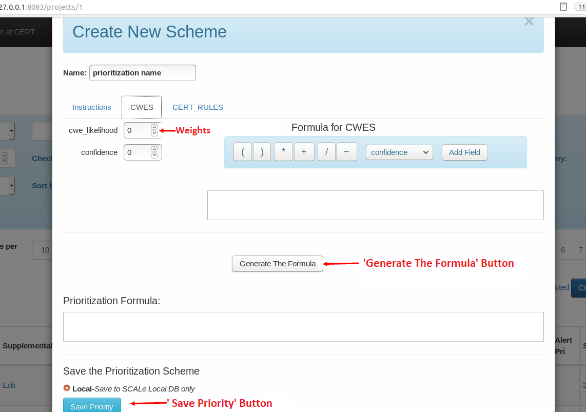

[SCALe](index.md) / [Source Code Analysis Lab (SCALe)](Welcome.md) / [Source Code Analysis Integrated Framework Environment (SCAIFE)](SCAIFE-Welcome.md)
<!-- <legal> -->
<!-- Copyright 2021 Carnegie Mellon University. -->
<!--  -->
<!-- This material is based upon work funded and supported by the -->
<!-- Department of Defense under Contract No. FA8702-15-D-0002 with -->
<!-- Carnegie Mellon University for the operation of the Software -->
<!-- Engineering Institute, a federally funded research and development -->
<!-- center. -->
<!--  -->
<!-- The view, opinions, and/or findings contained in this material are -->
<!-- those of the author(s) and should not be construed as an official -->
<!-- Government position, policy, or decision, unless designated by other -->
<!-- documentation. -->
<!--  -->
<!-- References herein to any specific commercial product, process, or -->
<!-- service by trade name, trade mark, manufacturer, or otherwise, does -->
<!-- not necessarily constitute or imply its endorsement, recommendation, -->
<!-- or favoring by Carnegie Mellon University or its Software Engineering -->
<!-- Institute. -->
<!--  -->
<!-- NO WARRANTY. THIS CARNEGIE MELLON UNIVERSITY AND SOFTWARE ENGINEERING -->
<!-- INSTITUTE MATERIAL IS FURNISHED ON AN 'AS-IS' BASIS. CARNEGIE MELLON -->
<!-- UNIVERSITY MAKES NO WARRANTIES OF ANY KIND, EITHER EXPRESSED OR -->
<!-- IMPLIED, AS TO ANY MATTER INCLUDING, BUT NOT LIMITED TO, WARRANTY OF -->
<!-- FITNESS FOR PURPOSE OR MERCHANTABILITY, EXCLUSIVITY, OR RESULTS -->
<!-- OBTAINED FROM USE OF THE MATERIAL. CARNEGIE MELLON UNIVERSITY DOES NOT -->
<!-- MAKE ANY WARRANTY OF ANY KIND WITH RESPECT TO FREEDOM FROM PATENT, -->
<!-- TRADEMARK, OR COPYRIGHT INFRINGEMENT. -->
<!--  -->
<!-- [DISTRIBUTION STATEMENT A] This material has been approved for public -->
<!-- release and unlimited distribution.  Please see Copyright notice for -->
<!-- non-US Government use and distribution. -->
<!--  -->
<!-- This work is licensed under a Creative Commons Attribution-ShareAlike -->
<!-- 4.0 International License. -->
<!--  -->
<!-- Carnegie Mellon® and CERT® are registered in the U.S. Patent and -->
<!-- Trademark Office by Carnegie Mellon University. -->
<!--   -->
<!-- DM20-0043 -->
<!-- </legal> -->

The SCAIFE manual (documentation) copyright covers all pages of the SCAIFE/SCALe manual with filenames that start with text 'SCAIFE' and that copyright is [here](SCAIFE-MANUAL-copyright.md).

The non-SCALe part of the SCAIFE _system_ has limited distribution that is different than the SCALe distribution. [Click here to see the SCAIFE system copyright.](SCAIFE-SYSTEM-copyright.md)

The SCAIFE API definition has its own distribution that is different than the SCAIFE system, SCAIFE manual, and SCALe distribution. The SCAIFE _API_ definition copyright is [here](SCAIFE-API-copyright.md)

SCAIFE : Prioritization Module
=====================

-   [Overview](#overview)
-   [Create a Prioritization Scheme](#create-a-prioritization-scheme)
-   [Edit a Prioritization Scheme](#edit-a-prioritization-scheme)
-   [Run a Prioritization Scheme](#run-a-prioritization-scheme)
-   [Delete a Prioritization Scheme](#delete-a-prioritization-scheme)

Overview
--------

The Prioritization Module stores and retrieves prioritization schemes with formulas for prioritizing meta-alerts.
It also modifies or deletes stored prioritization schemes.
The schemes are mathematical formulas that can use these mathematical constructs: (,  ),   +, -, *, /.
The prioritization scheme can contain the following fields:
classifier-returned confidence, particular fields specific to a code flaw taxonomy
(e.g., CWE likelihood or CERT Coding Rules' cost),
and user-identified fields (e.g., a user can have additional fields in their own archives,
and this prioritization scheme can refer to the additional fields by name).

SCAIFE Prototype Prioritization Module
------------------------------------
[SCALe](Welcome.md) is one instantiation of a SCAIFE UI module. We've modified the previous version of SCALe for (optional) SCAIFE integration.
The text below describes how to interact with the SCAIFE prototype's Prioritization Module via the SCALe UI to create, edit, run, and delete a prioritization scheme.

**Warning: SCALe access control is not enforced beyond limiting what is shown in the GUI.**

Create a Prioritization Scheme
--------------------------------
To create a new prioritization scheme, you must do the following:

1. After creating a project in SCALe, click on the "Prioritization Schemes" dropdown in the alertConditions viewer navigation bar.
1. Choose the "Create New Scheme" button in the dropdown. (Image shown above)
1. Follow the instructions on the "Instructions" tab (first tab in the popup).

Instructions are also here:

-   Select each taxonomy tab in the popup, and enter a formula to calculate priority for meta-alerts mapped to each taxonomy.
Classifier-derived confidence and user-uploaded fields can be used in formulas for all taxonomies.
-   Weights (1 or higher) must be selected on the left, for each field used in the formula.
Numbers and math operators can also be entered via keyboard.
-   Name the prioritization scheme in the box at the top left.
-   After each taxonomy has a formula, generate a prioritization formula by selecting the button 'Generate The Formula'.
-   To save the scheme, select the "Save Priority" button. The default save mode in SCALe is Local.
Local prioritization schemes are saved to the SCALe database only.
-   If you are connected to SCAIFE additional options for saving the prioritization scheme will be present. The options are:
    -   Global: All projects can access global prioritization schemes
    -   Remote: Only SCAIFE users in the same organization can access the prioritization scheme
    -   Project-Only Checkbox: Access is limited to only the project currently in the GUI

_Note: You must click on the 'Generate The Formula' button prior to running or saving a prioritization scheme_

Edit a Prioritization Scheme
----------------------------
To select an existing prioritization scheme to edit:

1. Click on the prioritization scheme name in the "Prioritization Schemes" dropdown in the navbar.
1. The "Edit" Prioritization scheme popup menu will show the details of the prioritization scheme.
11. Use this menu to edit the formula or weights of the prioritization scheme.
11. To save the updated prioritization scheme, click the "Save Priority" button at the bottom left of the popup menu.

Run a Prioritization Scheme
----------------------------

To run a prioritization scheme:

1. From the "Create New Scheme" or "Edit" prioritization scheme popup menu:
11. Select the button "Run Priority". This will trigger SCALe to populate the alert priority field in the GUI based on the formula
  created in the popup menu.
11. To prioritize the new alert priorities in ascending or descending order set the filter sorting on the main page to "AlertCondition Priority".

Delete a Prioritization Scheme
------------------------------

To delete a prioritization scheme:

1. From the "Edit" prioritization scheme popup menu:
11. Select the red "Delete Prioritization Scheme" button in the top right corner of the popup menu.

_Note: Currently, SCAIFE Global Prioritization Schemes cannot be updated or deleted in the SCAIFE DB_

