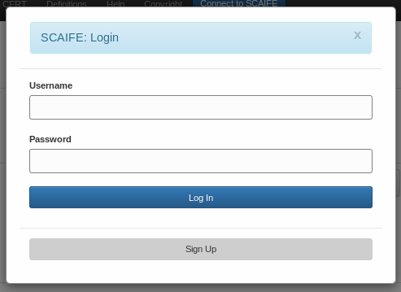
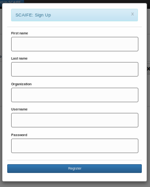

[SCALe](index.md) / [Source Code Analysis Lab (SCALe)](Welcome.md) / [Source Code Analysis Integrated Framework Environment (SCAIFE)](SCAIFE-Welcome.md)
<!-- <legal> -->
<!-- Copyright 2021 Carnegie Mellon University. -->
<!--  -->
<!-- This material is based upon work funded and supported by the -->
<!-- Department of Defense under Contract No. FA8702-15-D-0002 with -->
<!-- Carnegie Mellon University for the operation of the Software -->
<!-- Engineering Institute, a federally funded research and development -->
<!-- center. -->
<!--  -->
<!-- The view, opinions, and/or findings contained in this material are -->
<!-- those of the author(s) and should not be construed as an official -->
<!-- Government position, policy, or decision, unless designated by other -->
<!-- documentation. -->
<!--  -->
<!-- References herein to any specific commercial product, process, or -->
<!-- service by trade name, trade mark, manufacturer, or otherwise, does -->
<!-- not necessarily constitute or imply its endorsement, recommendation, -->
<!-- or favoring by Carnegie Mellon University or its Software Engineering -->
<!-- Institute. -->
<!--  -->
<!-- NO WARRANTY. THIS CARNEGIE MELLON UNIVERSITY AND SOFTWARE ENGINEERING -->
<!-- INSTITUTE MATERIAL IS FURNISHED ON AN 'AS-IS' BASIS. CARNEGIE MELLON -->
<!-- UNIVERSITY MAKES NO WARRANTIES OF ANY KIND, EITHER EXPRESSED OR -->
<!-- IMPLIED, AS TO ANY MATTER INCLUDING, BUT NOT LIMITED TO, WARRANTY OF -->
<!-- FITNESS FOR PURPOSE OR MERCHANTABILITY, EXCLUSIVITY, OR RESULTS -->
<!-- OBTAINED FROM USE OF THE MATERIAL. CARNEGIE MELLON UNIVERSITY DOES NOT -->
<!-- MAKE ANY WARRANTY OF ANY KIND WITH RESPECT TO FREEDOM FROM PATENT, -->
<!-- TRADEMARK, OR COPYRIGHT INFRINGEMENT. -->
<!--  -->
<!-- [DISTRIBUTION STATEMENT A] This material has been approved for public -->
<!-- release and unlimited distribution.  Please see Copyright notice for -->
<!-- non-US Government use and distribution. -->
<!--  -->
<!-- This work is licensed under a Creative Commons Attribution-ShareAlike -->
<!-- 4.0 International License. -->
<!--  -->
<!-- Carnegie Mellon® and CERT® are registered in the U.S. Patent and -->
<!-- Trademark Office by Carnegie Mellon University. -->
<!--   -->
<!-- DM20-0043 -->
<!-- </legal> -->

The SCAIFE manual (documentation) copyright covers all pages of the SCAIFE/SCALe manual with filenames that start with text 'SCAIFE' and that copyright is [here](SCAIFE-MANUAL-copyright.md).

The non-SCALe part of the SCAIFE _system_ has limited distribution that is different than the SCALe distribution. [Click here to see the SCAIFE system copyright.](SCAIFE-SYSTEM-copyright.md)

The SCAIFE API definition has its own distribution that is different than the SCAIFE system, SCAIFE manual, and SCALe distribution. The SCAIFE _API_ definition copyright is [here](SCAIFE-API-copyright.md)

SCALe : SCAIFE Registration
===========================

-   [Overview](#overview)
-   [Creating a SCAIFE account](#creating-a-scaife-account)
-   [Disconnecting from SCAIFE](#disconnecting-from-scaife)

Overview
--------
The Registration Module is a server used to register users in the SCAIFE system.
Users at the UI module register and login through this server to receive an access token that is
intended in the future to enable the UI Module to communicate securely with the Statistics, DataHub, and
Prioritization Modules that are connected to the Registration Module.

Note: The SCAIFE Registration Module utilizes JSON Web Tokens (JWTs) to grant access to its users. Currently, the access tokens
used to interact with the Statistics, Prioritization, and DataHub modules are validated to ensure they are not expired
and that they contain the correct security keys for server access; however, access tokens are not validated against
the SCAIFE user database in the Registration module. Currently, security weaknesses in the system include:

- If any user anywhere in the distributed system gains access to the security key, which is the same and shared by all modules,
then that user can create a token of the acceptable format and can interact with all the other non-Registration SCAIFE servers. (For example, a malicious user who gained access to the security key could create API messages that would appear to come from any of the types of SCAIFE modules. By sending incorrect data such a malicious user could corrupt the system and data within all the servers. Also, such a malicious user could gain access to data they should not have access to, if the security key were not shared by all modules and not otherwise protected as in the current system.)
- The current system setup does not accommodate de-registering a user in the Registration Module. Although expiration is enforced by examining timestamps,
a malicious user (e.g., a malicious user at the UI Module) could get around that simply by creating a new token using the same security key to successfully communicate with the other non-Registration SCAIFE servers. (An example of a way to more securely handle de-registering a user follows: The non-Registration SCAIFE server modules could check with the Registration Module to find out if a token was authorized by the Registration module. The Registration module could handle de-registering a user, e.g., if a SCAIFE system administrator decides to de-authorize a previously-authorized user. After that, queries to the Registration Module about that user would show they were not authorized.)

To provide more security within the SCAIFE system future iterations may implement validation of access tokens at the Registration Module,
and/or enable the Transport Layer Security (TLS) protocol for server communications.

SCAIFE Prototype Registration Module
------------------------------------
[SCALe](Welcome.md) is one instantiation of a SCAIFE UI module. We've modified the previous version of SCALe for (optional) SCAIFE integration.
The text below describes how to interact with the SCAIFE prototype's Registration Module via the SCALe UI to create a SCAIFE account, connect, and disconnect.

Creating a SCAIFE account
-------------------------
To access SCAIFE functionality in SCALe, a user must create a SCAIFE account to connect to the SCAIFe servers.

1. Click the "Connect to SCAIFE" button in the navigation bar. This will bring up a login screen.

2. Click the "Sign Up" button in the modal that appears. This will bring up a "sign up" screen.

3. Fill out the "Sign Up" form and click "Register"
4. On successful account creation, the user will automatically be connected to the SCAIFE servers
and SCAIFE functionality will be available in the GUI

On subsequent uses of SCALe, the user can connect to SCAIFE by clicking "Connect to SCAIFE" in the navbar,
and using their SCAIFE account credentials to log in.

Disconnecting from SCAIFE
-------------------------
To disconnect from SCAIFE and log a user out of the SCAIFE system, click on the "Disconnect from SCAIFE" button in the navigation bar.

------------------------------------------------------------------------

Attachments:
------------

[ScaifeLogin.png](attachments/ScaifeLogin.png) (image/png)\

[ScaifeSignup.png](attachments/ScaifeSignup.png) (image/png)
