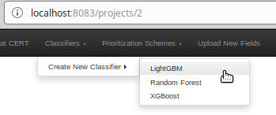
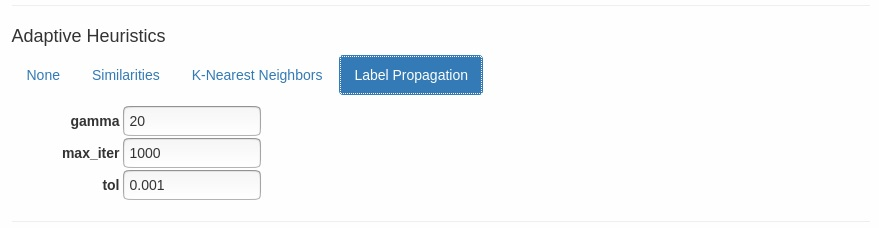
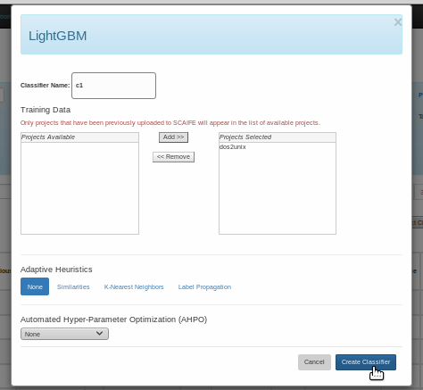

[SCALe](index.md) / [Source Code Analysis Lab (SCALe)](Welcome.md) / [Source Code Analysis Integrated Framework Environment (SCAIFE)](SCAIFE-Welcome.md)
<!-- <legal> -->
<!-- Copyright 2021 Carnegie Mellon University. -->
<!--  -->
<!-- This material is based upon work funded and supported by the -->
<!-- Department of Defense under Contract No. FA8702-15-D-0002 with -->
<!-- Carnegie Mellon University for the operation of the Software -->
<!-- Engineering Institute, a federally funded research and development -->
<!-- center. -->
<!--  -->
<!-- The view, opinions, and/or findings contained in this material are -->
<!-- those of the author(s) and should not be construed as an official -->
<!-- Government position, policy, or decision, unless designated by other -->
<!-- documentation. -->
<!--  -->
<!-- References herein to any specific commercial product, process, or -->
<!-- service by trade name, trade mark, manufacturer, or otherwise, does -->
<!-- not necessarily constitute or imply its endorsement, recommendation, -->
<!-- or favoring by Carnegie Mellon University or its Software Engineering -->
<!-- Institute. -->
<!--  -->
<!-- NO WARRANTY. THIS CARNEGIE MELLON UNIVERSITY AND SOFTWARE ENGINEERING -->
<!-- INSTITUTE MATERIAL IS FURNISHED ON AN 'AS-IS' BASIS. CARNEGIE MELLON -->
<!-- UNIVERSITY MAKES NO WARRANTIES OF ANY KIND, EITHER EXPRESSED OR -->
<!-- IMPLIED, AS TO ANY MATTER INCLUDING, BUT NOT LIMITED TO, WARRANTY OF -->
<!-- FITNESS FOR PURPOSE OR MERCHANTABILITY, EXCLUSIVITY, OR RESULTS -->
<!-- OBTAINED FROM USE OF THE MATERIAL. CARNEGIE MELLON UNIVERSITY DOES NOT -->
<!-- MAKE ANY WARRANTY OF ANY KIND WITH RESPECT TO FREEDOM FROM PATENT, -->
<!-- TRADEMARK, OR COPYRIGHT INFRINGEMENT. -->
<!--  -->
<!-- [DISTRIBUTION STATEMENT A] This material has been approved for public -->
<!-- release and unlimited distribution.  Please see Copyright notice for -->
<!-- non-US Government use and distribution. -->
<!--  -->
<!-- This work is licensed under a Creative Commons Attribution-ShareAlike -->
<!-- 4.0 International License. -->
<!--  -->
<!-- Carnegie Mellon® and CERT® are registered in the U.S. Patent and -->
<!-- Trademark Office by Carnegie Mellon University. -->
<!--   -->
<!-- DM20-0043 -->
<!-- </legal> -->

The SCAIFE manual (documentation) copyright covers all pages of the SCAIFE/SCALe manual with filenames that start with text 'SCAIFE' and that copyright is [here](SCAIFE-MANUAL-copyright.md).

The non-SCALe part of the SCAIFE _system_ has limited distribution that is different than the SCALe distribution. [Click here to see the SCAIFE system copyright.](SCAIFE-SYSTEM-copyright.md)

The SCAIFE API definition has its own distribution that is different than the SCAIFE system, SCAIFE manual, and SCALe distribution. The SCAIFE _API_ definition copyright is [here](SCAIFE-API-copyright.md).

SCAIFE : Statistics (Stats) Module
=====================

-   [Overview](#overview)
-   [Creating a new classifier type](#creating-a-new-classifier-type)
-   [Creating a new adaptive heuristic](#creating-a-new-adaptive-heuristic)
-   [SCAIFE Prototype Statistics Module](#scaife-prototype-statistics-module)
-   [Creating a new classifier](#creating-a-new-classifier)
-   [Running a classifier](#running-a-classifier)
-   [Performance Metrics](#performance-metrics)

Overview
--------

This Statistics Module stores and retrieves classification options, performs classification, 
and receives data and commands from the DataHub Module and UI Module.
Machine learning classifiers predict which meta-alerts produced by static analysis tools are likely true positive ("True") 
or likely false positive ("False") via a process called classification.
Parameters are learned by the classifier, whereas hyper-parameters are values that can be adjusted to control the classifier's learning process.
Automated hyper-parameter optimization (AH-PO) is used to automatically tune hyper-parameters.
If AH-PO isn't selected, a classifier's default hyper-parameters are used.
Adaptive heuristics (AHs) are algorithms that optionally allow information from unlabeled data (i.e., data for which no manual or automatic adjudications exist) to be considered by the Statistics Module when making predictions about the data.  Machine learning algorithms use unlabeled data to find similarities between data points and uncover latent patterns in large data sets.
The following is what the SCAIFE Statistics Module is intended to do:
It interacts with the DataHub Module to get project data for its classification and adaptive heuristics
(including notifying the DataHub Module if it should forward updates for a particular project,
if the Statistics Module has an adaptive heuristic active for that project).
For projects that have an active AH, the Statistics Module receives updates from the DataHub Module
including for new static analysis tool output, new audit determinations, new code metrics data.
It interacts with the UI Module to respond to requests for classification options, classification
of a project, and changing/removing a classifier. For each overarching type of classification
(e.g., xgboost), the Statistics Module stores options for associated AH-POs and AHs.
The Statistics Module stores the data for each active classifier (including project id,
classifier type, AH-PO, AH, UI Module URL, and user ID).

[SCALe](Welcome.md) is one instantiation of a SCAIFE UI module. We've modified the previous version of SCALe for (optional) SCAIFE integration. The current SCAIFE prototype uses SCALe as the UI module.
The text below describes how to interact with the SCAIFE prototype's Statistics Module via the SCALe UI to create, modify, and use classifiers.

**Important**: To access SCAIFE functionality in SCALe, the user must be connected to SCAIFE.  See [SCAIFE Registration](SCAIFE-Registration.md) for more information.

How to Use Classifiers and GUI-Related Stats Module Functionality (no SCAIFE development required)
----------------------------------------------------------------------------------------------------

Creating a new classifier
-------------------------

1. Click the "Classifiers" item in the SCALe navigation bar
2. Select the type of classifier you want (e.g., "LightGBM")

Note:  Some classifiers are more powerful than others and require more data to avoid remembering a huge number of meta-alerts instead of learning to notice features, a phenomenon known as [overfitting](https://en.wikipedia.org/wiki/Overfitting).  Random Forest is the most appropriate classifier to use on small data sets.  XGBoost is suitable for moderately large data sets (e.g., 1,000+ labeled meta-alerts), and LightGBM is intended to be used on large data sets (e.g., 10,000+ labeled meta-alerts).  If unsure which type of classifier to apply to your data, consider building more than one type of classifier to see which provides the highest precision and recall on the training data set.  

3. Enter/Select the required information:
   1. A classifier name
   2. One or more projects to train the classifier on.  To appear in the list of available projects, a project must have been previously uploaded to the SCAIFE DataHub Module.  (See "Using SCALe to Upload to the DataHub" in the [DataHub Module documentation](SCAIFE-DataHub.md) for more information.)
   3. An adaptive heuristic (AH)

Note:  Both [Similarities](https://en.wikipedia.org/wiki/Nearest_neighbour_algorithm) and [K-Nearest neighbors](https://en.wikipedia.org/wiki/K-nearest_neighbors_algorithm) have an average-case runtime complexity of O(NM), while [Label Propagation](https://en.wikipedia.org/wiki/Label_propagation_algorithm) operates in O(N), where M is the number of existing meta-alerts and N is the number of new meta-alerts received since the classifier was trained.  When applied to very large data sets, AHs may significantly slow down the process of running a classifier and/or errors may be encountered if there is an insufficent amount of memory on your machine.  If unsure whether or not to apply an adaptive heuristic to your data, consider building more than one type of classifier to see if including an AH leads to higher precision and recall on the training data set. 

Each adaptive heuristic type has a set of GUI fields for tailoring that AH.  The fields are pre-populated with the default values that come with the packaged implementation of the algorithm.  However, a machine learning practitioner might want to modify these values, using their expert knowledge to improve the AH's performance. Since SCAIFE assumes no prior knowledge of machine learning, we expect most SCAIFE users won't end up modifying the fields if the classifier is performing well. SCAIFE users should inspect performance metrics (especially, precision and recall).

   4. An automated hyperparameter optimization algorithm (AHPO)

Note:  Selecting an AHPO slightly increases the amount of time to create a classifier; however, AHPOs are expected to identify better hyperparameters than the default values, which leads to higher classifier accuracy.

   5. Whether to apply [principal component analysis](https://en.wikipedia.org/wiki/Principal_component_analysis) (PCA) to the data.  Machine learning features are variables that act like input to the classifier.  PCA is a technique that reduces the number of features in a data set, while preserving as much useful information as possible.  Because it reduces noise in the data, PCA can both improve classifier accuracy and efficiency.  Consider applying this option to a data set with a large number of features to see if PCA improves classifier performance.

Note: The functionality behind the option to "Use Semantic Features" will be available in a subsequent version of SCAIFE.  Currently, this option can be ignored.  When available, the option will combine information from existing machine learning features, such as the number of static analysis alerts per file, and semantic (source code) features to possibly improve classifier precision and recall.  In the future, consider selecting this option to see if semantic features improves classifier performance on your data.  

4. Click the "Create Classifier" button

Running a classifier
--------------------

1. After creating a new classifier (see above), select the classifier you want to apply to the current project's data
   from the 'Run Classifiers' dropdown.
   * Note: If SCALe is connected to the other SCAIFE servers, a help icon may appear which indicates the current project
   must be uploaded to the DataHub Module before it can be used to run the classifier.
2. Click the "Classify" button on the page displaying alertConditions/Meta-alerts

Classifier Metrics
--------------------
**In the near future, performance data, including classifier metrics, will be saved when in experimental mode and persist externally after the experiments' containers are brought down.**

The following classifier metrics are saved in SCALe after running a classifier.  In each case, higher metric values are better than lower values.

- __train_accuracy__.  The percent of predictions made by the classifier on the training data set that are correct. For example, if the classifier had 40 true positives, 30 true negatives, 20 false positives, and 10 false negatives, then the accuracy would be (40 + 30) / (40 + 30 + 20 + 10) = 0.7.
- __train_precision__.  The percentage of positive predictions on the training data set (i.e., predictions that a meta-alert is an actual defect) that are correct. For example, if the classifier had 75 true positives and 25 false positives, then the recall would be 75 / (75 + 25) = 0.75. This is determined by comparing classifier predictions with the available ground truth data. (Both manual adjudications and automated adjudications based on test suite metadata provide ground truth.)
- __train_recall__.  The percentage of defects that were correctly identified in the training data set, where “defect” refers to a meta-alert with a ground-truth status of true. For example, if the classifier had 60 true positives and 40 false negatives, then the recall would be 60 / (60 + 40) = 0.6.
- __train_f1__.  An overall measure of a classifier’s accuracy on the training data set that combines precision and recall. See [F1](https://en.wikipedia.org/wiki/F-score) for more detail.
- __test_accuracy__.  TThe percent of predictions made by the classifier on the test data set that are correct. For example, if the classifier had 40 true positives, 30 true negatives, 20 false positives, and 10 false negatives, then the accuracy would be (40 + 30) / (40 + 30 + 20 + 10) = 0.7.
- __test_precision__.  The percentage of positive predictions on the test data set (i.e., predictions that a meta-alert is an actual defect) that are correct. For example, if the classifier had 75 true positives and 25 false positives, then the recall would be 75 / (75 + 25) = 0.75. This is determined by comparing classifier predictions with the available ground truth data. (Both manual adjudications and automated adjudications based on test suite metadata provide ground truth.)
- __test_recall__.  The percentage of defects that were correctly identified in the test data set, where “defect” refers to a meta-alert with a ground-truth status of true. For example, if the classifier had 60 true positives and 40 false negatives, then the recall would be 60 / (60 + 40) = 0.6.
- __test_f1__.  An overall measure of a classifier’s accuracy on the test data set that combines precision and recall. See [F1](https://en.wikipedia.org/wiki/F-score) for more detail.
- __num_labeled_meta_alerts_used_for_classifier_training__.  The number of adjudicated meta-alerts used to create the classifier.
- __num_labeled_T_test_suite_used_for_classifier_training__.  The number of meta-alerts in a test suite adjudicated as "True" used to create the classifier.
- __num_labeled_F_test_suite_used_for_classifier_training__.  The number of meta-alerts in a test suite adjudicated as "False" used to create the classifier.
- __num_labeled_T_manual_verdicts_used_for_classifier_training__.  The number of meta-alerts manually-adjudicated as "True" used to create the classifier.
- __num_labeled_F_manual_verdicts_used_for_classifier_training__.  The number of meta-alerts manually-adjudicated as "False" used to create the classifier.
- __num_code_metrics_tools_used_for_classifier_training__.  The number of code metrics tools used to create the classifier.
- __top_features_impacting_classifier__.  The features that best help the classifier make correct predictions, as determined by retrieving feature importance values from the classifier.  For example, see [feature importances](https://scikit-learn.org/stable/modules/generated/sklearn.ensemble.ExtraTreesClassifier.html#sklearn.ensemble.ExtraTreesClassifier.feature_importances_).

For more information about precision, recall, true positives, and false positives, please see the following link:
- [Precision and recall](https://en.wikipedia.org/wiki/Precision_and_recall)

For SCAIFE Developers: How to Extend Current Classifiers
----------------------------------------------------------

Creating a new classifier type
------------------------------

1. Add a row to the 'classifier_types.csv' file (stats_server_stub/swagger_server/machine_learning/classifiers/classifier_types.csv) that includes the following information:
    1. A string describing the type of classifier in Column 1
    2. The name of the Python submodule (script) you will create for the new classifier type in Column 2
2. Create a new Python submodule in stats_server_stub/swagger_server/machine_learning/classifiers/ with a name that matches the string you entered in classifier_types.csv file in Step 1.2.  The submodule must include both a 'fit' and 'predict' function.  (See stats_server_stub/swagger_server/machine_learning/classifiers/lightgbm.py for more details.)
3. Edit the 'classify.py' script (stats_server_stub/swagger_server/machine_learning/classify.py) to import the new submodule created in Step 2.
4. Restart the Stats server using the command "python -m swagger_server". The new classifier type will be automatically added to the SCAIFE database

To specify the set of adaptive heuristics and automated hyperparameter optimization (AHPO) algorithms that can be used with the new classifier type, edit the 'insert_classifiers.py' script (stats_server_stub/swagger_server/database/insert_classifiers.py).

Creating a new adaptive heuristic
---------------------------------
1. Create a Python submodule in stats_server_stub/swagger_server/machine_learning/adaptive_heuristics/ with a name that describes the new adaptive heuristic.  The submodule must include both a 'train' and 'run' function.  (See stats_server_stub/swagger_server/machine_learning/adaptive_heuristics/k_nearest_neighbors.py for more details.)
2. Edit the following files to import the new submodule created in Step 1:
    1. stats_server_stub/swagger_server/controllers/datahub_to_stats_controller.py
    2. stats_server_stub/swagger_server/controllers/ui_to_stats_controller.py
    3. stats_server_stub/swagger_server/controllers/helper_controller.py
3. Add the new adaptive heuristic to the switch statement in the get_adaptive_heuristic function in stats_server_stub/swagger_server/controllers/helper_controller.py

To specify the set of classifier types that can be used with the new adaptive heuristic, edit the 'insert_classifiers.py' script (stats_server_stub/swagger_server/database/insert_classifiers.py).

------------------------------------------------------------------------

Attachments:
------------

[CreateClassifier.png](attachments/CreateClassifier.png) (image/png)\

[LightGBMClassifier.png](attachments/LightGBMClassifier.png) (image/png)\
