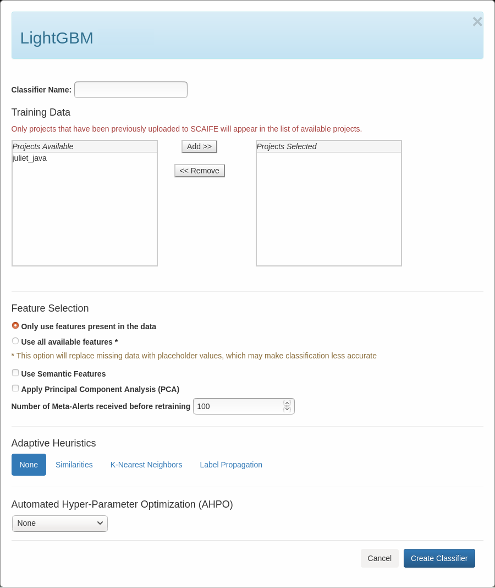

[SCALe](index.md) / [Source Code Analysis Lab (SCALe)](Welcome.md) / [Source Code Analysis Integrated Framework Environment (SCAIFE)](SCAIFE-Welcome.md)
<!-- <legal> -->
<!-- SCAIFE System version 1.2.2 -->
<!--  -->
<!-- Copyright 2020 Carnegie Mellon University. -->
<!--  -->
<!-- NO WARRANTY. THIS CARNEGIE MELLON UNIVERSITY AND SOFTWARE ENGINEERING -->
<!-- INSTITUTE MATERIAL IS FURNISHED ON AN "AS-IS" BASIS. CARNEGIE MELLON -->
<!-- UNIVERSITY MAKES NO WARRANTIES OF ANY KIND, EITHER EXPRESSED OR -->
<!-- IMPLIED, AS TO ANY MATTER INCLUDING, BUT NOT LIMITED TO, WARRANTY OF -->
<!-- FITNESS FOR PURPOSE OR MERCHANTABILITY, EXCLUSIVITY, OR RESULTS -->
<!-- OBTAINED FROM USE OF THE MATERIAL. CARNEGIE MELLON UNIVERSITY DOES NOT -->
<!-- MAKE ANY WARRANTY OF ANY KIND WITH RESPECT TO FREEDOM FROM PATENT, -->
<!-- TRADEMARK, OR COPYRIGHT INFRINGEMENT. -->
<!--  -->
<!-- [DISTRIBUTION STATEMENT F] Further dissemination only as directed by -->
<!-- OSD/ASD R&E (determination date: 2019-12-11) or higher DoD authority. -->
<!--  -->
<!-- Notice to DoD Subcontractors: This document may contain Covered -->
<!-- Defense Information (CDI).  Handling of this information is subject to -->
<!-- the controls identified in DFARS 252.204-7012 – SAFEGUARDING COVERED -->
<!-- DEFENSE INFORMATION AND CYBER INCIDENT REPORTING -->
<!--  -->
<!-- This Software includes and/or makes use of Third-Party Software -->
<!-- subject to its own license. -->
<!--  -->
<!-- This material includes field names used in the Software Assurance -->
<!-- Marketplace (SWAMP), a service that provides continuous software -->
<!-- assurance capabilities to developers and researchers at -->
<!-- https://www.mir-swamp.org/#.  Copyright © 2012-2020 The Morgridge -->
<!-- Institute for Research, Inc. All rights reserved.” -->
<!--  -->
<!-- This material includes field names used in the Software Assurance Tool -->
<!-- (SwAT), a tool that is used by analysts to analyze static analysis -->
<!-- alerts from multiple static analysis -->
<!-- tools. https://www.cerdec.army.mil/ Combat Capabilities Development -->
<!-- Command (CCDC) C5ISR Center. All rights reserved. -->
<!--  -->
<!-- DM19-1273 -->
<!-- </legal> -->

The SCAIFE manual (documentation) copyright covers all pages of the SCAIFE/SCALe manual with filenames that start with text 'SCAIFE' and that copyright is [here](SCAIFE-MANUAL-copyright.md).

The non-SCALe part of the SCAIFE _system_ has limited distribution that is different than the SCALe distribution. [Click here to see the SCAIFE system copyright.](SCAIFE-SYSTEM-copyright.md)

The SCAIFE API definition has its own distribution that is different than the SCAIFE system, SCAIFE manual, and SCALe distribution. The SCAIFE _API_ definition copyright is [here](SCAIFE-API-copyright.md)

SCAIFE : Statistics (Stats) Module
=====================

-   [Overview](#overview)
-   [Creating a new classifier type](#creating-a-new-classifier-type)
-   [Creating a new adaptive heuristic](#creating-a-new-adaptive-heuristic)
-   [SCAIFE Prototype Statistics Module](#scaife-prototype-statistics-module)
-   [Creating a new classifier](#creating-a-new-classifier)
-   [Running a classifier](#running-a-classifier)

Overview
--------

This Statistics Module stores and retrieves classification options, performs classification
(including performing automated hyper-parameter optimization (AH-PO) and adaptive heuristics (AHs),
per specification), and receives data and commands from the DataHub and UI Module.
The following is what the SCAIFE Statistics Module is intended to do:
It interacts with the DataHub to get data for its classification and adaptive heuristics
(including notifying the DataHub if it should forward updates for a particular project,
if the Statistics Module has an adaptive heuristic active for that project).
For projects that have an active AH, the Statistics Module receives updates from the DataHub
including for new static analysis tool output, new audit determinations, new code metrics data.
It interacts with the UI Module to respond to requests for classification options, classification
of a project, and changing/removing a classifier. For each overarching type of classification
(e.g., xgboost), the Statistics Module stores options for associated AH-POs and AHs.
The Statistics Module stores the data for each active classifier (including project id,
classifier type, AH-PO, AH, UI Module URL, and user ID).

Creating a new classifier type
------------------------------

1. Add a row to the 'classifier_types.csv' file (stats_server_stub/swagger_server/machine_learning/classifier_types.csv) that includes the following information:
    1. A string describing the type of classifier in Column 1
    2. The name of the Python submodule (script) you will create for the new classifier type in Column 2
2. Create a new Python submodule in stats_server_stub/swagger_server/machine_learning/ with a name that matches the string you entered in classifier_types.csv file in Step 1.2.  The submodule must include both a 'fit' and 'predict' function.  (See stats_server_stub/swagger_server/machine_learning/lightgbm.py for more details.)
3. Edit the 'classify.py' script (stats_server_stub/swagger_server/machine_learning/classify.py) to import the new submodule created in Step 2.
4. Restart the Stats server, and the new classifier type will be automatically added to the SCAIFE database

To specify the set of adaptive heuristics and automated hyperparameter optimization (AHPO) algorithms that can be used with the new classifier type, edit the 'insert_classifiers.py' script (stats_server_stub/swagger_server/database/insert_classifiers.py).

Creating a new adaptive heuristic
---------------------------------
1. Create a Python submodule in stats_server_stub/swagger_server/machine_learning/adaptive_heuristics/ with a name that describes the new adaptive heuristic.  The submodule must include both a 'train' and 'run' function.  (See stats_server_stub/swagger_server/machine_learning/adaptive_heuristics/k_nearest_neighbors.py for more details.)
2. Edit the following files to import the new submodule created in Step 1:
    1. stats_server_stub/swagger_server/controllers/datahub_to_stats_controller.py
    2. stats_server_stub/swagger_server/controllers/ui_to_stats_controller.py
    3. stats_server_stub/swagger_server/controllers/helper_controller.py
3. Add the new adaptive heuristic to the switch statement in the get_adaptive_heuristic function in stats_server_stub/swagger_server/controllers/helper_controller.py

To specify the set of classifier types that can be used with the new adaptive heuristic, edit the 'insert_classifiers.py' script (stats_server_stub/swagger_server/database/insert_classifiers.py).

SCAIFE Prototype Statistics Module
----------------------------------

The prototype stores and retrieves classification options, performs classification
(including performing automated hyper-parameter optimization (AH-PO) and adaptive heuristics (AHs),
per specification), and receives data and commands from the DataHub and UI Module.
The following is what the SCAIFE Statistics Module currently does:
It interacts with the DataHub to get data for its classification.
It interacts with the UI Module to respond to requests for classification options, classification
of a project, and changing/removing a classifier. For each overarching type of classification
(e.g., XGBoost), the Statistics Module stores options for associated AH-POs and AHs.
The Statistics Module stores the data for each active classifier (including project id,
classifier type, AH-PO, AH, user ID).
In the future, the Statistics Module will also store additional data for each active classifier (e.g., UI Module URL).
It will also interact with the DataHub to get data for its adaptive heuristics
(including notifying the DataHub if it should forward updates for a particular project,
if the Statistics Module has an adaptive heuristic active for that project).
For projects that have an active AH, the Statistics Module will receive updates from the DataHub
including for new static analysis tool output, new audit determinations, new code metrics data.

[SCALe](Welcome.md) is one instantiation of a SCAIFE UI module. We've modified the previous version of SCALe for (optional) SCAIFE integration. The current SCAIFE prototype uses SCALe as the UI module.
The text below describes how to interact with the SCAIFE prototype's Statistics Module via the SCALe UI to create, modify, and use classifiers.

**Important**: To access SCAIFE functionality in SCALe, the user must be connected to SCAIFE.  See [SCAIFE Registration](SCAIFE-Registration.md) for more information.

Creating a new classifier
-------------------------

1. Click the "Classifiers" button in the navigation bar
2. Select the type of classifier you want (e.g., "LightGBM")

3. Enter/Select the required information:
   1. A classifier name
   2. One or more projects to train the classifier on
   3. An adaptive heuristic (AH)
   4. An automated hyperparameter optimization algorithm (AHPO)

4. Click the "Save" button

Running a classifier
--------------------

1. After creating a new classifier (see above), select the classifier you want to apply to the current project's data
   from the 'Run Classifiers' dropdown.
   * Note: If SCALe is connected to the other SCAIFE servers, a help icon may appear which indicates the current project
   must be uploaded to the DataHub before it can be used to run the classifier.
2. Click the "Classify" button on the page displaying alertConditions/Meta-alerts

------------------------------------------------------------------------

Attachments:
------------

[CreateClassifier.png](attachments/CreateClassifier.png) (image/png)\

[LightGBMClassifier.png](attachments/LightGBMClassifier.png) (image/png)\
