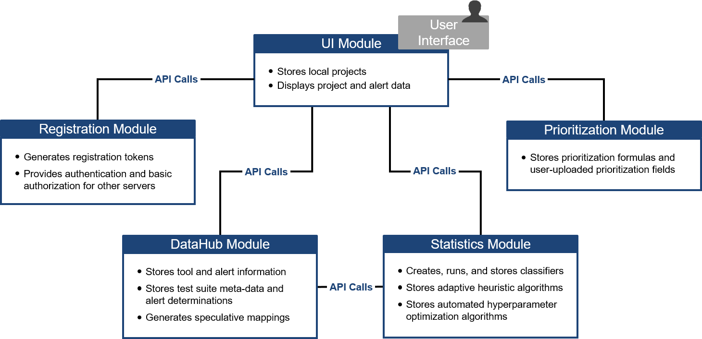

[SCALe](index.md) / [Source Code Analysis Lab (SCALe)](Welcome.md) / [Source Code Analysis Integrated Framework Environment (SCAIFE)](SCAIFE-Welcome.md)
<!-- <legal> -->
<!-- Copyright 2021 Carnegie Mellon University. -->
<!--  -->
<!-- This material is based upon work funded and supported by the -->
<!-- Department of Defense under Contract No. FA8702-15-D-0002 with -->
<!-- Carnegie Mellon University for the operation of the Software -->
<!-- Engineering Institute, a federally funded research and development -->
<!-- center. -->
<!--  -->
<!-- The view, opinions, and/or findings contained in this material are -->
<!-- those of the author(s) and should not be construed as an official -->
<!-- Government position, policy, or decision, unless designated by other -->
<!-- documentation. -->
<!--  -->
<!-- References herein to any specific commercial product, process, or -->
<!-- service by trade name, trade mark, manufacturer, or otherwise, does -->
<!-- not necessarily constitute or imply its endorsement, recommendation, -->
<!-- or favoring by Carnegie Mellon University or its Software Engineering -->
<!-- Institute. -->
<!--  -->
<!-- NO WARRANTY. THIS CARNEGIE MELLON UNIVERSITY AND SOFTWARE ENGINEERING -->
<!-- INSTITUTE MATERIAL IS FURNISHED ON AN 'AS-IS' BASIS. CARNEGIE MELLON -->
<!-- UNIVERSITY MAKES NO WARRANTIES OF ANY KIND, EITHER EXPRESSED OR -->
<!-- IMPLIED, AS TO ANY MATTER INCLUDING, BUT NOT LIMITED TO, WARRANTY OF -->
<!-- FITNESS FOR PURPOSE OR MERCHANTABILITY, EXCLUSIVITY, OR RESULTS -->
<!-- OBTAINED FROM USE OF THE MATERIAL. CARNEGIE MELLON UNIVERSITY DOES NOT -->
<!-- MAKE ANY WARRANTY OF ANY KIND WITH RESPECT TO FREEDOM FROM PATENT, -->
<!-- TRADEMARK, OR COPYRIGHT INFRINGEMENT. -->
<!--  -->
<!-- [DISTRIBUTION STATEMENT A] This material has been approved for public -->
<!-- release and unlimited distribution.  Please see Copyright notice for -->
<!-- non-US Government use and distribution. -->
<!--  -->
<!-- This work is licensed under a Creative Commons Attribution-ShareAlike -->
<!-- 4.0 International License. -->
<!--  -->
<!-- Carnegie Mellon® and CERT® are registered in the U.S. Patent and -->
<!-- Trademark Office by Carnegie Mellon University. -->
<!--   -->
<!-- DM20-0043 -->
<!-- </legal> -->

The SCAIFE manual (documentation) copyright covers all pages of the SCAIFE/SCALe manual with filenames that start with text 'SCAIFE' and that copyright is [here](SCAIFE-MANUAL-copyright.md).

The non-SCALe part of the SCAIFE _system_ has limited distribution that is different than the SCALe distribution. [Click here to see the SCAIFE system copyright.](SCAIFE-SYSTEM-copyright.md)

The SCAIFE API definition has its own distribution that is different than the SCAIFE system, SCAIFE manual, and SCALe distribution. The SCAIFE _API_ definition copyright is [here](SCAIFE-API-copyright.md)

SCAIFE : Source Code Analysis Integrated Framework Environment (SCAIFE)
=========================================

Welcome to the SCAIFE documentation!

-   [Purpose](#purpose)
-   [SCAIFE Overview](#scaife-overview)

Purpose
-------

The purpose of this document is to provide usage information for new
SCAIFE users, whether individuals or organizations. This document is meant
to be read electronically (although no Internet connectivity is required),
so we use hyperlinks to direct readers to other parts of the document.

SCAIFE Overview
---------------

Source Code Analysis Integrated Framework Environment (SCAIFE) is a multi-server architecture
with an application programming interface (API) and an open-source prototype that enables
static analysis alert classification and prioritization. It is designed so a wide variety of
static analysis tools can integrate with the system using the API definition. The SCAIFE
architecture shown below includes five types of servers:

1.  [Registration Module](SCAIFE-Registration.md)
1.  [DataHub Module](SCAIFE-DataHub.md)
1.  [Statistics (Stats) Module](SCAIFE-Statistics.md)
1.  [Prioritization Module](SCAIFE-Prioritization.md)
1.  [User Interface (UI) Module](SCAIFE-UserInterface.md)
1.  [Customizing SCAIFE](SCAIFE-Customization.md)
1.  [Extending SCAIFE manual](SCAIFE-Editing-Manual.md)
1.  [Managing SCAIFE servers](SCAIFE-Server-Management.md)
1.  [Continuous Integration (CI) Development with SCAIFE](SCAIFE-CI.md)
1.  [Automated Distribution of SCAIFE](SCAIFE-Automated-Distribution.md)
1.  [Developing Testing and Inspecting SCAIFE and SCALe Docker Containers](SCAIFE-Docker-Wisdom.md)
1.  [SCAIFE and SCALe Coding Conventions](SCAIFE-and-SCALe-Coding-Conventions.md)

------------------------------------------------------------------------
