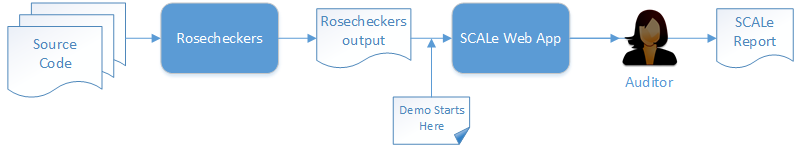

[SCALe](index.md) / [Source Code Analysis Lab (SCALe)](Welcome.md)
<!-- <legal> -->
<!-- SCALe version r.6.2.2.2.A -->
<!--  -->
<!-- Copyright 2020 Carnegie Mellon University. -->
<!--  -->
<!-- NO WARRANTY. THIS CARNEGIE MELLON UNIVERSITY AND SOFTWARE ENGINEERING -->
<!-- INSTITUTE MATERIAL IS FURNISHED ON AN "AS-IS" BASIS. CARNEGIE MELLON -->
<!-- UNIVERSITY MAKES NO WARRANTIES OF ANY KIND, EITHER EXPRESSED OR -->
<!-- IMPLIED, AS TO ANY MATTER INCLUDING, BUT NOT LIMITED TO, WARRANTY OF -->
<!-- FITNESS FOR PURPOSE OR MERCHANTABILITY, EXCLUSIVITY, OR RESULTS -->
<!-- OBTAINED FROM USE OF THE MATERIAL. CARNEGIE MELLON UNIVERSITY DOES NOT -->
<!-- MAKE ANY WARRANTY OF ANY KIND WITH RESPECT TO FREEDOM FROM PATENT, -->
<!-- TRADEMARK, OR COPYRIGHT INFRINGEMENT. -->
<!--  -->
<!-- Released under a MIT (SEI)-style license, please see COPYRIGHT file or -->
<!-- contact permission@sei.cmu.edu for full terms. -->
<!--  -->
<!-- [DISTRIBUTION STATEMENT A] This material has been approved for public -->
<!-- release and unlimited distribution.  Please see Copyright notice for -->
<!-- non-US Government use and distribution. -->
<!--  -->
<!-- DM19-1274 -->
<!-- </legal> -->

SCALe : SCALe Quick Start Demo for Auditors
============================================

### Please note: This section has not been fully updated for SCALe version 3. Screenshots and usage information may be deprecated, and new features not introduced.

### See section [The SCALe Web App](The-SCALe-Web-App.md) for updated feature and use information for SCALe version 3.

Demo Overview
-------------

In this demo, we use SCALe to audit the source code of the common UNIX
utility
[dos2unix](http://waterlan.home.xs4all.nl/dos2unix.html){.extlink},
version 7.2.2. We evaluate alerts from the static analysis tool
CERT Rosecheckers. We show how to import the output into the SCALe auditing
application. We then show how to use the web application to evaluate
alerts. Finally, we show how to export the results of this evaluation
from the application.

This diagram summarizes the scenario.

Demo Prerequisites
------------------

To complete the entire demo, you need the following:

1.  The SCALe web application, installed and running on a host
    accessible to the demo machine (for more information, see
    [Installing SCALe](Installing-SCALe.md).)
2.  A web browser

Demo Steps
----------

The demo is composed of the following steps:

1.  [Upload Source Code and Analysis
    Outputs](Upload-Source-Code-and-Analysis-Outputs.md)
2.  [Inspect Alerts for Violations of CERT Secure Coding
    Rules](Inspect-Alerts-for-Violations-of-CERT-Secure-Coding-Rules.md)
3.  [Export Analysis Results from the Web
    Application](Export-Analysis-Results-from-the-Web-Application.md)

------------------------------------------------------------------------

Attachments:
------------

 [AuditorDiagram.png](attachments/AuditorDiagram.png) (image/png)
