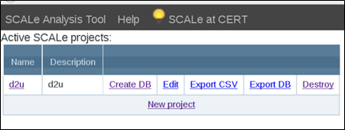

[SCALe](index.md) / [Source Code Analysis Lab (SCALe)](Welcome.md)
<!-- <legal> -->
<!-- SCALe version r.6.2.2.2.A -->
<!--  -->
<!-- Copyright 2020 Carnegie Mellon University. -->
<!--  -->
<!-- NO WARRANTY. THIS CARNEGIE MELLON UNIVERSITY AND SOFTWARE ENGINEERING -->
<!-- INSTITUTE MATERIAL IS FURNISHED ON AN "AS-IS" BASIS. CARNEGIE MELLON -->
<!-- UNIVERSITY MAKES NO WARRANTIES OF ANY KIND, EITHER EXPRESSED OR -->
<!-- IMPLIED, AS TO ANY MATTER INCLUDING, BUT NOT LIMITED TO, WARRANTY OF -->
<!-- FITNESS FOR PURPOSE OR MERCHANTABILITY, EXCLUSIVITY, OR RESULTS -->
<!-- OBTAINED FROM USE OF THE MATERIAL. CARNEGIE MELLON UNIVERSITY DOES NOT -->
<!-- MAKE ANY WARRANTY OF ANY KIND WITH RESPECT TO FREEDOM FROM PATENT, -->
<!-- TRADEMARK, OR COPYRIGHT INFRINGEMENT. -->
<!--  -->
<!-- Released under a MIT (SEI)-style license, please see COPYRIGHT file or -->
<!-- contact permission@sei.cmu.edu for full terms. -->
<!--  -->
<!-- [DISTRIBUTION STATEMENT A] This material has been approved for public -->
<!-- release and unlimited distribution.  Please see Copyright notice for -->
<!-- non-US Government use and distribution. -->
<!--  -->
<!-- DM19-1274 -->
<!-- </legal> -->

SCALe : Sanitizer
==================

SCALe code includes a script that creates a "sanitized" version of an
exported SCALe database, anonymizing fields (and deleting some fields)
that may possibly contain sensitive data.

**CAUTION:** In the current SCALe
distribution, sanitizer functionality is provided only for exported
SQLite3 databases, and sanitization can only be done via the command
line. This section detail  how to use the sanitizer and how it works.

-   [Audit Archive Sanitizer](#audit-archive-sanitizer)
-   [How the Sanitizer Works](#how-the-sanitizer-works)
-   [Using the SCALe Database
    Sanitizer](#using-the-scale-database-sanitizer)
-   [Tables and Sensitive Fields in Enhanced SCALe
    DB](#tables-and-sensitive-fields-in-enhanced-scale-db)
-   [Tool Extensibility](#tool-extensibility)
-   [Rationale for Sanitizing Audit
    Archives](#rationale-for-sanitizing-audit-archives)
    -   [Envisioned Transition: Large Audit Archives for Highly-Accurate
        Classifiers](#envisioned-transition-to-large-audit-archives-for-highly-accurate-classifiers)
-   [Testing the Sanitizer](#testing-the-sanitizer)
-   [Updating the Sanitizer Test](#updating-the-sanitizer-test)

Audit Archive Sanitizer
=======================

SEI CERT has developed a file sanitizer that anonymizes sensitive fields
of databases. Our sanitizer is designed to anonymize fields of SQLite
audit archives created by the CERT SCALe (Secure Code Analysis Lab)
auditing tool. SCALe provides a GUI environment for analysts to examine
alerts (warnings) from static analysis tools and their associated source
code, mark alert determinations (e.g., true or false), and export the
audit project information in a database. Along with the audit
determination (primary and supplemental) and auditor notes, the database
contains information about the alert and the associated source code.
Those database fields may contain sensitive information. For example,
one could imagine a class name of SecretRocketXControlCode might be
sensitive.

Our sanitizing script anonymizes or discards the following:

-   Alert message
-   Notes
-   Path, including directories and filename
-   Function or method name
-   Class name
-   Namespace/package
-   Project filename

The only fields we discard during sanitization are the alert
message and auditor notes. Both of those often contain a snippet of the
code. Most of the database fields that we anonymize describe the source
code location that the alert warns about: path, function or method name,
class name, and namespace/package. The project filename is the filename
of the audit project database, and since that name might divulge
sensitive information about the software that was audited, we anonymize
it.

How the Sanitizer Works
=======================

Anonymization is done by using SHA-256 hashing with a
[salt](https://en.wikipedia.org/wiki/Salt_%28cryptography%29){.extlink},
where the salt should be kept a secret and not shared with the
anonymized file. The salt greatly increases the difficulty of creating
[lookup
tables](https://crackstation.net/hashing-security.htm){.extlink},
which pre-hash dictionary words (and variations of them) with the
intention of making the hash reversible by enabling quick lookup of
potential words that a particular hash value could have come from. The
[salt should be a random string that is relatively
long](https://crackstation.net/hashing-security.htm){.extlink},
which is concatenated to the original string meant to be hashed.
Concatenating this string is intended to make creation of a lookup table
take too much time and space to be worthwhile for a potential attacker
trying to reverse the hashes. For the file path, we gave each directory
a separate anonymized name, and used slashes to separate hashed names
along a filepath.

The database sanitization script performs the following tasks:

1.  It looks for a filename “`salt.txt`” in the sanitizer script’s
    directory, to check if the collaborator has already created their
    own salt. If the file does not yet exist, the script generates a
    salt using the method described below.
2.  For each potentially-sensitive field in the database to be sanitized
    (as opposed to discarded), it:
    1.  concatenates the salt with whatever string it is about to hash
    2.  hashes the salted string (the concatenated text)
    3.  note: fields that would normally be sanitized but whose values
        are empty or populated with the original default value (e.g.
        "0") will not be sanitized

The salt should be generated using [a cryptographically secure
pseudo-random number
generator](https://crackstation.net/hashing-security.htm){.extlink}.
We instructed collaborators to create their own secret
(secret-from-the-SEI) salts. If the collaborator didn’t do that, then
the script auto-generates a salt and put it into a file named
“salt.txt.” The following command could be used for generating the salt
on a Linux computer from a bash terminal:

```
head /dev/urandom -c 16 | base64
```

Using the SCALe Database Sanitizer
==================================

The sanitizer is expected to be run on a database at any point to create
a sanitized version of that database as well as an additional database
that contains the salt used to create the hashes in the sanitized
database (as a new table called Salt with a single entry containing the
salt) and the sanitized pathnames in the Messages table that pertain to
each Messages entry (by adding a new column to the Messages table called
sanitPath).

Start by exporting your current SCALe project database:

1.  Open the SCALe GUI in your browser
2.  Select “Export DB” to save the SCALe project to a sqlite3-formatted
    database.
3.  Close the SCALe GUI



You will sanitize this database that you have exported.

**When a SCALe database is sanitized, only one new sanitized database is
created. The original database and the database with the new table
called** **Salt** **still have sensitive information in them.**

Creating the salt:

After applying any SCALe patches (patches are updates to the SCALe
software), either 1. put a salt value in a file named salt.txt in the
\$SCALE\_HOME/scale.app/scripts directory; or 2. if file salt.txt
doesn’t exist, the sanitizer creates it.

**For multiple auditors on the same codebase** (each creates a different
SCALe project)**, use the same salt value with each database. This is
important, so the sanitized data from different auditors can be analyzed
together. **

To run the sanitizer, run the following command in the
\$SCALE\_HOME/scale.app/scripts directory:

`python sanitize_db.py [-n] <path_to_database_to_sanitize>`

`-n, --newDb Option:`

It is possible to sanitize a database of the same name more than once
with the same salt, which will cause a collision on the hashed name of
the database.

If the –n argument is NOT specified, then the current sanitized database
and additional database with salt will be removed and a new sanitized
database and additional database with salt will be created with the same
names.

If the –n argument IS specified, and if the sanitizer finds that a
sanitized database of a certain name already exists, it will create a
new database of the same name with ‘\_&lt;random int between 0 and
1,000,000&gt;’ appended to the end of the name and a new additional
database with salt also containing ‘\_&lt;random int between 0 and
1,000,000&gt;’ appended to the end of the name. It is to be noted that
if the –n is specified and no duplicate named sanitized and salt
containing databases exist, then random values will not be append to the
end of the names of the databases. Therefore, if the behavior of adding
the –n argument is the preferred behavior expected when running the
sanitizer, it may be best to specify it on every run of the script.

Examples (assume these runs are executed in sequential order, using the
same salt value):

**Note: You should save the database in the scripts directory or specify the database path relative to the scripts directory**

1. Run: `python sanitize_db.py ../db/mydatabase.sqlite3`
    - Output: A sanitized database named <some SHA-256 hash value>.sqlite3 and an additional database named mydatabase_with_salt.sqlite3.
2. Run: `python sanitize_db.py ../db/mydatabase.sqlite3`
    - Output: Since –n was not specified, this will delete the previous outputted databases and create new databases named <same SHA-256 hash value as before>.sqlite3 and mydatabase_with_salt.sqlite3.
3. Run: `python sanitize_db.py –n ../db/mydatabase.sqlite3`
    - Output: Since –n was specified in this case, two new databases will be created and the current sanitized and salt containing databases will not be altered.
    - Suppose the script chooses the random values 34239 and 987 to append to the new databases. The new databases will be named <same SHA-256 hash value as before>_34239.sqlite3 and mydatabase_with_salt_987.sqlite3.

**Sharing Post-Sanitized Databases**

The first sanitization creates two new databases, for a total of three
databases:

1.  Original database (sensitive)
2.  New database with the salt (sensitive)
3.  New sanitized database with a hashed name

Only the “new sanitized database with a hashed name” should be shared.

Actual example original (blue) and 2 new output filenames:

`test6-2016-02-11_19:50:29.sqlite3`

`test6-2016-02-11_19:50:29_with_salt.sqlite3`

`eb8276f623bd4f61e0a52907e29b9f2deed771c288034a313ebaa5ab3cd467db.sqlite3`

Tables and Sensitive Fields in Enhanced SCALe DB
================================================

This section describes some tables and sensitive fields in the SCALe
database.

In a SCALe database, some of the potentially-sensitive data items stored
include the message, the path (including filename), and the name of the
SCALe database file itself. Also function and class names may be
sensitive.

An exported SCALe database has many tables, including among others the
following 3 tables: LizardMetrics, ExtraFeatures, and
ExtraSourceContext. For each of the 3 tables, charts below show the
fields, data type of each field, description, and determination of its
sensitivity. Sensitive fields in the new tables are highlighted in
red-colored rows.

**LizardMetrics    **

  Metric              Type      Description                                                                                    Sensitive
  ------------------- --------- ---------------------------------------------------------------------------------------------- -------------
  name                TEXT      Contains name of a directory, file, or function                                                Yes
  length              INTEGER   Number of lines of code                                                                        No
  sloc                INTEGER   Number of significant lines of code                                                            No
  parent              TEXT      Null for directory and file entries, but contains the path of the parent file for functions.   Yes
  file_methods        INTEGER   Number of methods in file                                                                      No
  cyc_comp            INTEGER   Cyclomatic complexity number                                                                   No
  avg_cyc_comp        REAL      Average cyclomatic complexity                                                                  No
  func_params         INTEGER   Number of function parameters                                                                  No
  avg_params          REAL      Average number of parameters per function                                                      No
  avg_sloc_folder     REAL      Average number of parameters per folder                                                        No
  tokens              INTEGER   Token count                                                                                    No
  avg_tokens          REAL      Average number of tokens                                                                       No
  start_line          INTEGER   Starting line number                                                                           No
  end_line            INTEGER   Ending line number                                                                             No
  ------------------- -------------------------------------------------------------------------------------------------------- -------------

**ExtraSourceContext**

  **Feature Name**   **Type**   **Description**                                                                   **Sensitive**
  ------------------ ---------- --------------------------------------------------------------------------------- ---------------
  message            INTEGER    The id of the alert message this information is associated with              No
  func               TEXT       The name of the function/method associated with this alert, if available     Yes
  class              TEXT       The name of the class associated with this alert, if available               Yes
  namespace          TEXT       The name of the namespace/package associated with this alert, if available   Yes
  lineend            INTEGER    The line where the alert ends, if available                                  No
  colstart           INTEGER    The start column in the line of code targeted by this alert, if available    No
  colend             INTEGER    The end column in the line of code targeted by this alert, if available      No
  ------------------ ---------- --------------------------------------------------------------------------------- ---------------

**ExtraFeatures**

  **Feature Name**   **Type**   **Description**                                                        **Sensitive**
  ------------------ ---------- ---------------------------------------------------------------------- -------------------------------------------------------------
  message            INTEGER    The id of the alert message this information is associated with   No
  name               TEXT       The name of the feature                                                No
  value              TEXT       The value of the feature                                               No (None of these current features gathered are sensitive.)
  ------------------ ---------- ---------------------------------------------------------------------- -------------------------------------------------------------

The ‘ExtraFeatures’ table is a little different from the other two new
tables.  It is more of a dictionary (in the programming sense) than a
SQL table.  It maps feature names to values for alerts.  Currently,
none of the extra features collected are sensitive.

Tool Extensibility
==================

The sanitizer could be lightly modified to sanitize sensitive fields of
other SQLite database structures. The tool would require more
modifications to enable it to sanitize data stored using other formats
(e.g., SQL or  comma separated values) .

Rationale for Sanitizing Audit Archives
=======================================

The reason we created a sanitizer for audit archives is to be able to do
correlation analysis on sensitive data that we could not analyze unless
it was anonymized. In a previous project, our collaborators could not
share the sensitive part of their audit archive data with us. Additional
reasons to need to sanitize audit archives before sharing them include
that the sensitive data might be too sensitive to share between
organizations, and also that different organizations are understandably
reluctant to share detailed information about potential code flaws (that
the alerts warn of) in code they have developed.

The goal of one of our ongoing
[research](http://resources.sei.cmu.edu/library/asset-view.cfm?assetID=474252){.extlink}
[projects](https://insights.sei.cmu.edu/sei_blog/2016/06/prioritizing-alerts-from-static-analysis-to-find-and-fix-code-flaws.html){.extlink}
is to create classifiers to automatically categorize static analysis
alerts as expected-True (e-TP), expected-False (e-FP), and
indeterminant. Previous research has shown that features of alerts and
their associated source code can be used to develop accurate classifiers
for alerts from single static analysis tools. (Our research created
classifiers with alerts from multiple tools.) Those features include
sensitive fields (class name, function or method name,
namespace/package, and partially-shared paths). To use features shown
helpful by previous related research, we developed a sanitization method
that allowed us to use these fields and to be able to correlate
anonymized fields when they were the same.

Further, creation of classifiers requires a lot of audit archive data
(i.e., many audited alerts), but auditing alerts takes significant human
work. To collect an archive with sufficient audit archives to create
accurate classifiers, in a timely manner, we developed a sanitizer
enabling others to share their data with us.

Envisioned Transition to Large Audit Archives for Highly Accurate Classifiers
---------------------------------------------------------------------------

Similarly, the sanitizer (along with standard audit archive fields,
lexicon, and auditing rules as discussed in our IEEE SecDev 2016 paper,
“Static Analysis Alert Audits: Lexicon & Rules”) could enable large
organizations and communities of practice such as the Software Assurance
Community of Practice (SwA-CoP ) to benefit from sharing large
quantities of sanitized audit data to develop highly-accurate
classifiers for static analysis alerts.

Testing the Sanitizer
=====================

The sanitizer is automatically tested as part of SEI DevOps during SCALe
development via JUnit tests and python tests. Tests can also be run
manually using `test/python/test_sanitizer.py`. By default tests compare
against a sanitized reference database. The test project was created
with the following inputs within the
`test/junit/test/scale_input/dos2unix` directory:

  **Tool**              **File**
  --------------------- -------------------------------
  project source        `dos2unix-7.2.2.zip`
  12/rosecheckers_oss/c `analysis/rosecheckers_oss.txt`
  24/coverity/c         `analysis/coverity.json`
  91/lizard_oss/metric  `analysis/lizard_oss.csv`
  92/ccsm_oss/metric    `analysis/ccsm_oss.csv`
  93/understand/metric  `analysis/understand.csv`
  --------------------- -------------------------------

The tool options must all be added at the same time during project
creation. If they are later added to an existing project the resulting
database will likely not match the reference database.

Once a test project is set up the most straightforward way to
test it is:

    `pytest -k TestSanitizer test/python/test_sanitizer.py --sanitizer-project=PROJECT_NAME`

The project DB will then be sanitized and compared to the pre-sanitized
reference DB. In order for the project name option to successfully work
the test must be invoked on the same SCALe host where the project to be
tested was created -- otherwise an explicit path to the database must be
provided with the `--sanitizer-tgtdb` option.

The reference databases and salt file are in the
`test/python/data/sanitizer` directory:

  **Description**          **File**
  ------------------------ --------------------------------------
  Unsanitized Reference DB `dos2unix.sanitizer.sqlite3`
  Sanitized Reference DB   `dos2unix.sanitizer.sanitized.sqlite3`
  Reference Salt File      `dos2unix.sanitizer.salt`
  ------------------------ --------------------------------------

The test_sanitizer.py script can be used in a more broadly generalized
fashion for arbitrary database comparisons, sanitized or unsanitized.
See the `--sanitizer-no-sanitize` option and read more about the various
command-line options by running:

    `test/python/test_sanitizer.py --help`


Updating the Sanitizer Test
===========================

The testProjectSanitizer tests ((1) Python at $SCALE_HOME/scale.app/test/python/test_sanitizer.py; and (2) Selenium at $SCALE_HOME/scale.app/test/junit/test/src/test/java/scale_webapp/test/scenario/TestWebAppCoreScenariosLocal.java) are designed to fail if the developer did not update the following when the database was changed:

1.  The developer should update the sanitizer when the database is changed:
    1.  The developer should update the sanitizer, and make an explicit determination whether to sanitize, remove, or keep the text for any new fields (and any new tables).
    2.  If tables were modified in other ways (e.g., fields were moved around or removed), again, the developer should make explicit determinations (encoded in the sanitizer script) how to securely sanitize / remove text/ or keep text for the fields that were moved
2.  Then, the developer should verify that the updated sanitizer indeed sanitizes the newly-created database properly by doing the following:
    1.  Carefully code the sanitizer
    2.  Then, carefully examine a newly exported database (unsanitized) to make sure that the expected entries are where they should be
    3.  Then, carefully examine a newly sanitized exported database to make sure that all sensitive data has been sanitized (hashed or removed)
3.  Then, the developer should create the new test database (unsanitized) via the SCALe GUI, and new test database (sanitized) for use in the automated tests.
Important notes about how to do this:

    1. Use the "dos2unix" code located in $SCALE_HOME/scale.app/test/junit/test/scale_input/dos2unix/ to create new test databases.
    2. Select the following open-source (not proprietary) tool output (located in $SCALE_HOME/scale.app/test/junit/test/scale_input/dos2unix/analysis/):

* gcc_oss
* rosecheckers_oss
* lizard_oss
* ccsm_oss

    3. Make sure to click "Clear Filters" on the alerts page in order to reset any session settings back to defaults. Also select SCAIFE Mode "Demo".
    4. Upload user-uploaded fields to the SCALe project using the following file: $SCALE_HOME/scale.app/test/junit/test/scale_input/misc/user_upload_example.csv (See in SCALe manual instructions how to do this, here: $SCALE_HOME/scale.app/public/doc/scale2/The-SCALe-Web-App.html#uploading-additional-fields )
    5. Set the first meta-alert to false, and the second meta-alert to true. (Do this in Fused View.)
    6. Create a prioritization scheme and name it "priorityScheme1", using instructions in the SCALe manual at: $SCALE_HOME/scale.app/public/doc/scale2/The-SCALe-Web-App.html#selecting-a-prioritization-scheme
        1. Weight "safeguard_countermeasure" to "1" 
        2. Weight "complexity" to "5" 
        3. Weight "CERT remediation" to "1" 
        4. Weight "CERT severity" to "2"
        5. Set the formula in the CERT tab to "cert_severity*2+cert_remediation+safeguard_countermeasure"  
        6. Weight "CWE likelihood" to "3" 
        7. Set the formula in the CWE tab to "cwe_likelihood*3+safeguard_countermeasure" 
        8. Select "Generate the formula" button
        9. Select "Save Priority" (save it locally-only) checkbox
        10. Select "Run Priority" button. 
    7. Create a classifier scheme in Demo mode (Demo-Xgboost) and name it "classifierScheme1", using instructions in the SCALe manual at: $SCALE_HOME/scale.app/public/doc/scale2/The-SCALe-Web-App.html#selecting-a-classification-scheme
        1. Add the available project to "Projects Selected"
        2. Select the "Z-ranking" Adaptive Heuristic
        3. Select the "sei-ahpo" Automated Hyper-Parameter Optimization algorithm (AHPO)
        4. Click "Create Classifier"
        5. Select the classifier "classifierScheme1" from the Run Classifier dropdown 
        6. Click "Classify" from the page displaying the list of meta-alerts (i.e., the Fused View)
    8. Return to the landing page, and export the SCALe DB.


4. Update the Selenium test as needed, so that the Selenium test "testProjectSanitizer" will create the same exported DB.
    a. For example 1: If different tool output needs to be uploaded, update "testProjectSanitizer()" to specify the file location in $SCALE_HOME/scale.app/test/junit/test/src/test/java/scale_webapp/test/scenario/TestWebAppCoreScenariosLocal.java
    b. For example 2: As needed, modify the prioritization scheme set and user uploads in $SCALE_HOME/scale.app/test/junit/test/src/test/java/scale_webapp/test/scenario/TestWebAppCoreScenariosLocal.java 

5. TO BE FIXED SOON: The following is a list of steps that aren't happening yet, but should be.

* Project tool output should be updated to include cppcheck_oss.xml (version 1.86)
* The C89 language should be selected/assigned during project creation
* When the classifier scheme can be run while connected to SCAIFE, the prioritization scheme used in the test needs to be updated to include teh confidence value returned
* When the classifier scheme can be run while connected to SCAIFE, start all the non-SCALe SCAIFE servers and then connect to SCAIFE from the SCALe GUI. Next, via the SCALe GUI: Create AND RUN a classification scheme. 
* Every field whose sanitization will be tested must be filled. That means every table and every field in the DB should be filled. Generally, you should not fill the tables/fields in the DB with a script, because then you might not catch changes that could cause sensitive data to go unsanitized. However, until some tables can be filled while connected to SCAIFE, those fields should be filled using the script $SCALE_HOME/scale.app/scripts/artificialTemporaryTableFillForSanitizer.py. NOTE: THIS SCRIPTED FILLING OF SUCH FIELDS ISN'T YET BEING DONE (1/21/2020) BUT THAT SHOULD START SOON. FIELD-FILLING SHOULD BE DONE WITH AND SCRIPTED IN $SCALE_HOME/scale.app/scripts/artificialTemporaryTableFillForSanitizer.py, AND SUCH EDITS SHOULD BE COMMITED INTO THE scale.app/scripts REPOSITORY (AND PR'd INTO THE MAIN DEVELOPMENT BRANCH) FOR ALL DEVELOPERS TO USE, and for the sanitizer tests to use.


The testProjectSanitizer test will also fail if the developer did not update the following when ONLY the checker mappings were changed:

1.  The developer should verify that the database format wasn't actually changed also, and that the pre-existing sanitizer indeed sanitizes the newly-created database properly by doing the following:
    1.  Carefully examine a newly exported database (unsanitized) to make sure that the expected entries are where they should be. Do this both before AND after any scripted field-filling using "$SCALE_HOME/scale.app/scripts/artificialTemporaryTableFillForSanitizer.py" as specified above.
    2.  Then, carefully examine a newly sanitized exported database to make sure that all sensitive data has been sanitized (hashed or removed)
2.  Then, the developer should create the new test database (unsanitized) and new test database (sanitized) for use in the automated tests. NOTE: See above section (item 3) which details exactly how the new database should be created. Make sure to fill all fields so the sanitization of all fields will be tested.

After creating the reference project as described above, export the project database to:

    `test/python/data/sanitizer/dos2unix.sanitizer.sqlite3`

Then run the following command to generate a new sanitized reference DB (while preserving the original salt file):

    `scripts/sanitize_db.py -H -C -s test/python/data/sanitizer/dos2unix.sanitizer.salt test/python/data/sanitizer/dos2unix.sanitizer.sqlite3`

(alternatively, just run scripts/update_sanitizer_test.py after exporting the project database)

Then commit the updated DB files to the repository.

------------------------------------------------------------------------

[](The-SCALe-Web-App.md)
[](Welcome.md)
[](SCALe-Quick-Start-Demo-for-Auditors.md)

Attachments:
------------


[SCALeGUI.png](attachments/SCALeGUI.png)
(image/png)
