[SCALe](index.md) / [Source Code Analysis Lab (SCALe)](Welcome.md)
<!-- <legal> -->
<!-- SCALe version r.6.7.0.0.A -->
<!--  -->
<!-- Copyright 2021 Carnegie Mellon University. -->
<!--  -->
<!-- NO WARRANTY. THIS CARNEGIE MELLON UNIVERSITY AND SOFTWARE ENGINEERING -->
<!-- INSTITUTE MATERIAL IS FURNISHED ON AN "AS-IS" BASIS. CARNEGIE MELLON -->
<!-- UNIVERSITY MAKES NO WARRANTIES OF ANY KIND, EITHER EXPRESSED OR -->
<!-- IMPLIED, AS TO ANY MATTER INCLUDING, BUT NOT LIMITED TO, WARRANTY OF -->
<!-- FITNESS FOR PURPOSE OR MERCHANTABILITY, EXCLUSIVITY, OR RESULTS -->
<!-- OBTAINED FROM USE OF THE MATERIAL. CARNEGIE MELLON UNIVERSITY DOES NOT -->
<!-- MAKE ANY WARRANTY OF ANY KIND WITH RESPECT TO FREEDOM FROM PATENT, -->
<!-- TRADEMARK, OR COPYRIGHT INFRINGEMENT. -->
<!--  -->
<!-- Released under a MIT (SEI)-style license, please see COPYRIGHT file or -->
<!-- contact permission@sei.cmu.edu for full terms. -->
<!--  -->
<!-- [DISTRIBUTION STATEMENT A] This material has been approved for public -->
<!-- release and unlimited distribution.  Please see Copyright notice for -->
<!-- non-US Government use and distribution. -->
<!--  -->
<!-- DM19-1274 -->
<!-- </legal> -->

SCALe : The SCALe Web App
==========================

This section documents the administration and use of the SCALe web app.

-   [Overview](#overview)
-   [Administration](#administration)
    -   [Configuration](#configuration)
        -   [Networking](#networking)
        -   [Access Control](#access-control)
        -   [SSL](#ssl)
    -   [Launching](#launching)
    -   [Maximum Memory Use and SCALe-Related Benchmarks (Time, Memory, and Disk Use)](#maximum-memory-use-and-scale-related-benchmarks-time-memory-and-disk-use)
-   [Usage](#usage)
    -   [Supported
        Browsers](#supported-browsers)
    -   [Uploading output from Static Analyzers (both alerts from general flaw-finder tools and metrics from code metrics tools)](#uploading-output-from-static-analyzers-both-alerts-from-general-flaw-finder-tools-and-metrics-from-code-metrics-tools)
    -   [Inspecting AlertConditions to Adjudicate for the Condition](#inspecting-alertconditions-to-adjudicate-for-the-condition)
        -   [The AlertCondition Viewer](#the-alertcondition-viewer)
        -   [The Auditing Workflow](#the-auditing-workflow)
            -   [Sorting the AlertConditions by CERT
                Priority](#sorting-the-alertconditions-by-cert-priority)
            -   [Filtering by
                Condition](#filtering-by-condition)
            -   [Auditing an AlertCondition](#auditing-an-alertcondition)
            -   [Updating AlertCondition
                Verdicts](#updating-alertcondition-verdicts)
            -   [Flagging AlertConditions](#flagging-alertconditions)
            -   [Updating Supplemental
                Verdicts](#updating-supplemental-verdicts)
            -   [Adding Notes](#adding-notes)
            -   [Selecting a Prioritization
                Scheme](#selecting-a-prioritization-scheme)
            -   [Uploading additional
                fields](#uploading-additional-fields)
            -   [Selecting a Classification
                Scheme](#selecting-a-classification-scheme)
            -   [Running the
                Classifier](#running-the-classifier)
            -   [alertCondition Determination
                History](#alertcondition-determination-history)
    -   [Editing, Exporting, Sanitizing, or Deleting an Existing Project](#editing-exporting-sanitizing-or-deleting-an-existing-project)
        -   [Exporting Analysis Results](#exporting-analysis-results)
        -   [Making a Sanitized Version of Exported Analysis Results](#making-a-sanitized-version-of-exported-analysis-results)
        -   [Editing an Existing Project](#editing-an-existing-project)
            -   [Cascade Determinations](#cascade-determinations)

Overview
--------

The SCALe web app facilitates the auditing of alertConditions from various [static analyzers](Terms-and-Definitions.md#static-analysis).
It is a Ruby on Rails application, accessed through a web browser. The
main use cases for this application are as follows:

1.  Uploading alerts and code metrics from static analyzers
2.  Inspecting alertConditions to adjudicate for the condition: look for a violation of the CERT Secure Coding rule or
    an instance of the Common Weakness Enumeration weakness (CWEs)
3.  Exporting analysis results

This diagram illustrates how users interact with the web app.

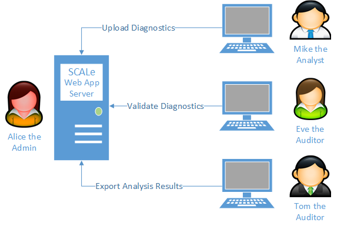

Here is a table overview of the actors in this diagram with their
responsibilities:

| Actor | Role |
|:---:|---------------------------|
|Alice the Admin | Installs the web app on a dedicated server and configures access for the other users |
|Mike the Analyst |Runs static analysis tools on source code and uploads the results to the web app |
| Eve the Auditor | Inspects the results uploaded by Mike, using the web app, for true violations of conditions (e.g., CERT Secure Coding rules) or instances of conditions (e.g., CWEs) |
| Tom the Auditor | Assists Eve and, for reporting purposes, exports the alertConditions from the web app after auditing is complete |

Administration
--------------

This section documents the administration and configuration of the SCALe
web app. This is the job of Alice in the diagram above.

### Configuration

#### Networking

The SCALe web app is, by nature, networked. Mike, Eve, and Tom must be
able to connect to the web app from their personal terminals. Therefore,
the server machine should be connected to a network accessible by all
users. The users need to know the network address or DNS name of this
machine. Moreover, the server machine must be configured so that users
can connect to the port used by the web app. The details for this
configuration are specific to each individual's machine operating
system.

#### Access Control

The SCALe web app provides its own login security. Users can use the
app's `Login` button and subsequent `Sign Up` button to create
suitable user names and passwords.

#### SSL

The web app can be configured to use HTTPS. Naturally, you need a Secure
Sockets Layer (SSL) certificate that is trusted by users on your
network. This certificate should be placed into
the `$SCALE_HOME/scale.app/cert `directory. Your web server process must
have sufficient permission to read this certificate. Next, the
`config.force_ssl` option
in `$SCALE_HOME/scale.app/app/controllers/application_controller.rb`
must be set to `true`. If you wish to disable SSL, this option can set
to `false:`

```ruby
class ApplicationController < ActionController::Base
    # Modify the next line to enable/disable SSL
    config.force_ssl = true # or, false, to disable
```

### Launching

If you are using SCAIFE, see [Managing the SCAIFE servers](SCAIFE-Server-Management.md) for how to launch SCALe with SCAIFE.

The SCALe web app comes packaged with an HTTP server called Thin. You are free to use a different server platform, such as Apache.

Before starting the SCALe web app, there must be a
`$SCALE_HOME/scale.app/db/development.sqlite3` file.  Run the following command to generate it:

```
cd $SCALE_HOME/scale.app
bundle exec rake db:migrate
```

Whenever the format of the SCALe database has been changed:

-   Kill the web server if it is currently running
-   delete all files within\$SCALE\_HOME/scale.app/public/GNU/
-   delete the `$SCALE_HOME/scale.app/db/backup` directory and all files
    within it.
-   delete the `$SCALE_HOME/scale.app/archive ` directory and all files
    within it.
-   delete the `$SCALE_HOME/scale.app/db/external.sqlite3 ` file.
-   delete the `$SCALE_HOME/scale.app/db/development.sqlite3` file
-   regenerate the (with-new-format)
    `$SCALE_HOME/scale.app/db/development.sqlite3` file

The following commands performs those steps:

```
killall -r ruby*
cd $SCALE_HOME/scale.app
rm -rf $SCALE_HOME/scale.app/public/GNU/*
rm -rf $SCALE_HOME/scale.app/db/backup
rm -rf $SCALE_HOME/scale.app/archive
rm $SCALE_HOME/scale.app/db/external.sqlite3
rm $SCALE_HOME/scale.app/db/development.sqlite3
bundle exec rake db:migrate
```


To run the Thin server on port 8083, with SSL disabled, execute the
following command:

```
cd $SCALE_HOME/scale.app
bundle exec thin start --port 8083
```

Accessing the server from your browser depends on your network
configuration. (See examples in bullets below.) The browser should then
prompt you for a username and password, and then show the available
projects (initially empty)

* If your SCALe web app server also has a browser handy, you should be able to direct the browser to  http://127.0.0.1:8083.  

* If your SCALe web app server is on a virtual machine (VM), you can also
test using a browser from your host (for example, a host MS
Windows) machine:

  -   In a bash terminal on your VM, get your VM's local IP address (we
    will call it VM_LOCAL_IP_ADDRESS) by executing `ifconfig` and
    then copy the IP address after "`inet addr:`"  If there are multiple
    IP addresses, you want the one that begins with `192.168`.
  -   In the host Windows machine, in a browser (e.g., Internet Explorer)
    enter: <http://VM_LOCAL_IP_ADDRESS:8083>
    (Change http to https as appropriate, and similarly change the port
    from 8083 if it should be different.) 

To run the Thin server on port 8083, with SSL enabled, execute the
following command after you've installed your SSL certificate and key
file to the `cert ` directory of the web app:

```
cd $SCALE_HOME/scale.app
bundle exec thin start --ssl --port 8083 --ssl-cert-file cert/server.crt --ssl-key-file cert/server.key
```

Accessing the server from your browser depends on your network
configuration. If your SCALe web app server also has a browser handy,
you should be able to direct the browser to https://127.0.0.1:8083. It
should then prompt you for a username and password, and then show the
available projects (initially empty)

 Some other useful command-line options for the `thin` utility include
the following:

  Option          Description
  --------------- ----------------------------------------------
  `--daemonize`   Run the server daemonized in the background
  `--pid`         Save the pid of the running server to a file

For other parameters, run

```
cd $SCALE_HOME/scale.app
bundle exec thin --help
```

To set up additional servers, clone the server directory and perform the
configuration, launching, and usage instructions again.

### Maximum Memory Use and SCALe-Related Benchmarks (Time, Memory, and Disk Use)

Ensure that the machine you will run the SCALe web app on has sufficient
available memory and disk space, and at least skim the benchmarks
provided for SCALe-related time, memory, and disk use. When running
the [SCALe Quick Start Demo for Auditors](SCALe-Quick-Start-Demo-for-Auditors.md), the SCALe
web app takes up to 300MB (both RAM and virtual memory). The app uses
GNU Global to produce hyperlinked web pages of source code. The codebase
used in the demo produces about 50MB of hyperlinked code.

Usage
-----

This section documents how users interact with the web app. These
interactions cover the responsibilities of Mike, Eve, and Tom in the
diagram above. This section is for informational purposes only. For a
hands-on walk through of the web app, see the [SCALe Quick Start Demo for Auditors](SCALe-Quick-Start-Demo-for-Auditors.md).

### Supported Browsers

The following browsers have been tested with the SCALe web app:

  Browser             Version
  ------------------- ---------
  Firefox             40.0.3
  Internet Explorer   11.0
  Chrome              44

### Uploading output from Static Analyzers (both alerts from general flaw-finder tools and metrics from code metrics tools)

Mike the Analyst can use the web app to upload the output from static
analysis tools. Mike will need the following before doing so:

1.  The outputs from all desired static analysis tools
2.  The source code analyzed in a zip archive
3.  The previous two items on a machine with connectivity to the SCALe
    web app
4.  The network address, port, username, and password for the web app
    from Alice

Mike connects to the web app using the details supplied by Alice. He
arrives at the homepage and sees a list of existing projects maintained
by the web app. He then creates a new project for this audit by clicking
the **New project** button:

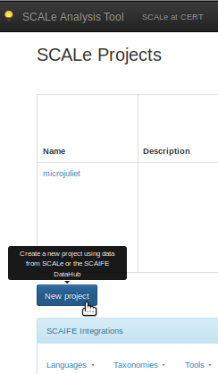

He then specifies a name and description for the project and clicks the
**Create Project** button:

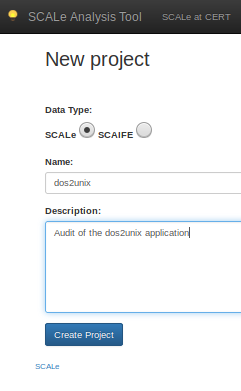

Next, Mike uploads the source code and the outputs from the static
analyzers. To upload the source, he clicks the **Browse...** button next
to the label **Archive containing src:**. SCALe can import source as a
zipfile or a tarball (.tar.gz or .tar.bz2). Then he selects the archive
containing the source code from his local machine. 

SCALe needs to normalize the file name references for the source code
with the file name references from the static analysis tool. The section
of the manual "Manual Project Creation" has detail on that, including
how to create parts of a project manually and ways to resolve filepaths
if the import using the SCALe GUI has problems resolving filepaths (to
match the source code filepaths and static analysis output filepaths).
Hopefully importing source code and static analysis output via the GUI
will work ok though, as that's simplest.

Hopefully importing source code and static analysis output via the GUI
will work ok though, as that's simplest.

Next he uploads the output from each tool using the appropriate row in
the table below the source upload dialog. The first column of this table
identifies general-purpose static analysis tools by toolname and
language in the format **ID / TOOL NAME / LANGUAGE**. The ID uniquely
identifies a Tool/Language combination. For example, the row **11 / gcc
/ c** identifies the "gcc" tool (compiler) for C/C++ source code. The
checkbox next to this identified tool and language should be checked,
then the output uploaded by clicking the **Browse...** button next to
the **Tool output:** label.

If Mike is uploading [Software Assurance Marketlace (SWAMP)](https://continuousassurance.org/)
tool output, he should first find the **swamp_oss** row for the correct tool language.
There he will see an additional dropdown that reads **Choose Tool Information**:

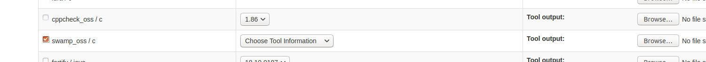

Using this tool output dropdown Mike will choose the tool used to create
the SWAMP output. The checkbox should also be checked and the SWAMP tool output
can be uploaded in the same way as the other tool output uploads described above.

Note of caution for uploading code metrics tool output: To upload code
metrics tool output successfully, the output from at least one
flaw-finding static analysis tool must also be uploaded (even if an
empty file). For example, for a C-language codebase, a GCC output file
could be uploaded using the command above (with the codebase
tarball/zipfile and the GCC tool ID), even if that GCC.txt file is empty
(therefore, has no alerts). After that, code metrics tool output uploads
should work.

Additional detail for uploading old versions of Lizard code metrics tool
output: To enable current SCALe to import those old Lizard output files
that have 16 columns, a developer must remove the final NULL from last
line, using a text editor. The old-format Lizard output is parsed by
SCALe when input, with conversion done by the script
scale.app/scripts/convert_lizard_metrics.py

Note that both on the tool selection page as well as the edit project
page (if updates are made later) there are some options for Language
configuration. These aren't strictly necessary unless SCAIFE integration
is desired. These actions are:

1.  Select target languages for this project (SCALe-only). Pick the programming languages that comprise the source code being analyzed. If unsure of a language version, pick the latest version. Do not select 'all' if unsure of the version, because all of the selected languages will need to be mapped to SCAIFE languages while in SCAIFE mode.
2.  Upload languages to SCAIFE. If SCAIFE doesn't know about a particular language, it should be uploaded before the project can be uploaded.
3.  Map languages to SCAIFE languages. In the event that a project being downloaded from SCAIFE, the languages present in that SCAIFE project need to be mapped to locally defined SCALe languages.

After source code and tool outputs are uploaded, a screen with the
results will appear that will look similar to the one below, the output
for two general flaw-finding static analysis tools (gcc and CERT
Rosecheckers):

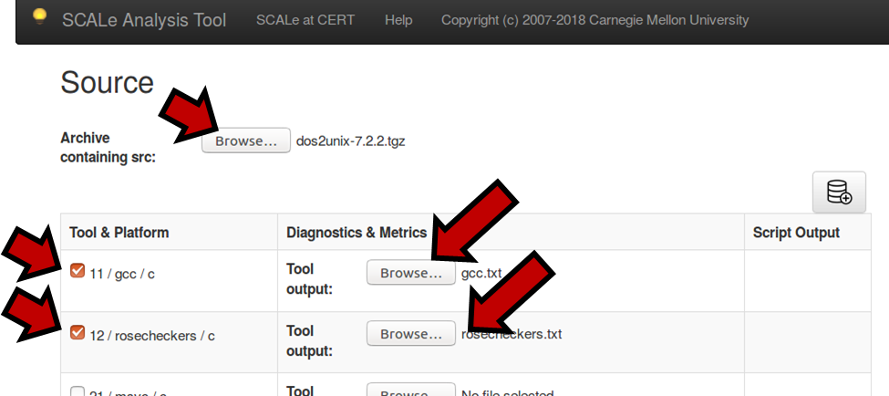

To upload output from code metrics static analysis tools (e.g., Lizard,
Understand, or CCSM), similarly the tool must be selected and the user
should browse to select the tool output.      

 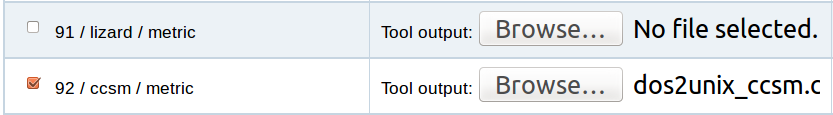


                                                                  

Next, Mike clicks the **Create Database** icon at the top right of the page (above the table for selecting output uploads):

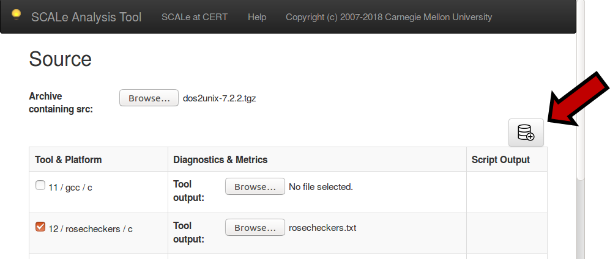

The creation process consolidates the uploaded outputs into a single
database. After the page refreshes, if any errors occur from
loading any tool output, the "Script Output Column" will have a
"Warnings" link that can be selected to reveal the errors. If no
errors occur, the column will simply say "Success!". Possible
errors and their potential remediations are summarized in the
following table:

+--------------------------------+-----------------------------------------------+-----------------------------------------------------------------------------+
| Error Message                  | Root Cause                                    | Remediation                                                                 |
+================================+===============================================+=============================================================================+
| [Warning] The following alerts | The listed alerts have checkers that are not  | Determine if the alert constitutes a violation of a CERT Secure             |
| have no known checker          | that are not recognized by SCALe.             | Coding rule, and report the alert and rule to the SCALe administrator,      |
| associated with them:          | Specifically, the checkers are not mapped to  | Alice. She can map the alert to the rule in the back end , as described in  |
| _Alert 1_                      | to CERT Secure Coding rules in the SCALe back | [Adding a Tool to SCALe: Step-by-Step Guide](Adding-a-Tool-to-SCALe.md).    |
| _Alert 2_                      | end.                                          | After this is done, re-create the project.                                  |
| _..._                          |                                               |                                                                             |
+--------------------------------+-----------------------------------------------+-----------------------------------------------------------------------------+
| [Warning] Path not found in    | The indicated path name from an alert message | Either files are missing from the uploaded source archive or a path name in |
| the provided source: pathname  | was not located in the provided source        | an alert cannot be disambiguated. In the former case, add the missing files |
|                                | archive.                                      | to the archive and try to re-create the project. The latter case occurs     |
|                                |                                               | when two files, in different directories, have the same name and an alert   |
|                                |                                               | message lacks enough information to determine which file it corresponds to. |
|                                |                                               | The path in the tool output file should be modified to refer specifically   |
|                                |                                               | to the desired source file (for example, by specifying the absolute path of |
|                                |                                               | the file). Mike the Analyst may need to assist with this task. Then, try to |
|                                |                                               | re-create the project.                                                      |
+--------------------------------+-----------------------------------------------+-----------------------------------------------------------------------------+
| Python Exception, such as      | The web app could not parse the tool output   | The input file is not in the expected format for the associated tool.       |
| ```                            | file.                                         | Review the Static Analysis Tool Support page and ensure that you are        |
| Traceback (most recent call    |                                               | generating the output file correctly. Then, re-create the project.          |
| last):<exception trace>        |                                               |                                                                             |
| ValueError: No JSON object     |                                               |                                                                             |
| could be decoded               |                                               |                                                                             |
| ```                            |                                               |                                                                             |
+--------------------------------+-----------------------------------------------+-----------------------------------------------------------------------------+

If no errors occur, Mike creates the project next by clicking the
**Create project from database** icon at the top of the page (image
below shows text that appears when the mouse hovers over the icon):

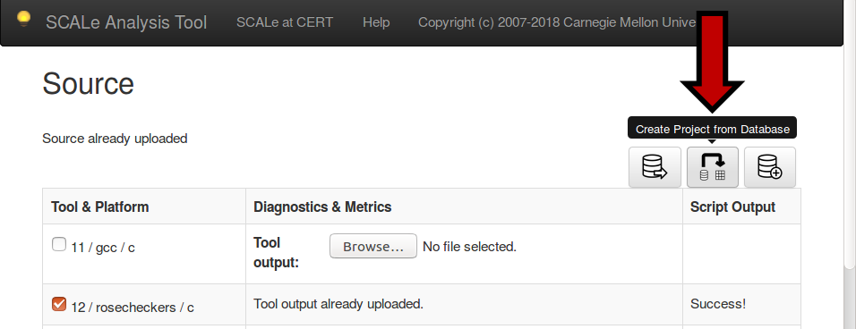

He could also click the icon on the left titled **Download**
**database** (hover mouse over icon to see text) to download a copy of
the alert database to his system. After creating the project, Mike's job
is done.

### Inspecting AlertConditions to Adjudicate for the Condition

After Mike the Analyst uploads the alerts to the web app, it is Eve the
Auditor's job to inspect the alertConditions. To do so, Eve navigates to the
SCALe web app and logs in using information obtained from Alice. She
arrives at the web app homepage where she clicks on the name of the
project created by Mike:

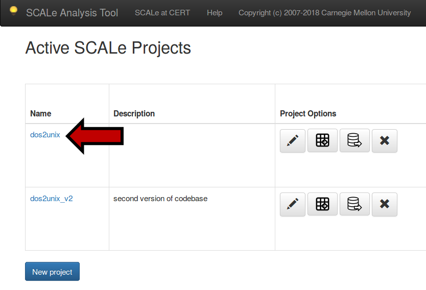

#### The AlertCondition Viewer

Clicking the project name takes Eve to the AlertCondition Viewer page. This page
allows her to view all of the alertConditions produced by the static analysis
tools. She can filter the alertConditions using various criteria. Information
pertinent to auditing is provided for each alertCondition. For example, the
location of the alert in the source code is provided. The source code
associated with each alert can also be viewed in the browser. A link is
provided to each CWE and/or CERT Secure Coding rule associated with the alert. Eve's
job is to determine if each alertCondition is indeed a violation of its
corresponding CWE or CERT Secure Coding rule.

Below is a screenshot of the alertCondition viewer.
NOTE it needs the following corrections to the labels on the left side:

-   "Alert List" should be changed to "AlertCondition List (in fused view, can list meta-alerts)"
-   "Alert filters" should be changed to "AlertCondition or Meta-Alert filters"


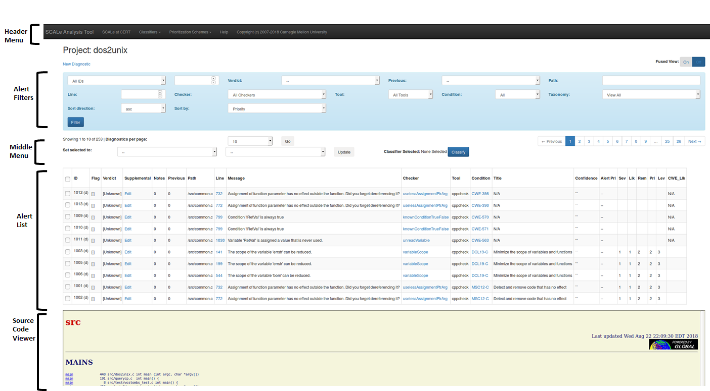

From top to bottom:

-   The black **Header Menu** toolbar allows you to edit and export
    projects ("SCALe Analysis Tool"), to create/edit/select Classifier
    schemes, to create/edit/select Prioritization schemes, and provides
    information about SCALe.
-   The light-blue **AlertCondition Filters** toolbar allows you to filter the
    displayed alertConditions by various criteria. 
-   The **Middle Menu **allows users to modify the alertCondition List size,
    displays the Classifier scheme name if one has been selected, and
    provides a button for the user to manually start automated
    classification of alertConditions. (Note: this functionality is not
    completely implemented, and selecting the button does not classify
    the alertConditions. It currently simply inserts example confidence values,
    not real ones.)
-   The **alertCondition List** section displays the meta-alerts, as fused alertConditions
    (that show a meta-alert ID on the yellow-colored-background row that
    audit determinations can be made on) or as single alertConditions (in a
    white-background row) that show a Display (d) ID. 
    -   *Detail: *A Display (d) ID is unique for each combination of
        condition ID and alert ID. Condition ID is unique per flaw type
        (e.g., one ID for CWE-190 and another ID for INT31-C). Alert ID
        is unique for a particular warning from a tool for a particular
        flaw type the tool identifies with its "checker", for a
        particular line number and filepath. fused alertConditions can be
        expanded by selecting editable fields on the Meta-Alert row, and
        then the alertConditions that were fused show on separate rows (with
        aqua-colored background) below that. If there are many alertConditions,
        they appear on multiple pages. To navigate these pages, click
        the **Next/Previous **links near the top of the viewer or click
        on the desired page number.
    -   In 'Fused view', each top-level (not expanded) row of the 'alertCondition
        List' shows a Meta-Alert
        -   it shows the ***Display (d) ID*** (aka alertCondition ID) if the Meta-Alert has only one alertCondition, meaning no alertCondition fusion happened)
        -   it shows the ***Meta-Alert (m) ID*** if the Meta-Alert contains fused alertConditions, and also can be expanded to show the single alertConditions it contains
    -   In 'Unfused view', each row of the 'alertCondition List' shows an
        alertCondition
        -   an alertCondition is a single alert **with information about only one of the conditions its checker maps to**
        -   If that alert's checker maps to multiple conditions, there will be a separate row in the 'alertCondition List' for each of the conditions it maps to.
-   The **Source Code Viewer** section at the bottom displays the code
    associated with a given meta-alert.

### AlertCondition Viewer Fields

The following table describes the fields displayed in the AlertCondition Viewer
section (not all of these are visible in the screenshot above).

+-----------------------+-----------------------------------------------------------------------------------------------------------------------------------------------------------------------------------------+-----------------------+
| AlertCondition Property Description                                                                                                                                                                               Possible Values       |
| Name                                                                                                                                                                                                            |                       |
+=======================+=========================================================================================================================================================================================+=======================+
| ID                    | A unique ID associated with this item.  In fused view, if multiple alertConditions map to the meta-alert, then it shows the meta-alert ID and ends with "(m)".                          | Positive integer      |
|                       | In fused view, if only one alertCondition maps to the meta-alert, then it shows the alertCondition(Display) ID and "(d)". In unfused view, it shows the                                 |                       |
|                       | alertCondition (development.sqlite3 database, display table) ID and "(d)".                                                                                                              |                       |
+-----------------------+-----------------------------------------------------------------------------------------------------------------------------------------------------------------------------------------+-----------------------+
| Flag                  | A binary value                                                                                                                                                                          | Flagged or not        |
|                       | associated with the                                                                                                                                                                     | flagged               |
|                       | alertCondition. You can click                                                                                                                                                           |                       |
|                       | on the box in the                                                                                                                                                                       |                       |
|                       | viewer to toggle the                                                                                                                                                                    |                       |
|                       | flag. The meaning of                                                                                                                                                                    |                       |
|                       | the flag is user                                                                                                                                                                        |                       |
|                       | defined. One possible                                                                                                                                                                   |                       |
|                       | meaning is to                                                                                                                                                                           |                       |
|                       | indicate "suspicious"                                                                                                                                                                   |                       |
|                       | alertConditions, that have not                                                                                                                                                          |                       |
|                       | been manually                                                                                                                                                                           |                       |
|                       | audited, but warrant                                                                                                                                                                    |                       |
|                       | attention for various                                                                                                                                                                   |                       |
|                       | reasons.                                                                                                                                                                                |                       |
+-----------------------+-----------------------------------------------------------------------------------------------------------------------------------------------------------------------------------------+-----------------------+
| Verdict               | The current                                                                                                                                                                             | Unknown, Complex,     |
|                       | conclusion (primary                                                                                                                                                                     | Dependent, False,     |
|                       | verdict) with respect                                                                                                                                                                   | True (actual value    |
|                       | to whether this alertCondition                                                                                                                                                          | used in data          |
|                       | violates the                                                                                                                                                                            | structure is a        |
|                       | associated Secure                                                                                                                                                                       | positive integer)     |
|                       | Coding rule (you can                                                                                                                                                                    |                       |
|                       | click on this field                                                                                                                                                                     |                       |
|                       | in the viewer to                                                                                                                                                                        |                       |
|                       | change it). Verdicts                                                                                                                                                                    |                       |
|                       | are defined in the                                                                                                                                                                      |                       |
|                       | IEEE Secure                                                                                                                                                                             |                       |
|                       | Development                                                                                                                                                                             |                       |
|                       | conference                                                                                                                                                                              |                       |
|                       | paper                                                                                                                                                                                   |                       |
|                       | [Static Analysis Alert Audits: Lexicon & Rules](http://resources.sei.cmu.edu/library/asset-view.cfm?assetid=484185){.extlink}    |                       |
+-----------------------+-----------------------------------------------------------------------------------------------------------------------------------------------------------------------------------------+-----------------------+
| Supplemental          | Supplemental                                                                                                                                                                            | Ignored, Dead,        |
|                       | verdicts.                                                                                                                                                                               | Inapplicable          |
|                       | Supplemental verdicts                                                                                                                                                                   | Environment, (high,   |
|                       | are defined in the                                                                                                                                                                      | medium, low)          |
|                       | IEEE Secure                                                                                                                                                                             | Dangerous Construct   |
|                       | Development                                                                                                                                                                             |                       |
|                       | conference                                                                                                                                                                              |                       |
|                       | paper                                                                                                                                                                                   |                       |
|                       | [Static Analysis Alert Audits: Lexicon & Rules](http://resources.sei.cmu.edu/library/asset-view.cfm?assetid=484185){.extlink}    |                       |
+-----------------------+-----------------------------------------------------------------------------------------------------------------------------------------------------------------------------------------+-----------------------+
| Notes                 | Notes by auditor(s)                                                                                                                                                                     | Any string value      |
|                       | about the                                                                                                                                                                               |                       |
|                       | determinations                                                                                                                                                                          |                       |
|                       | (primary                                                                                                                                                                                |                       |
|                       | and/or supplemental),                                                                                                                                                                   |                       |
|                       | alert, meta-alert,                                                                                                                                                                      |                       |
|                       | checker, condition,                                                                                                                                                                     |                       |
|                       | or language.                                                                                                                                                                            |                       |
|                       | Intention of field is                                                                                                                                                                   |                       |
|                       | to help later                                                                                                                                                                           |                       |
|                       | auditors reviewing                                                                                                                                                                      |                       |
|                       | same or similar                                                                                                                                                                         |                       |
|                       | issues.                                                                                                                                                                                 |                       |
+-----------------------+-----------------------------------------------------------------------------------------------------------------------------------------------------------------------------------------+-----------------------+
| Previous              | The number of changes                                                                                                                                                                   | 0 or a positive       |
|                       | to the determination                                                                                                                                                                    | integer               |
|                       | fields (flag,                                                                                                                                                                           |                       |
|                       | verdict,                                                                                                                                                                                |                       |
|                       | supplemental, notes)                                                                                                                                                                    |                       |
|                       | for this alertCondition. If                                                                                                                                                             |                       |
|                       | nonzero, the number                                                                                                                                                                     |                       |
|                       | links to a table                                                                                                                                                                        |                       |
|                       | showing a change log                                                                                                                                                                    |                       |
|                       | for this alertCondition.                                                                                                                                                                |                       |
+-----------------------+-----------------------------------------------------------------------------------------------------------------------------------------------------------------------------------------+-----------------------+
| Path                  | The path of the                                                                                                                                                                         | A relative directory  |
|                       | source file where the                                                                                                                                                                   | path                  |
|                       | violation occurs                                                                                                                                                                        |                       |
+-----------------------+-----------------------------------------------------------------------------------------------------------------------------------------------------------------------------------------+-----------------------+
| Line                  | The line number in                                                                                                                                                                      | Positive integer      |
|                       | the source file where                                                                                                                                                                   |                       |
|                       | the alert occurs;                                                                                                                                                                       |                       |
|                       | selecting this field                                                                                                                                                                    |                       |
|                       | causes the snippet of                                                                                                                                                                   |                       |
|                       | source code that                                                                                                                                                                        |                       |
|                       | triggered the alert                                                                                                                                                                     |                       |
|                       | to appear in the                                                                                                                                                                        |                       |
|                       | **Source Code                                                                                                                                                                           |                       |
|                       | Viewer** section                                                                                                                                                                        |                       |
+-----------------------+-----------------------------------------------------------------------------------------------------------------------------------------------------------------------------------------+-----------------------+
| Message               | The message issued by                                                                                                                                                                   | Any string value. If  |
|                       | the static analysis                                                                                                                                                                     | hyperlinked text      |
|                       | tool                                                                                                                                                                                    | "More" or "Secondary  |
|                       |                                                                                                                                                                                         | message(s) set"       |
|                       |                                                                                                                                                                                         | exists, then a set of |
|                       |                                                                                                                                                                                         | secondary messages    |
|                       |                                                                                                                                                                                         | exists for this       |
|                       |                                                                                                                                                                                         | message, providing    |
|                       |                                                                                                                                                                                         | additional clues      |
|                       |                                                                                                                                                                                         | about potentially     |
|                       |                                                                                                                                                                                         | problematic           |
|                       |                                                                                                                                                                                         | data/control/type     |
|                       |                                                                                                                                                                                         | flow related to the   |
|                       |                                                                                                                                                                                         | message. Selecting    |
|                       |                                                                                                                                                                                         | the hyperlink will    |
|                       |                                                                                                                                                                                         | cause those messages  |
|                       |                                                                                                                                                                                         | to show in a popup    |
|                       |                                                                                                                                                                                         | window. If separate   |
|                       |                                                                                                                                                                                         | rows of fused alertConditions         |
|                       |                                                                                                                                                                                         | have the same checker |
|                       |                                                                                                                                                                                         | ID and message, their |
|                       |                                                                                                                                                                                         | secondary message     |
|                       |                                                                                                                                                                                         | sets differ.          |
+-----------------------+-----------------------------------------------------------------------------------------------------------------------------------------------------------------------------------------+-----------------------+
| Checker               | The name of the                                                                                                                                                                         | Any string value,     |
|                       | checker in the static                                                                                                                                                                   | with hyperlink as     |
|                       | analysis tool that                                                                                                                                                                      | specified in cell to  |
|                       | triggered the alert.                                                                                                                                                                    | left.                 |
|                       | This is hyperlinked,                                                                                                                                                                    |                       |
|                       | and selecting                                                                                                                                                                           |                       |
|                       | hyperlink leads to                                                                                                                                                                      |                       |
|                       | list of all                                                                                                                                                                             |                       |
|                       | Meta-Alerts for that                                                                                                                                                                    |                       |
|                       | line of that file AND                                                                                                                                                                   |                       |
|                       | that checker (there                                                                                                                                                                     |                       |
|                       | may be multiple                                                                                                                                                                         |                       |
|                       | conditions, e.g. a                                                                                                                                                                      |                       |
|                       | CWE and a CERT rule                                                                                                                                                                     |                       |
|                       | both mapped to that                                                                                                                                                                     |                       |
|                       | checker ID).                                                                                                                                                                            |                       |
+-----------------------+-----------------------------------------------------------------------------------------------------------------------------------------------------------------------------------------+-----------------------+
| Tool                  | The name of the                                                                                                                                                                         | gcc, rosecheckers,    |
|                       | static analysis tool                                                                                                                                                                    | etc.                  |
+-----------------------+-----------------------------------------------------------------------------------------------------------------------------------------------------------------------------------------+-----------------------+
| Condition             | The identifier of the                                                                                                                                                                   | See                   |
|                       | condition (e.g., CERT                                                                                                                                                                   | [https://securecoding.cert.org](https://securecoding.cert.org){.extlink} |
|                       | Secure Coding rule or                                                                                                                                                                   |                       |
|                       | CWE) that this alert                                                                                                                                                                    |                       |
|                       | potentially violates;                                                                                                                                                                   |                       |
|                       | selecting this field                                                                                                                                                                    |                       |
|                       | causes                                                                                                                                                                                  |                       |
|                       | the condition associa                                                                                                                                                                   |                       |
|                       | ted                                                                                                                                                                                     |                       |
|                       | with the alert to                                                                                                                                                                       |                       |
|                       | appear in a new                                                                                                                                                                         |                       |
|                       | browser window or tab                                                                                                                                                                   |                       |
+-----------------------+-----------------------------------------------------------------------------------------------------------------------------------------------------------------------------------------+-----------------------+
| Title                 | The title of                                                                                                                                                                            | See                   |
|                       | the condition this                                                                                                                                                                      | [https://securecoding.cert.org](https://securecoding.cert.org){.extlink}  |
|                       | alert indicates a                                                                                                                                                                       |                       |
|                       | potential violation                                                                                                                                                                     |                       |
|                       | of (e.g., for CERT                                                                                                                                                                      |                       |
|                       | Secure Coding rules)                                                                                                                                                                    |                       |
|                       | or indicates a                                                                                                                                                                          |                       |
|                       | potential instance of                                                                                                                                                                   |                       |
|                       | (e.g., for a CWE)                                                                                                                                                                       |                       |
+-----------------------+-----------------------------------------------------------------------------------------------------------------------------------------------------------------------------------------+-----------------------+
| Confidence            | Placeholder field for                                                                                                                                                                   |                       |
|                       | confidence that                                                                                                                                                                         |                       |
|                       | Meta-Alert is True.                                                                                                                                                                     |                       |
|                       | Not currently used by                                                                                                                                                                   |                       |
|                       | SCALe web app.                                                                                                                                                                          |                       |
+-----------------------+-----------------------------------------------------------------------------------------------------------------------------------------------------------------------------------------+-----------------------+
| Label                 | Placeholder field for                                                                                                                                                                   |                       |
|                       | class_label that                                                                                                                                                                        |                       |
|                       | Meta-Alert is True or False.                                                                                                                                                            |                       |
|                       | Not currently used by                                                                                                                                                                   |                       |
|                       | SCALe web app.                                                                                                                                                                          |                       |
+-----------------------+-----------------------------------------------------------------------------------------------------------------------------------------------------------------------------------------+-----------------------+
| AlertCondition Priority| Priority of making a                                                                                                                                                                   |                       |
| (AlertCondition Pri)   | manual                                                                                                                                                                                 |                       |
|                       | determination of the                                                                                                                                                                    |                       |
|                       | verdict for                                                                                                                                                                             |                       |
|                       | the Meta-Alert, as                                                                                                                                                                      |                       |
|                       | determined using a                                                                                                                                                                      |                       |
|                       | prioritization                                                                                                                                                                          |                       |
|                       | scheme.                                                                                                                                                                                 |                       |
+-----------------------+-----------------------------------------------------------------------------------------------------------------------------------------------------------------------------------------+-----------------------+
| Severity (Sev)        | The severity of the                                                                                                                                                                     | See                   |
|                       | consequences of the                                                                                                                                                                     | [Risk Assessment](https://wiki.sei.cmu.edu/confluence/display/c/How+this+Coding+Standard+is+Organized#HowthisCodingStandardisOrganized-RiskAssessment){.extlink} |
|                       | CERT Secure Coding                                                                                                                                                                      |                       |
|                       | rule being ignored                                                                                                                                                                      |                       |
|                       |                                                                                                                                                                                         |                       |
|                       |                                                                                                                                                                                         |                       |
|                       |                                                                                                                                                                                         |                       |
|                       |                                                                                                                                                                                         |                       |
|                       |                                                                                                                                                                                         |                       |
|                       |                                                                                                                                                                                         |                       |
+-----------------------+-----------------------------------------------------------------------------------------------------------------------------------------------------------------------------------------+-----------------------+
| Likelihood (Lik)      | The likelihood that a                                                                                                                                                                   | See                   |
|                       | flaw introduced by                                                                                                                                                                      | [Risk Assessment](https://wiki.sei.cmu.edu/confluence/display/c/How+this+Coding+Standard+is+Organized#HowthisCodingStandardisOrganized-RiskAssessment){.extlink} |
|                       | ignoring the CERT                                                                                                                                                                       |                       |
|                       | Secure Coding rule                                                                                                                                                                      |                       |
|                       | can lead to an                                                                                                                                                                          |                       |
|                       | exploitable                                                                                                                                                                             |                       |
|                       | vulnerability                                                                                                                                                                           |                       |
|                       |                                                                                                                                                                                         |                       |
|                       |                                                                                                                                                                                         |                       |
|                       |                                                                                                                                                                                         |                       |
+-----------------------+-----------------------------------------------------------------------------------------------------------------------------------------------------------------------------------------+-----------------------+
| Remediation (Rem)     | The expense required                                                                                                                                                                    | See                   |
|                       | to modify the code to                                                                                                                                                                   | [Risk Assessment](https://wiki.sei.cmu.edu/confluence/display/c/How+this+Coding+Standard+is+Organized#HowthisCodingStandardisOrganized-RiskAssessment){.extlink} |
|                       | comply with the CERT                                                                                                                                                                    |                       |
|                       | Secure Coding rule                                                                                                                                                                      |                       |
|                       |                                                                                                                                                                                         |                       |
|                       |                                                                                                                                                                                         |                       |
|                       |                                                                                                                                                                                         |                       |
|                       |                                                                                                                                                                                         |                       |
|                       |                                                                                                                                                                                         |                       |
|                       |                                                                                                                                                                                         |                       |
+-----------------------+-----------------------------------------------------------------------------------------------------------------------------------------------------------------------------------------+-----------------------+
| Priority (Pri)        | The priority of the                                                                                                                                                                     | See                   |
|                       | violated CERT Secure                                                                                                                                                                    | [Risk Assessment](https://wiki.sei.cmu.edu/confluence/display/c/How+this+Coding+Standard+is+Organized#HowthisCodingStandardisOrganized-RiskAssessment){.extlink} |
|                       | Coding rule                                                                                                                                                                             |                       |
|                       |                                                                                                                                                                                         |                       |
|                       |                                                                                                                                                                                         |                       |
|                       |                                                                                                                                                                                         |                       |
|                       |                                                                                                                                                                                         |                       |
|                       |                                                                                                                                                                                         |                       |
|                       |                                                                                                                                                                                         |                       |
|                       |                                                                                                                                                                                         |                       |
+-----------------------+-----------------------------------------------------------------------------------------------------------------------------------------------------------------------------------------+-----------------------+
| Level (Lev)           | The level of the                                                                                                                                                                        | See                   |
|                       | violated CERT Secure                                                                                                                                                                    | [Risk Assessment](https://wiki.sei.cmu.edu/confluence/display/c/How+this+Coding+Standard+is+Organized#HowthisCodingStandardisOrganized-RiskAssessment){.extlink} |
|                       | Coding rule                                                                                                                                                                             |                       |
|                       |                                                                                                                                                                                         |                       |
|                       |                                                                                                                                                                                         |                       |
|                       |                                                                                                                                                                                         |                       |
|                       |                                                                                                                                                                                         |                       |
|                       |                                                                                                                                                                                         |                       |
|                       |                                                                                                                                                                                         |                       |
|                       |                                                                                                                                                                                         |                       |
+-----------------------+-----------------------------------------------------------------------------------------------------------------------------------------------------------------------------------------+-----------------------+
| CWE likelihood        | The likelihood (as                                                                                                                                                                      | E.g., see             |
| (CWE_Lik)             | defined by MITRE) of                                                                                                                                                                    | [Common Consequences Section](https://cwe.mitre.org/data/definitions/190.html){.extlink} |
|                       | the CWE, in the                                                                                                                                                                         |                       |
|                       | Common Consequences                                                                                                                                                                     |                       |
|                       | section. "The                                                                                                                                                                           |                       |
|                       | Likelihood provides                                                                                                                                                                     |                       |
|                       | information about how                                                                                                                                                                   |                       |
|                       | likely the specific                                                                                                                                                                     |                       |
|                       | consequence is                                                                                                                                                                          |                       |
|                       | expected to be seen                                                                                                                                                                     |                       |
|                       | relative to the other                                                                                                                                                                   |                       |
|                       | consequences in the                                                                                                                                                                     |                       |
|                       | list. For example,                                                                                                                                                                      |                       |
|                       | there may be high                                                                                                                                                                       |                       |
|                       | likelihood that a                                                                                                                                                                       |                       |
|                       | weakness will be                                                                                                                                                                        |                       |
|                       | exploited to achieve                                                                                                                                                                    |                       |
|                       | a certain impact, but                                                                                                                                                                   |                       |
|                       | a low likelihood that                                                                                                                                                                   |                       |
|                       | it will be exploited                                                                                                                                                                    |                       |
|                       | to achieve a                                                                                                                                                                            |                       |
|                       | different impact."                                                                                                                                                                      |                       |
+-----------------------+-----------------------------------------------------------------------------------------------------------------------------------------------------------------------------------------+-----------------------+

#### AlertCondition Filters
##### Filtering by ID type
* Filtering by the default "All IDs"
  * If the number field to the right of the ID type dropdown menu is left blank,
  all IDs of all types will be included (including Meta-Alert (m) IDs and
  Display (d) IDs).
* Filtering by Meta-Alert (m) ID" or "Display (d) ID"
  * An ID must be entered into the number field to the right of the ID type
  dropdown menu. Otherwise, no IDs will be included in the filter, therefore
  no alertConditions will show up in the alertCondition List


##### Filtering by Path
* Filepaths for the filter require the user to input exact file paths starting from the source code archive's (decompressed) base directory. The entries for the "Path" field in the alertCondition list provide filepaths that can be used for this filter.
  * The filepaths here may differ from the filepath strings in tool output (e.g., output from flaw-finding static analysis tools or code metrics tools). Those tools' filepaths may differ at the beginning (e.g., a tool's output filepath may have "/home/USERNAME/SOME_DIRECTORY" at the beginning), and also the archive's base directory name may be different.


##### Filtering by Verdict
* The user may select to view only verdicts. The final item "Known" shows all Meta-Alerts that are not "Unknown". The other itmes show only Meta-Alerts with the specific verdict.


##### Sorting by Display (d) ID
* Unfused View
  * Every row in the alertCondition List is an
  alertCondition with a Display (d) ID in the ID field. The rows are ordered by
  Display (d) ID.
* Fused View
  * Rows are ordered by Display (d) ID. fused alertConditions are ranked by their
  alertCondition with the lowest Display (d) ID. For example, a fused alertCondition with
  Meta-Alert (m) ID 12 linking alertConditions with Display (d) IDs 100 and 105
  would be treated as Display (d) ID 100 for sorting. Unfused alertConditions appear the
  same as in the Unfused View.


##### Sorting by Meta-Alert (m) ID
* Fused View
  * When sorting by Meta-Alert (m) ID, the top-level rows (Meta-Alerts) will appear
  in order by Meta-Alert (m) ID. The expanded rows within a fused alertCondition will
  have their Display (d) ID in the ID field, and appear in ascending order by
  Display (d) ID.

#### Shuffling

Rather than specifying a sort order, you can request that the elements
be shuffled into a random order. If the **Shuffle Seed** is empty, no
shuffling takes place. If it is given the value 0, the elements are
shuffled in a non-reproducible random order. If it has any positive
number, that serves as a seed for SCALe's pseudo random number
generator (PRNG). This means that if two SCALe users provide the same
filtering constraints and the same nonzero shuffle seed, they will
both get the same shuffling of elemenets.

#### The Auditing Workflow

The Meta-Alerts in the web app indicate potential violations of CERT
Secure Coding rules or instances of CWEs. Eve's job is to determine if
these Meta-Alerts are **true positives** (actual violation of the
rule), **false positives** (not a violation of the rule), or any other
correct primary or supplemental determination. The auditor should
examine a Meta-Alert and determine the appropriate primary verdict,
supplemental verdict(s), and add text to the Notes field to provide
information as needed for future analysts. When examining a particular
Meta-Alert, look at any audit determinations and/or notes for the same
checker(s) at this location, to save time by using previously-determined
related information. Also, examine all messages, including all sets of
secondary messages, to use clues from the tools about the condition in
question. There are two methods CERT recommends for auditing:

1.  Address Meta-Alerts according to (filtered and prioritized) priority
    level. The auditor should be knowledgeable about the condition(s)
    they audit, and if audited conditions are frequently switched extra
    time may be required for the auditor to refresh themselves on the
    condition being audited.
2.  Use bucketing method: One recommended way to use the bucketing
    method is to structure auditing work by condition. That is, Eve
    analyzes Meta-Alerts that correspond to a single condition.
    Conditions (e.g., CERT coding rules) with high priority can be
    inspected first (see "Priority (Pri)" in the table above). She
    inspects the Meta-Alerts one by one until she finds a true positive.
    Any false positives along the way are assigned the **False**
    verdict. If a true positive is discovered, she assigns it
    the **True **verdict, then **flags** any remaining uninspected
    Meta-Alerts to indicate a **Suspicious** verdict. After completing
    this process, Eve moves on to another code condition (CERT Secure
    Coding Rule or CWE).

##### Sorting the AlertConditions by CERT Priority

Note that CERT priority (defined per-CERT-rule by CERT) is different
than alertCondition priority (which is short for meta-alert priority, as determined by a prioritization formula). To sort
the alertConditions by CERT Priority, Eve selects **CERT Priority** in the **Sort
By **drop-down in the AlertCondition Filter toolbar, chooses **desc** in the
adjacent box to indicate a descending sort, and clicks **Filter**. The
resulting alertConditions will be sorted by priority, beginning with the
highest-CERT priority alertConditions (a larger CERT priority indicates a more
severe violation of CERT coding rules).

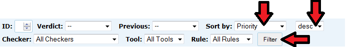

##### Filtering by Condition

To filter the Meta-Alerts by rule, Eve clicks on the **Condition**
drop-down in the AlertCondition Filter toolbar, selects the desired rule,
and clicks **Filter**. For example, the following shows all Meta-Alerts
that potentially violate ERR33-C. Other filters can be applied in a
similar fashion. **NOTE: must update figure so screenshot shows
'Condition' not 'Rule'.**

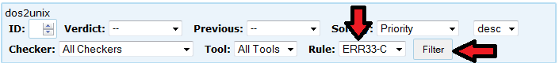

##### Auditing an AlertCondition

Eve can use the web app in the following ways to facilitate auditing a
given Meta-Alert:

-   Click on the **Condition** link to review the associated Secure
    Coding rule or CWE.
-   Read the alert message (one or more) in the **Message** column.
-   Click the hyperlinked line number to review the source code
    associated with the alert in the source code viewer at the bottom of
    the page.
-   If present, click the **More** link or links in the **Message**
    column to review additional information about alert(s) from the
    analysis tool(s).

The source code viewer uses GNU Global to render the code in HTML.
Global also provides simple navigation through the code, for example, to
find declarations of variables, functions, and classes. Eve can use this
view to explore the source code. Using these resources and her knowledge
of the programming language at hand, Eve can decide whether the alertCondition
is a true positive or false positive.

While analyzing the potential flaw, auditors can add notes to the Notes
field by clicking in the field and then entering text, as shown below.
The notes can help future auditors to work with alertConditions for this code
region and condition, by communicating what has been analyzed and
learned so far.

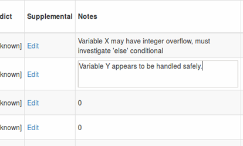

##### Updating AlertCondition Verdicts

Once Eve comes to a conclusion regarding a Meta-Alert (a single alertCondition
[alertCondition](Terms-and-Definitions.md#alertcondition) or
multiple fused alertConditions), she sets the **Verdict** field
appropriately. This table describes the possible verdicts:

  ---------------------------------------------------------------------------------------------------------------------------------------------------------------------------------------------------------------------------------------------------------------------------------------------------------------------------------------------------------------------------------------------------------------------------------------------------------------------------------------------------------------------------------------------------------------
  Verdict     Description
  ----------- ---------------------------------------------------------------------------------------------------------------------------------------------------------------------------------------------------------------------------------------------------------------------------------------------------------------------------------------------------------------------------------------------------------------------------------------------------------------------------------------------------------------------------------------------------
  Unknown     (Default value before auditing) It is unknown if the meta-alert is a true positive or false positive

  Complex     The alertCondition is too difficult to judge in a reasonable amount of time and effort. Each organization should document what is a reasonable amount of time and effort.
              Preferably, an approximate time spent auditing would be documented with each Complex alertCondition. See Audit Rule 2 in  [Static Analysis Alert Audits: Lexicon & Rules](http://resources.sei.cmu.edu/library/asset-view.cfm?assetid=484185). 

  Dependent   The alertCondition indicates a code flaw which could only be true if a different coding flaw that is marked True or “Dangerous construct” occurs earlier in the code execution. See Audit Rule 3 in  [Static Analysis Alert Audits: Lexicon & Rules](http://resources.sei.cmu.edu/library/asset-view.cfm?assetid=484185) for more information. This determination should include a reference to the related alertCondition, via the alertConditions’s unique identifier.

  False       The code in question does *not* violate the condition indicated by the alertCondition.

  True        The code in question violates the condition indicated by the alertCondition.

  Flagged     Suspicious, using one of the audit methods. The meta-alert has not been manually inspected because another alertCondition violating the same Secure Coding rule was found to be a true positive.
  ---------------------------------------------------------------------------------------------------------------------------------------------------------------------------------------------------------------------------------------------------------------------------------------------------------------------------------------------------------------------------------------------------------------------------------------------------------------------------------------------------------------------------------------------------------------

To set the Verdict field, Eve clicks on the text inside the Verdict
column associated with the alertCondition. This click creates a drop-down menu.

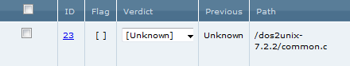

A second click will open the drop down, allowing Eve to select the
desired verdict. Suppose the alertCondition at hand is a false positive,
warranting a **False** verdict.

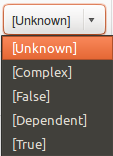

The alertCondition now has the desired verdict.

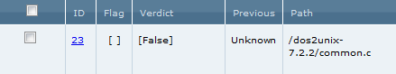

Multiple alertConditions can be updated simultaneously.

* To select specific alertConditions on the page, select the
  checkbox by each alertCondition to update.
* To select all alertConditions displayed on the current page, click on the checkbox to the left of the **ID** column in the title row of the alertCondition List
* To select all alertConditions that meet the filter requirements, check the **Select all # ..** checkbox above **Set all selected to **.

Then, set values for the Verdict
and Flag fields in the drop-down menus next to **Set all selected
to **at the top of the page, and click **Update**.


In the following screenshot, all selected alertConditions will have their Verdict
field set to **True** after Update is clicked:

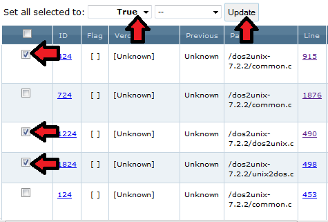

All visible alertConditions can be selected and deselected by clicking the
checkbox in the header row. The number of alertConditions shown per page can be
changed by updating the **per page **drop-down menu and
clicking **Go**.

* Fused view
  * The **per page** drop-down menu is called **Meta-Alerts per page**
* Unfused view
  * The **per page** drop-down menu is called **Displays per page**

##### Flagging AlertConditions

alertConditions can also be **flagged**. Eve might flag an alertCondition if she
wants to revisit it later. An alertCondition is flagged or unflagged by clicking
the box in the **Flag** column. Multiple alertConditions can be flagged or
unflagged, similarly to the way they are simultaneously updated in the Verdict
field, using the **Set all selected to** dialog. The second drop-down
menu controls the flag status of the selected alertConditions.

##### Updating Supplemental Verdicts

Once Eve comes to a conclusion regarding an
[alertCondition](Terms-and-Definitions.md#alertcondition)'s
supplemental verdict, she sets the **Supplemental Verdict** field
appropriately.  A pop-up window appears when she selects the
Supplemental Verdict field for a Meta-Alert, and she can choose one or
more supplemental verdicts. Although only one primary verdict can be
chosen, any number of supplemental verdicts can be selected.
Supplemental verdicts can be set for: Ignored, Dead, Inapplicable
Environment, and (high, medium, or low) Dangerous Construct. After she
completes making her Supplemental Verdict selections, Eve closes the
popup by selecting the "X" at the top-right of the popup window.

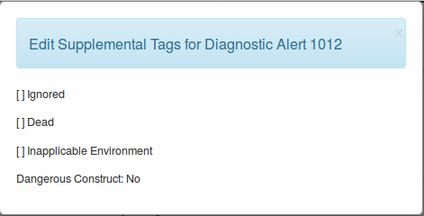

##### Adding Notes

In the Notes field of the Meta-Alert, Eve adds textual information of
use to subsequent auditors (including possibly herself, returning to
look at the alertCondition in the future). Her notes may contain her findings
relevant to the alert, checker, condition, or language about control
flow, data flow, type, alert, checker, condition, or language.

##### Selecting a Prioritization Scheme

Prioritization scheme selection allows users to prioritize static
analysis alertConditions using factors they care about. The formulas can combine
classifier confidence and other values (e.g., risk, cost, etc.) used by
the system, using math symbols including: ‘\*’, ‘/’, ‘+’, ‘-‘, ‘(‘, and
‘)’

To create a new prioritization scheme, select 'Create New Scheme' from
the top menu bar's 'Prioritization Schemes' option.

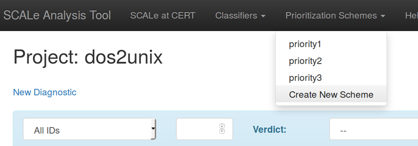

Next, select each taxonomy tab and enter a formula (or even a single
weighted field) to calculate priority for meta-alerts for conditions in
that taxonomy. Note that classifier-derived confidence and user-uploaded
fields can be used in formulas for all of the taxonomies.

Weights (1 or higher) must be selected on the left, for each field that
will be used in the formula. Numbers and mathematical operators can also
be entered using the keyboard.

The screenshot below shows a warning that appears if the button
'Generate the Formula' is selected before each taxonomy has a formula.

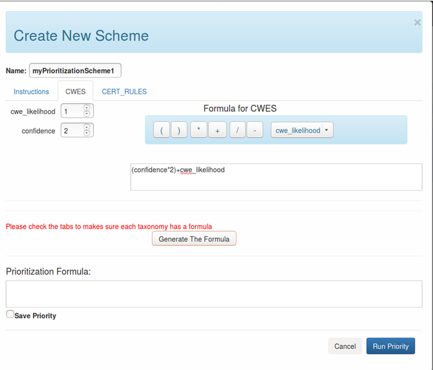

Name the prioritization scheme, e.g., in the figure above the name is
'myPrioritizationScheme1'. To save the scheme, select 'Save Priority'.
Depending on the SCAIFE mode chosen in the interface you may see different
options for saving a prioritization scheme. The default mode in SCALe is Local.
Local prioritization schemes are saved to the SCALe database only.

If you are in 'SCAIFE-connected' mode additional options for saving the prioritization
scheme will be present. The options are:
    -   Global: All projects can access global prioritization schemes
    -   Remote: Only SCAIFE users in the same organization can access the prioritization scheme
    -   Project-Only Checkbox: Access is limited to only the project currently in the GUI

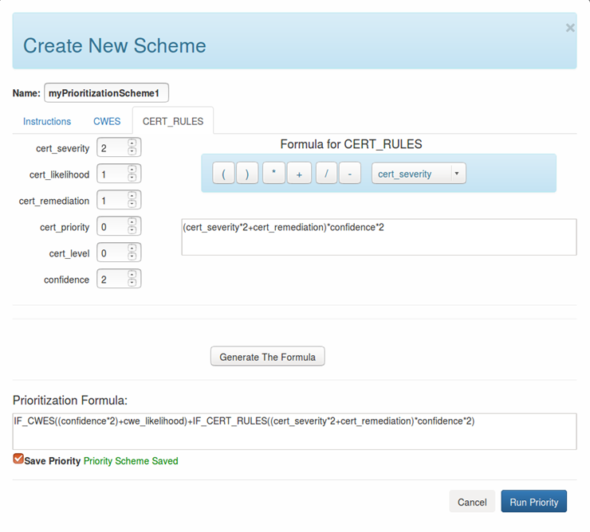

Run the prioritization by selecting the button 'Run Priority' at the
bottom-right of the popup. This will calculate values and put them in
the 'Alert pri' ("alertCondition Priority") field for the meta-alerts, as shown
below. Note: Prioritization scheme calculations that use confidence values while
in 'Demo' or 'SCALE-only' mode will only use randomly-generated confidence values in the results for
alertCondition priority. On the other hand, in 'SCAIFE-connected' mode real confidence values should
be populated by running a SCAIFE classifier prior to creating and running a prioritization scheme
that will use the confidence field in its calculation.

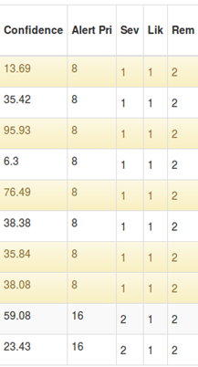

To order meta-alerts by values from this priority scheme, in the filter
section for 'Sort by' select 'AlertCondition Priority', and for 'Sort direction'
select 'desc' (descending). (See screenshot below with these options
selected.) Select the button 'Filter' for the desired prioritization
ordering.

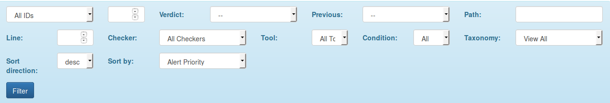

After saving and running a new prioritization scheme, on return to the
Prioritization menu drop-down, users do not initially see the full
formula at the bottom of the popup window for the previously-saved
scheme. It does show the sub-formulas in each tab, still. Also, if the
user selects the button 'Generate The Formula', it will show the full
formula.

##### Uploading additional fields

Users can upload additional fields. Select the header menu item 'Upload
New Fields'. The popup window shown below will appear.

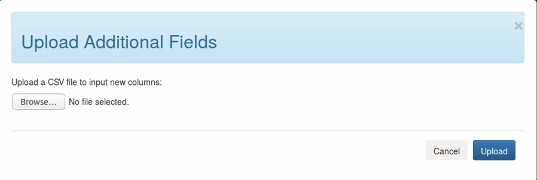

Currently, the user-uploaded fields can be used in prioritization
formulas, but cannot be viewed in the GUI. (Future versions of SCALe
will include the fields in the GUI.)

The upload-fields option is currently for advanced users that can work
with SQL databases and have or can generate values for new fields, e.g.,
based on advanced logic using the other alertCondition fields or based on
proprietary data. However, an extended and more user-friendly version of
the concept could be instantiated without technical difficulty beyond
standard development, to enable less-technical users to generate values
for new fields using mathematical formulas, advanced logic, and data
beyond that provided in the initial SCALe database.

The comma separated value (CSV) uploaded file should have the following:

-   one line for every meta-alert ID that exists in the project
-   left-most field holds meta-alert ID
-   top row holds labels for each field, with left-most top field being
    equivalent to `meta_alert_id`
-   the rest of the rows should hold a value for each field, for each
    meta-alert

An example file (`user_upload_example.csv`) is located in the
`scale.app/``demo` folder, and shown in a screenshot below:

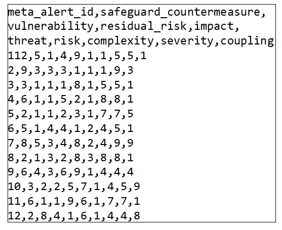

After the new fields have been uploaded, they auto-populate the
prioritization scheme interface, below the initially-populated fields.
See screenshot below:

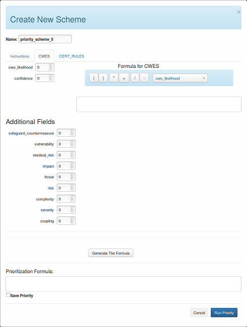

Example prioritization formula using a user-uploaded field
`safeguard_countermeasure`:

`IF_CWES(cwe_likelihood*safeguard_countermeasure)+IF_CERT_RULES((cert_severity*2+cert_remediation)/3*safeguard_countermeasure)`

##### Selecting a Classification Scheme

**Note: Classification is not available in this version of SCALe, but many features required for classification have already been integrated into this version of SCALe. interfaces are provided for user testing and feedback.**

To create a new classification scheme, select 'Create New Classifier'
from the header menu bar's 'Classifiers' option.

Next, select one of the options shown. In the screenshot below, there
are 3 options: Xgboost, Random Forest, and Logistic Regression.

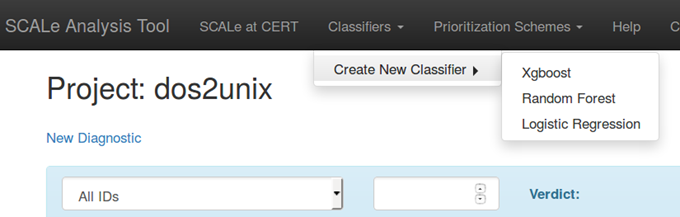

After selecting a classifier type, a popup window will appear with
various options for:

-   **Projects available:** This section lists available projects that
    could possibly be used for labeled data (meta-alerts with
    determinations) that could be used to train the classifier. These
    project names are auto-populated from the current active set of
    SCALe projects. Select the project(s) and then select the 'Add'
    button, to use a project's labeled data to train the classifier.
-   **Adaptive heuristics:** This section provides options to
    choose from various adaptive heuristics (or not to use any). An
    adaptive heuristic modifies classification values as new data
    relevant to the project comes in. (For instance, as new audit
    determinations are made, or as new static analysis tools are run on
    the codebase and the tool output is loaded into the
    project.** **Many of the adaptive heuristics have user-editable
    parameters.
-   **Automated hyper-parameter optimization (AHPO):** This section
    provides AHPO options, and the user can select one (or none). The
    options shown in the screenshot below are 'caret' and 'sei-ahpo'.

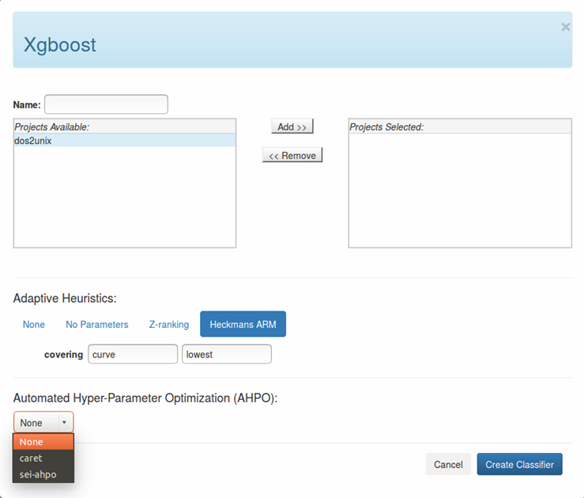

Enter a name for the new classifier (e.g., "myNewClassifier"), then
select the button 'Create Classifier' at the bottom right.

The name of the selected classifier will now appear as an option
in the Run Classifier dropdown next to the 'Classify' button in
the GUI as shown in the screenshot below.

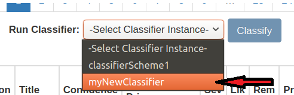

##### Running the Classifier

**Note: Classification is not available in this version of SCALe, but many features required for classification have already been integrated into this version of SCALe. interfaces are provided for user testing and feedback.**. 

After selecting a classification scheme from the dropdown menu,
click the button 'Classify'. When fully functional, this will
cause meta-alerts to be classified (e.g., confidence True or False
will be predicted). Currently, when the button is selected, example
metrics are loaded for the 'Confidence' field of meta-alerts.
However, this is for usability demonstration only,
and these values do not currently come from a classifier.

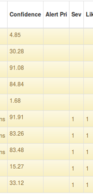

##### alertCondition Determination History

The ‘Previous’ field in the GUI stores the count of previous
determinations, and if the hyperlinked number is selected, it brings up
a comprehensive history of audit determinations for this Meta-Alert
including primary determinations, supplemental determinations, the Note
field, and the Flag field. Auditors can browse all of the old
determinations per Meta-Alert, with this view.

Note that whenever the auditor loads new tool output results, the
verdict of an alertCondition will be reset to 'Unknown', which itself counts as a
determination in the history of the associated Meta-Alert. The
displayed value is one less than the total number of determinations and
therefore starts at 0.

### Editing, Exporting, Sanitizing, or Deleting an Existing Project

First, select the Top Menu item "SCALe Analysis Tool", to get the SCALe
homepage. It shows the list of active SCALe projects (see example
screenshot below). For each project, icons (which have popup text when
you hover the mouse over them) provide action options to:

-   edit (the icon that looks like a pencil)
-   export the project to a database (sqlite3) or a comma-separated
    value (CSV) file
-   delete the project (the 'X' icon) (Note that this uses the POSIX "shred" command to securely erase any project-sensitive files.)

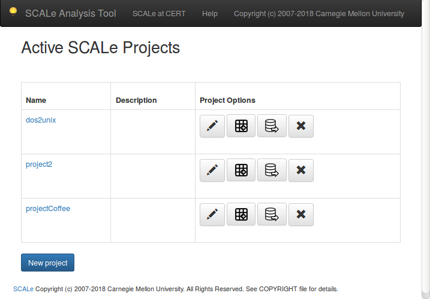


#### Exporting Analysis Results

After Eve is done auditing alertConditions, another auditor, Tom, can
perform either a "table export" or a "database" export of the results of
Eve's analysis. A table export is an archive of several files; each is a
comma-separated value (CSV) file representing the audit data, including
all of the determinations. A database export is a SQLite3 database
encoding the audit data, including all of the determinations. Note
that **a database export contains all the data from the project, but a
table export does not** (e.g., a table export does not contain secondary
alertCondition messages, may not contain all (or any) of the primary
alertCondition messages, and may not include alert IDs). Furthermore, a
database export may be re-imported back into SCALe, while a table export
can not be re-imported.  An exported table archive is often further
analyzed to produce statistics for a report. To obtain the table export,
Tom goes to the SCALe web app homepage, logs in with the credentials
supplied by Alice, and clicks the **Export Tables** icon for the desired
project.

Tom saves the file to his local system. He can now open the file's CSV
tables in a spreadsheet tool such as Excel. The CSV files contain
information about every alertCondition in the project, including the tool that
produced the alert, the file and line number associated with the alertCondition, the
message from the alert, the audit verdict, and so on. See
this [table](#alertcondition-viewer-fields) for a detailed explanation of
all the alertCondition's fields.

#### Making a Sanitized Version of Exported Analysis Results

SCALe code includes a script that creates a "sanitized" version of an
exported SCALe database, anonymizing fields (and deleting some fields)
that may possibly contain sensitive data. In the current SCALe
distribution, sanitizer functionality is provided only for exported
SQLite3 databases, and sanitization can only be done via the command
line. Details about how to use the sanitizer and how it works are in
the [Sanitizer](Sanitizer.md) section.

#### Editing an Existing Project

Select the 'Edit' icon (looks like a pencil) for the project.

A screenshot of the edit screen is shown below. From this screen, you
can add or replace tool outputs, modify the project name or description,
upload determinations for the project, upload a SCALe database, or
upload GNU Global pages. (Upload of a previously-exported SCALe database
may not be fully functional.)

##### Cascade Determinations

This feature allows a user to take determinations made from a previous
SCALe audit and apply them to alertConditions generated by a new SCALe audit. It
uses `diff` to determine if a code line within a file from a previous
version of a codebase matches a code line within the current version of
the codebase. If the lines are matched and there was a previously-made
determination for the Meta-Alert, then it infers the same determination
for the current Meta-Alert. A new Note is added that identifies the
verdict as being cascaded, with a timestamp (see another screenshot
below).

**NOTE OF CAUTION:** Cascaded verdicts are not as trustworthy as direct
verdicts, because data, control, and type flow changes may cause the
previously-correct determination to change. E.g., with different control
flow, a previous True can become a currently-correct False.

The section 'Upload Determinations from Project' in the 'Edit Project'
page provides this functionality.

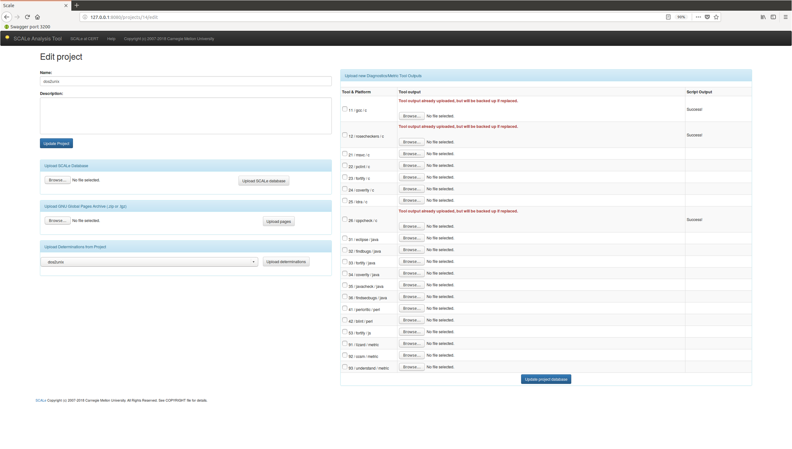

After importing cascaded verdicts, auditor view shows Notes entries for
cascaded determinations in the partial screenshot below:

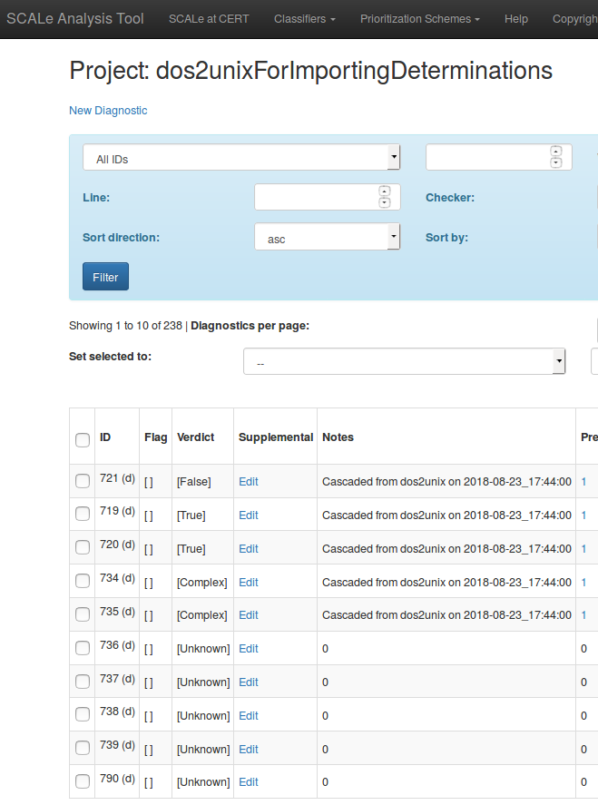

------------------------------------------------------------------------

[](Installing-SCALe.md)
[](Welcome.md) 
[](Sanitizer.md)


Attachments:
------------


[VerdictSet.png](attachments/VerdictSet.png) (image/png)\

[VerdictField.png](attachments/VerdictField.png) (image/png)\

[Personas.png](attachments/Personas.png) (image/png)\
 [MultipleVerdict.png](attachments/MultipleVerdict.png) (image/png)\
 [FilterByCondition.png](attachments/FilterByCondition.png) (image/png)\
 [SortByCERTPri.png](attachments/SortByCERTPri.png) (image/png)\
 [info for SCALe manual updates.pdf](attachments/info_for_SCALe_manual_updates.pdf)
(application/pdf)\

[SelectCCSMExample.png](attachments/SelectCCSMExample.png)
(image/png)\

[BigRedUpArrow.png](attachments/BigRedUpArrow.png) (image/png)\
 [audit-rules-lex-secdev-final-ieee.pdf](attachments/audit-rules-lex-secdev-final-ieee.pdf) (application/pdf)\
 [GUI large view.docx](attachments/GUI_large_view.docx)
(application/vnd.openxmlformats-officedocument.wordprocessingml.document)\
 [GUI large view.gif](attachments/GUI_large_view.gif) (image/gif)\

[EditProjectDetermination.png](attachments/EditProjectDetermination.png) (image/png)\

[SupplementalVerdicts.png](attachments/SupplementalVerdicts.png)
(image/png)\

[ActiveSCALeProjects.png](attachments/ActiveSCALeProjects.png)
(image/png)\

[VerdictFieldOptions.png](attachments/VerdictFieldOptions.png)
(image/png)\

[PrioritizationScheme.png](attachments/PrioritizationScheme.png)
(image/png)\

[AHPOOptions.png](attachments/AHPOOptions.png)
(image/png)\

[NameClassifier.png](attachments/NameClassifier.png)
(image/png)\

[ConfidenceExample.png](attachments/ConfidenceExample.png)
(image/png)\

[CreateNewScheme.png](attachments/CreateNewScheme.png)
(image/png)\

[AlertPriorityCalc](attachments/AlertPriorityCalc.png)
(image/png)\

[OrderMetaAlerts.png](attachments/OrderMetaAlerts.png)
(image/png)\

[NotesField.png](attachments/NotesField.png)
(image/png)\

[UploadAddditionalFields.png](attachments/UploadAddditionalFields.png)
(image/png)\

[AlertConditionsViewer.png](attachments/AlertConditionsViewer.png)
(image/png)\

[CascadedNotes.png](attachments/CascadedNotes.png) (image/png)\

[CreateDatabaseButton.png](attachments/CreateDatabaseButton.png)
(image/png)\

[CreateFromDBButton.png](attachments/CreateFromDBButton.png)
(image/png)\

[NewProjectButton.png](attachments/NewProjectButton.png)
(image/png)\

[ToolOutputUpload.png](attachments/ToolOutputUpload.png)
(image/png)\

[InspectingAlertConditions.png](attachments/InspectingAlertConditions.png)
(image/png)\

[CSVExample.png](attachments/CSVExample.png)
(image/png)\

[NewFieldsOnScheme.png](attachments/NewFieldsOnScheme.png)\
