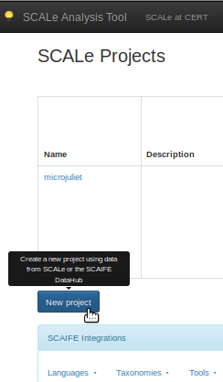

[SCALe](index.md) / [Source Code Analysis Lab (SCALe)](Welcome.md) / [SCALe Quick Start Demo for
    Auditors](SCALe-Quick-Start-Demo-for-Auditors.md)
<!-- <legal> -->
<!-- SCALe version r.6.5.5.1.A -->
<!--  -->
<!-- Copyright 2021 Carnegie Mellon University. -->
<!--  -->
<!-- NO WARRANTY. THIS CARNEGIE MELLON UNIVERSITY AND SOFTWARE ENGINEERING -->
<!-- INSTITUTE MATERIAL IS FURNISHED ON AN "AS-IS" BASIS. CARNEGIE MELLON -->
<!-- UNIVERSITY MAKES NO WARRANTIES OF ANY KIND, EITHER EXPRESSED OR -->
<!-- IMPLIED, AS TO ANY MATTER INCLUDING, BUT NOT LIMITED TO, WARRANTY OF -->
<!-- FITNESS FOR PURPOSE OR MERCHANTABILITY, EXCLUSIVITY, OR RESULTS -->
<!-- OBTAINED FROM USE OF THE MATERIAL. CARNEGIE MELLON UNIVERSITY DOES NOT -->
<!-- MAKE ANY WARRANTY OF ANY KIND WITH RESPECT TO FREEDOM FROM PATENT, -->
<!-- TRADEMARK, OR COPYRIGHT INFRINGEMENT. -->
<!--  -->
<!-- Released under a MIT (SEI)-style license, please see COPYRIGHT file or -->
<!-- contact permission@sei.cmu.edu for full terms. -->
<!--  -->
<!-- [DISTRIBUTION STATEMENT A] This material has been approved for public -->
<!-- release and unlimited distribution.  Please see Copyright notice for -->
<!-- non-US Government use and distribution. -->
<!--  -->
<!-- DM19-1274 -->
<!-- </legal> -->

SCALe : Upload Source Code and Analysis Outputs
================================================

### Please note: This section has not been fully updated for SCALe versions 3 and newer. Screenshots and usage information may be deprecated, and new features not introduced.

### See section [The SCALe Web App](The-SCALe-Web-App.md) for updated feature and use information for SCALe versions 3 and newer.

Prerequisites for This Step
---------------------------

1.  Access to a SCALe web app (you will need the URL of the application
    as well as a username and password, obtainable from your SCALe
    administrator)
2.  Output from CERT Rosecheckers
    a.  [rosecheckers.txt](attachments/rosecheckers.txt)
    a.  For online installs, the file rosecheckers.txt may be located in `$SCALE_HOME/scale.app/demo/dos2unix/analysis`, or the file may be downloaded using the link above.
3.  The dos2unix source code
    a.  [dos2unix-7.2.2.tar.gz](http://waterlan.home.xs4all.nl/dos2unix/dos2unix-7.2.2.tar.gz){.extlink}:
        Use this link for online installs
    a.  For offline installs, the file dos2unix-7.2.2.tar.gz is located
        in `$SCALE_HOME/scale.app/demo/dos2unix`. Use package.zip
        instead of the dos2unix-7.2.2.tar.gz file.
    a.  For online installs, the file can be downloaded from the link
        above, but also the file may be located in
        `$SCALE_HOME/scale.app/demo/dos2unix/package.zip`
4.  A supported web browser (currently Chrome, Firefox, or Internet
    Explorer)

In this step, output from an analysis tool is uploaded to the SCALe web
app, along with an archive of the source code.

Navigate to the URL of your local installation of the SCALE web app
using a supported browser. Log in with the appropriate credentials. You
should now see a list of existing SCALe projects maintained by this
application. Select the icon for **New project** (bottom-left of window).

Next, specify a project name and a description, then select **Create
Project**.

The application now moves to a page where you can upload the source code
and tool outputs. On this new page, click the **Browse**... button next
to the **Archive containing src** label, and select the tarball
containing the dos2unix source. You must also specify a language and a version under **Code Languages**. For this project, use "C" and "99".

  

Next, indicate that you wish to upload CERT Rosecheckers output
by uploading the tool output for Rosecheckers. Click the **Browse...**
button on the same row, then select the [file provided
above](attachments/rosecheckers.txt).

  

Above the **Script Output** column, click the **Create database** icon
(text will appear if you hover your mouse above the icon). This loads
the alerts into a database.

After the page reloads, the results of the operation are displayed in
the far right column of the tool table. If any errors occurred during
the construction of the database, this column will provide a link. If
no errors occurred, click the icon for **Create project from
database** .

The alertConditions are now ready to audit.

------------------------------------------------------------------------

Attachments:
------------

 [rosecheckers.txt](attachments/rosecheckers.txt) (text/plain)\
 [UploadSource.png](attachments/UploadSource.png) (image/png)\
 [UploadSAToolOutput.png](attachments/UploadSAToolOutput.png) (image/png)\
 [dos2unix-7.2.2.zip](attachments/dos2unix-7.2.2.zip)(application/zip)\
 [CreateDatabase.png](attachments/CreateDatabase.png) (image/png)\
 [CreateProjectFromDatabase.png](attachments/CreateProjectFromDatabase.png) (image/png)\
 [CreateProjectScreen.png](attachments/CreateProjectScreen.png) (image/png)\
 [SpecifyNameDesc.png](attachments/SpecifyNameDesc.png) (image/png)\
 [NewProjectButton.png](attachments/NewProjectButton.png) (image/png)\
